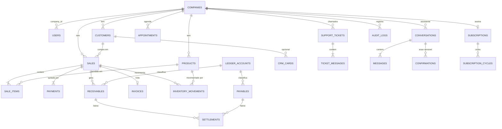

# Dados

Modelo de dados, isolamento multi-tenant, migrations e auditoria.

Implementação em [`packages/db`](../../packages/db/README.md). Este documento
define as **regras**; o catálogo físico está em
[`esquema-postgresql.md`](esquema-postgresql.md).

---

## Multi-tenant

> Isolamento entre empresas é **RLS por linha**: `company_id` em toda tabela de
> negócio e política no PostgreSQL.
> [ADR-0001](../decisoes/adr/0001-rls-por-linha.md) (origem
> [DEC-002](../decisoes/README.md#dec-002)). A materialização em `packages/db` é
> a `NR-007`.

### As opções

| Opção                                                              | Isolamento                   | Custo operacional            | Migrations                   | Veredito                                                                           |
| ------------------------------------------------------------------ | ---------------------------- | ---------------------------- | ---------------------------- | ---------------------------------------------------------------------------------- |
| **RLS por linha** — `company_id` em toda tabela, política no banco | Alto (imposto pelo Postgres) | Baixo — um banco, um schema  | Uma vez para todos           | ✅ **Escolhida** ([ADR-0001](../decisoes/adr/0001-rls-por-linha.md))               |
| Schema por empresa                                                 | Muito alto                   | Alto — N schemas para migrar | N execuções, uma pode falhar | ❌ inviável com 1.000 tenants ([RNF-016](../produto/requisitos-nao-funcionais.md)) |
| Banco por empresa                                                  | Máximo                       | Muito alto                   | Inviável                     | ❌ fora de escala para o público-alvo                                              |
| Filtro só na aplicação                                             | **Nenhum de verdade**        | Baixo                        | Simples                      | ❌ um `WHERE` esquecido vaza dados entre lojas                                     |

A quarta opção é a que acontece por omissão quando ninguém decide — e é a única
inaceitável. [RNF-021](../produto/requisitos-nao-funcionais.md) exige isolamento
**no banco**, não na disciplina do desenvolvedor.

### Como RLS funciona aqui

```sql
-- toda tabela de negócio
ALTER TABLE sales ENABLE ROW LEVEL SECURITY;
ALTER TABLE sales FORCE ROW LEVEL SECURITY;

CREATE POLICY tenant_isolation ON sales
  USING (company_id = current_setting('app.company_id')::uuid);
```

```ts
// packages/db — a variável de sessão vem do ExecutionContext, nunca do cliente
await tx.execute(sql`SELECT set_config('app.company_id', ${ctx.companyId}, true)`)
```

**Consequências que valem para todo o código:**

| Regra                                             | Motivo                                                                                 |
| ------------------------------------------------- | -------------------------------------------------------------------------------------- |
| Toda tabela de negócio tem `company_id NOT NULL`  | Exceções: `companies.id`; `users.company_id` nulo até `/app/empresa`; inbox de webhook |
| Nenhum endpoint aceita `companyId` do cliente     | [Princípio 8](principios.md#8-o-tenant-vem-do-contexto-nunca-do-cliente)               |
| Consulta sem `app.company_id` definido **falha**  | [RF-121](../produto/requisitos-funcionais.md) — falhar é melhor que retornar tudo      |
| `FORCE ROW LEVEL SECURITY` é obrigatório          | Sem ele o dono da tabela ignora a política                                             |
| Migrations rodam com papel separado, sem RLS      | Manutenção precisa enxergar tudo                                                       |
| Recurso de outro tenant responde **404**, não 403 | 403 confirma que o recurso existe                                                      |

E um teste automatizado, rodando na CI, que tenta ler dados de outro
`company_id` e **precisa falhar** — a verificação de
[RNF-021](../produto/requisitos-nao-funcionais.md).

## Modelo de dados

Visão lógica do recorte A–J. Catálogo físico (colunas, CHECKs, índices, RLS):
[`esquema-postgresql.md`](esquema-postgresql.md). Implementação em
[`packages/db`](../../packages/db).

Um usuário pertence a **uma** empresa ([ADR-0004](../decisoes/adr/0004-usuario-uma-empresa.md)):
sem `company_users`. `users.company_id` fica nulo só entre o cadastro da conta
e `/app/empresa` (jornada A); depois é 1:1. Staff futuro = outro `users` com o
mesmo `company_id`.

Visão lógica A–J (o Postgres já materializa estas tabelas, mais `company_integrations`):



### Agrupamento por módulo dono

30 tabelas no Postgres deste recorte. Colunas e restrições:
[`esquema-postgresql.md`](esquema-postgresql.md).

Integrações (fiscal, pagamentos) moram em **`company_integrations` 1:0..1**, não
como colunas em `companies`. Artefatos de cobrança online ficam em `payments`.
Vendor não nomeia tabela.

| Grupo                  | Tabelas                                                                                                  | Módulo dono       |
| ---------------------- | -------------------------------------------------------------------------------------------------------- | ----------------- |
| Empresa e acesso       | `companies`, `users` (`company_id` no owner/staff), `company_integrations`                                  | `core` + `fiscal` |
| Cadastros e estoque    | `customers`, `products` (saldo na coluna), `inventory_movements`                                             | `core`            |
| Venda e nota           | `sales`, `sale_items`, `payments`, `invoices` (`kind` `nfce` \| `nfse`)                                  | `core` + `fiscal` |
| Financeiro             | `receivables`, `payables`, `settlements`, `ledger_accounts`                                              | `core`            |
| Agenda / CRM / suporte | `appointments`, `crm_cards`, `support_tickets`, `ticket_messages`                                        | `core`            |
| Assistente             | `conversations`, `messages`, `confirmations`                                                             | `agent`           |
| Assinatura             | `subscriptions`, `subscription_cycles`, `partners`, `coupons`                                            | `billing`         |
| Plataforma             | `audit_logs`, `idempotency_keys`, `attachments`, `outbox`, `webhook_events`                              | `core`            |

**Fundido de propósito (não criar tabela):** `categories` e `suppliers` → texto em
`products` / `payables`; `customer_addresses` → colunas nullable em `customers`;
`crm_comments` → `crm_cards.comments` jsonb;
`tool_calls` → `messages.tool_calls` jsonb; `plans` → `subscriptions.plan_code`;
`pix_charges` / `payment_links` → colunas de provedor em `payments` (e `receivables.collection_url` depois);
custo fixo → `payables.is_template`.

**Não neste recorte:** `company_users` ([ADR-0004](../decisoes/adr/0004-usuario-uma-empresa.md)),
`product_variants`, `inventory` (cache), `sale_return_items`, `invoice_events`,
`invoice_inutilizations`, `company_provider_accounts`, `bank_accounts`,
`bank_transactions`, `reconciliations`, `entries`, `tax_rules`, cofre de PFX.

**Não gravar:** arquivo/senha do A1; PAN; chave da subconta Asaas em claro; `authToken` do webhook em claro;
CSC em resposta de API; `habilita_nfe`; payload municipal `/v2/nfse`.

Não em `companies`: limite de desconto de staff (RF-008, depois), D+ de cartão
(padrão 30 no `domain`), contador `next_sale_number` (`sales.number` = MAX+1 na
TX), telefone de WhatsApp separado, endereço em jsonb, coluna derivada
“pode emitir” (a regra vive em `domain`).

### Catálogo de colunas (cadastro e fiscal)

Origem de cada campo (lojista, Focus, Asaas, CEP) — não o tipo SQL. Tipos,
CHECKs e índices: [`esquema-postgresql.md`](esquema-postgresql.md). Schema
Drizzle + SQL em [`packages/db`](../../packages/db). Além das colunas abaixo,
valem as [convenções](#convenções-de-schema) (`id`, `company_id` nas tabelas de
negócio, `created_at` / `updated_at` / `deleted_at`).

Elegibilidade de emissão **não** é coluna: `isEligibleForFiscalEmission` em
`packages/domain` ([DEC-017](../decisoes/README.md#dec-017), RF-146). ERP
grava a empresa mesmo inelegível — **sem** linha em `company_integrations`.

#### `companies`

Cadastro visível e regime. Sem colunas de provedor.

| Coluna                                                                                  | Origem                                                                       | Vai para API?                                                                          |
| --------------------------------------------------------------------------------------- | ---------------------------------------------------------------------------- | -------------------------------------------------------------------------------------- |
| `legal_name`, `trade_name`, `cnpj`, `email`, `phone`                                    | lojista / CNPJ                                                               | Focus `nome`, `nome_fantasia`, `cnpj`, `email`, `telefone`                             |
| `state_registration`, `municipal_registration`                                          | lojista (IM omitida na DPS se o município não cadastrou no emissor nacional) | Focus `inscricao_estadual`, `inscricao_municipal`                                      |
| `street`, `street_number`, `complement`, `neighborhood`, `postal_code`, `city`, `state` | lojista / CEP                                                                | Focus endereço                                                                         |
| `city_ibge_code`                                                                        | CEP (`GET /v2/ceps`), não digitado                                           | Focus `codigo_municipio_emissora` (NFS-e Nacional)                                     |
| `tax_regime`                                                                            | lojista; CNPJ **sugere** `mei` vs `simples_nacional`                         | Focus `regime_tributario` **só se elegível**: `mei`→4, `simples_nacional`→1. Nunca `3` |
| `opted_reforma_hibrida`                                                                 | autodeclaração (padrão `false`)                                              | **não** — CNPJ/Focus não devolvem Híbrido                                              |
| `tax_rate`                                                                              | lojista (alíquota do **cálculo da venda**)                                   | **não** (Focus não recebe)                                                             |
| `whatsapp_linked_at`                                                                    | vínculo Cloud API                                                            | **não**                                                                                |

`tax_regime`: `mei` \| `simples_nacional` \| `lucro_presumido` \| `lucro_real`.

`users.company_id` é nullable até `/app/empresa` (jornada A). Login por e-mail
usa `find_login_by_email` (`SECURITY DEFINER`), não uma leitura RLS sem tenant.

#### `company_integrations`

Linha **só** quando a empresa inicia fiscal (A1/CSC/flags) **ou** KYC de
pagamentos. Inelegível / sem KYC não tem satélite.

| Coluna                                                                 | Origem                                                          |
| ---------------------------------------------------------------------- | --------------------------------------------------------------- |
| `fiscal_provider`, `fiscal_company_id`, `fiscal_token_secret_ref`      | slug + id/token do emitente (cofre)                             |
| `fiscal_nfce_enabled`, `fiscal_nfse_enabled`                           | flags que enviamos se elegível                                  |
| `fiscal_certificate_status`, `fiscal_certificate_expires_at`           | provedor fiscal / parse na borda **sem** PFX                    |
| `fiscal_has_nfce_csc`                                                  | CSC foi encaminhado; **não** o valor                            |
| `payments_provider`, `payments_onboarding_status`, `payments_account_id`, `payments_wallet_id` | KYC / subconta do PSP                          |
| `payments_api_key_secret_ref`, `payments_webhook_auth_secret_ref`      | cofre — nunca em claro                                          |
| `billing_customer_id`                                                  | cliente da mensalidade SaaS na conta-pai                        |
| `payments_estimated_monthly_income_cents`                              | renda informada na criação da subconta                          |

#### `products`

| Coluna                                                                                                                | Uso                                |
| --------------------------------------------------------------------------------------------------------------------- | ---------------------------------- |
| `kind`                                                                                                                | `product` \| `service`             |
| `description`, `barcode`, `unit_of_measure`, `sale_price_cents`, `cost_price_cents`, `stock`, `min_stock`, `tax_rate` | cadastro / cálculo                 |
| `category`, `supplier`                                                                                                | `text`, sem tabela                 |
| `ncm`                                                                                                                 | NFC-e; null em serviço             |
| `codigo_tributacao_nacional_iss`, `codigo_nbs`                                                                        | NFS-e Nacional; null em mercadoria |

`products.stock` é o saldo atual. Cada alteração gera `inventory_movements`
com snapshot `stock_before` / `stock_after` (`stock_after = stock_before +
quantity_delta`). Baixa de venda aponta `sale_id`; entrada por compra aponta
`purchase_id` (coluna já existe; tabela `purchases` ainda fora do recorte).
Ajuste: os dois ids nulos.

**Não há** `item_lista_servico`, código municipal LC 116, CFOP nem CSOSN no
produto. CFOP/CSOSN da NFC-e são padrão do adapter para MEI/Simples.

#### `customers`

Documento, telefone e e-mail opcionais (balcão). Endereço no mesmo registro
(`street` … `city_ibge_code`), todos nullable: a DPS pode ir sem tomador
completo. Pedido LGPD anonimiza (RF-127), não apaga. Id no PSP:
`payments_customer_id`. Lista oculta com `deleted_at`; venda antiga continua
apontando o uuid.

#### `sale_items`

Snapshot `ncm` / `codigo_tributacao_nacional_iss` / `codigo_nbs` no fechamento.
Só preenche o que o item usa (produto vs serviço).

#### `payments`

`payments` tem forma e valor (`cash`, `pix`, `boleto`, `debit`, `credit`,
`wallet`). Pix/boleto/link/cartão online preenchem `provider_payment_id`,
`pix_payload` / `bank_slip_url`, evento. Dinheiro e maquininha deixam essas
colunas nulas. `method` é o domínio — sem `billing_type` de vendor.

#### `invoices`

Espelho da nota. Linha **só** quando há emissão. `kind` só `nfce` \| `nfse`. Sem
colunas de NF-e modelo 55. `access_key` / `series` / `qr_code` preenchidos na
NFC-e; NFS-e usa `number` e verificação no `provider_payload`.

#### `webhook_events`

Inbox dos provedores. `UNIQUE (provider, event_id)`. `company_id` preenchido
depois de casar o evento. Sem RLS no insert — a API ainda não tem tenant.

### Estados da venda

O lojista precisa ver se a nota saiu, se o Pix liquidou, se um job falhou.
Isso **não** cabe num campo `sales.status` (`pending` / `paid` / `invoiced`):
pagamento e a nota (NFC-e ou NFS-e Nacional) têm ciclos independentes — a venda fecha **antes** da nota
([fluxos](fluxos.md#venda-completa)), o fiado é venda válida sem liquidação, o
cartão presencial não passa pelo PSP.

A tela da venda **compõe** os estados das tabelas ligadas:

| Pergunta do lojista                         | Onde vive                                                                                         | Requisito              |
| ------------------------------------------- | ------------------------------------------------------------------------------------------------- | ---------------------- |
| A venda existe, foi cancelada ou devolvida? | `sales` — nunca `DELETE`                                                                          | RNF-040                |
| A nota saiu?                                | `invoices` — `autorizada`, `processing` (NFS-e), `contingencia` (NFC-e), `rejeitada`, `cancelada` | RF-054, US-025, US-073 |
| O dinheiro entrou?                          | `receivables` + `settlements` (`cash`/`pix` já liquidado; `credit`/`wallet` em aberto)            | RF-063, RF-064         |
| A integração falhou com qual resposta?      | `requestId` + corpo do provedor; job reprocessa até o limite                                      | RF-129, RF-130         |

Duas falhas distintas, dois desfechos:

1. **`registerSale` aborta** (banco, timeout no meio da transação) — não fica
   venda pela metade. Estoque, recebível e auditoria entram juntos
   ([RNF-046](../produto/requisitos-nao-funcionais.md)); o PDV mostra o erro e
   reenvia com a mesma chave de idempotência ([RNF-043](../produto/requisitos-nao-funcionais.md)).
2. **A venda já gravou e o resto falha** (Focus, webhook Asaas) — a venda permanece;
   o estado filho (nota, recebível, outbox) fica explícito na consulta.

Quem persiste isso é `core` + `db` (NR-022, schema, RF-054), não `domain`.

## Convenções de schema

| Elemento           | Convenção                                                                                                        |
| ------------------ | ---------------------------------------------------------------------------------------------------------------- |
| Tabela             | `snake_case`, plural — `sale_items`                                                                              |
| Coluna             | `snake_case` — `net_amount`                                                                                      |
| Chave primária     | `id uuid` (UUIDv7, ordenável por tempo)                                                                          |
| Chave estrangeira  | `<singular>_id` — `customer_id`                                                                                  |
| Tenant             | `company_id uuid NOT NULL` nas tabelas de negócio (`users` nulo até a empresa; `webhook_events` depois do match) |
| Dinheiro           | `bigint`, em **centavos** — nunca `float`, `real` ou `money`                                                     |
| Percentual         | `numeric(7,4)` — `0.1250` = 12,5%                                                                                |
| Data/hora          | `timestamptz`, sempre UTC, sufixo `_at`                                                                          |
| Data sem hora      | `date` — só vencimento e competência                                                                             |
| Booleano           | `is_` / `has_` — `is_active`                                                                                     |
| Enum               | tabela de domínio ou `text` + `CHECK`; nunca `enum` nativo (migrar dói)                                          |
| Exclusão           | `deleted_at` em toda tabela com `created_at` ou `updated_at` (nulo = vigente); **nunca** `DELETE` em venda, nota ou auditoria |
| Auditoria de linha | `created_at`, `updated_at`, `created_by`, `updated_by`                                                           |

Fora dessa regra: `sale_items`, `confirmations`, `audit_logs` e `webhook_events`
não têm `created_at`/`updated_at`, logo não têm `deleted_at`.

**Por que `bigint` em centavos:** `numeric` seria correto mas convida a
aritmética em JavaScript com precisão perdida na borda; `bigint` em centavos
torna o erro impossível por construção e casa com o tipo
[`Money`](../../packages/money/README.md)
([RNF-044](../produto/requisitos-nao-funcionais.md)).

## Índices obrigatórios

Com RLS, **toda consulta filtra por `company_id`**. Índice que não começa por
`company_id` quase nunca é usado.

| Padrão                                                   | Exemplo                                                                    |
| -------------------------------------------------------- | -------------------------------------------------------------------------- |
| Todo índice de tabela de negócio começa por `company_id` | `(company_id, created_at DESC)`                                            |
| Busca por telefone e documento                           | `(company_id, phone)`, `(company_id, document)`                            |
| Código de barras                                         | `(company_id, barcode)` — único                                            |
| Vencimento                                               | `(company_id, due_date) WHERE settled_at IS NULL` — parcial                |
| Idempotência                                             | `(company_id, idempotency_key)` — único                                    |
| Webhook (Asaas / Focus)                                  | `UNIQUE (provider, event_id)` em `webhook_events` — sem tenant na inserção |

## Transações

Fronteira de transação = **caso de uso**, nunca repositório
([princípio 6](principios.md#6-o-caso-de-uso-controla-a-transação)).

```ts
// packages/core — o caso de uso possui a transação
export async function registerSale(deps, ctx, input) {
  return deps.db.transaction(async (tx) => {
    await tx.setTenant(ctx.companyId)
    const sale = await tx.sales.insert(...)
    await tx.inventory.decrease(...)
    await tx.receivables.createMany(...)
    await tx.auditLogs.insert(...)
    return sale
  })
}
```

Efeitos externos (emitir nota na Focus, cobrar no Asaas, enviar mensagem)
**não** entram na transação: vão para a fila via padrão _outbox_. Sem isso, um
erro de rede com a Focus desfaz uma venda já concluída.

## Migrations

| Regra                                                           | Motivo                                             |
| --------------------------------------------------------------- | -------------------------------------------------- |
| Toda migration é versionada e roda em ordem                     | Reprodutibilidade                                  |
| Reversível, ou com plano de reversão no PR                      | [RNF-048](../produto/requisitos-nao-funcionais.md) |
| Sem bloqueio de escrita acima de 30 s                           | [RNF-049](../produto/requisitos-nao-funcionais.md) |
| Mudança destrutiva em duas etapas: expandir → migrar → contrair | Permite reverter o deploy sem perder dado          |
| Toda tabela nova já nasce com RLS habilitado                    | Esquecer é vazamento entre tenants                 |
| Migration não contém regra de negócio                           | Regra vive em `domain`                             |
| Seed de plano de contas padrão é migration versionada           | [RF-081](../produto/requisitos-funcionais.md)      |

## Auditoria

[RF-123](../produto/requisitos-funcionais.md),
[RNF-047](../produto/requisitos-nao-funcionais.md).

```
audit_logs
├── id, company_id, occurred_at
├── actor_user_id          quem — nunca "sistema" para ação confirmada por humano
├── channel                app | whatsapp | api | job
├── request_id             correlaciona com o log (RNF-058)
├── entity_type, entity_id  o que mudou
├── action                 created | updated | cancelled | settled | ...
└── before, after (jsonb)  estado antes e depois, sem dado pessoal (RNF-034)
```

`audit_logs` é **somente-inserção**: sem `UPDATE`, sem `DELETE`, imposto por
política no banco. Uma auditoria alterável não serve para resolver divergência
entre lojista e funcionário, que é exatamente o motivo de ela existir.

## Retenção e expurgo

| Dado                                     | Retenção                      | Base                                                                 |
| ---------------------------------------- | ----------------------------- | -------------------------------------------------------------------- |
| XML de nota fiscal                       | ≥ 5 anos                      | [RNF-037](../produto/requisitos-nao-funcionais.md) — obrigação legal |
| Vendas e financeiro                      | Vida da conta + 5 anos        | Obrigação fiscal                                                     |
| Auditoria                                | ≥ 5 anos                      | Prova em disputa                                                     |
| Mensagens do WhatsApp                    | Prazo mínimo declarado        | [RNF-035](../produto/requisitos-nao-funcionais.md) — LGPD            |
| Contexto de conversa                     | Curto, expira por inatividade | [RF-106](../produto/requisitos-funcionais.md)                        |
| Dados de cliente após pedido de exclusão | Anonimizados                  | [RF-127](../produto/requisitos-funcionais.md)                        |

**Anonimização, não exclusão:** apagar o cliente destruiria os totais das vendas
dele e quebraria relatório e obrigação fiscal. Os campos pessoais são
substituídos, o registro e os valores permanecem
([RF-128](../produto/requisitos-funcionais.md)).

## Backup e recuperação

| Item                         | Alvo                                                                    |
| ---------------------------- | ----------------------------------------------------------------------- |
| Backup completo              | Diário                                                                  |
| Recuperação a ponto no tempo | RPO ≤ 15 min ([RNF-013](../produto/requisitos-nao-funcionais.md))       |
| Tempo de restauração         | RTO ≤ 4 h                                                               |
| Teste de restauração         | Mensal, registrado ([RNF-014](../produto/requisitos-nao-funcionais.md)) |
| XMLs e anexos                | Versionados no object storage, com retenção separada                    |

Backup não testado não é backup. O teste mensal é requisito, não boa prática.

## Documentos relacionados

- [Esquema PostgreSQL](esquema-postgresql.md) — catálogo físico das 30 tabelas
- [`packages/db`](../../packages/db/README.md) — implementação do schema
- [Princípios](principios.md) — a regra de dependência que `db` respeita
- [Segurança](seguranca.md) — como o isolamento se conecta à autorização
- [ADR-0001](../decisoes/adr/0001-rls-por-linha.md) — isolamento multi-tenant por RLS
