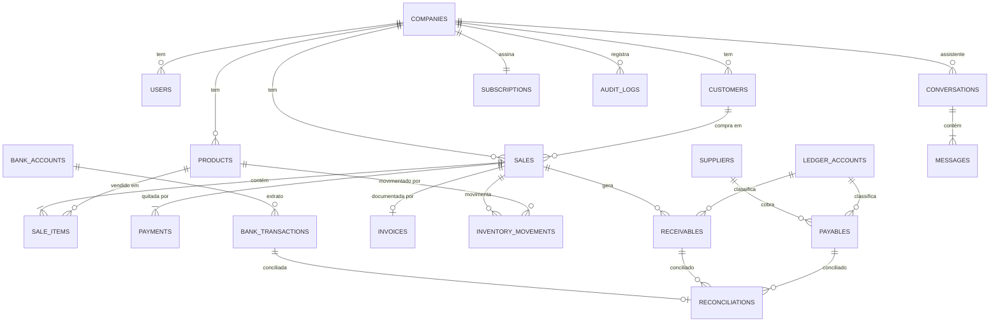

# Dados

Modelo de dados, isolamento multi-tenant, migrations e auditoria.

Implementação em [`packages/db`](../../packages/db/README.md). Este documento
define as **regras**; o pacote as materializa em schema Drizzle.

---

## Multi-tenant

> Isolamento entre empresas é **RLS por linha**: `company_id` em toda tabela de
> negócio e política no PostgreSQL.
> [ADR-0001](../decisoes/adr/0001-rls-por-linha.md) (origem
> [DEC-002](../decisoes/README.md#dec-002)). A materialização em `packages/db` é
> a `NR-007`.

### As opções

| Opção                                                              | Isolamento                   | Custo operacional            | Migrations                   | Veredito                                                                           |
| ------------------------------------------------------------------ | ---------------------------- | ---------------------------- | ---------------------------- | ---------------------------------------------------------------------------------- |
| **RLS por linha** — `company_id` em toda tabela, política no banco | Alto (imposto pelo Postgres) | Baixo — um banco, um schema  | Uma vez para todos           | ✅ **Escolhida** ([ADR-0001](../decisoes/adr/0001-rls-por-linha.md))               |
| Schema por empresa                                                 | Muito alto                   | Alto — N schemas para migrar | N execuções, uma pode falhar | ❌ inviável com 1.000 tenants ([RNF-016](../produto/requisitos-nao-funcionais.md)) |
| Banco por empresa                                                  | Máximo                       | Muito alto                   | Inviável                     | ❌ fora de escala para o público-alvo                                              |
| Filtro só na aplicação                                             | **Nenhum de verdade**        | Baixo                        | Simples                      | ❌ um `WHERE` esquecido vaza dados entre lojas                                     |

A quarta opção é a que acontece por omissão quando ninguém decide — e é a única
inaceitável. [RNF-021](../produto/requisitos-nao-funcionais.md) exige isolamento
**no banco**, não na disciplina do desenvolvedor.

### Como RLS funciona aqui

```sql
-- toda tabela de negócio
ALTER TABLE sales ENABLE ROW LEVEL SECURITY;
ALTER TABLE sales FORCE ROW LEVEL SECURITY;

CREATE POLICY tenant_isolation ON sales
  USING (company_id = current_setting('app.company_id')::uuid);
```

```ts
// packages/db — a variável de sessão vem do ExecutionContext, nunca do cliente
await tx.execute(sql`SELECT set_config('app.company_id', ${ctx.companyId}, true)`)
```

**Consequências que valem para todo o código:**

| Regra                                             | Motivo                                                                            |
| ------------------------------------------------- | --------------------------------------------------------------------------------- |
| Toda tabela de negócio tem `company_id NOT NULL`  | Sem ela a política não se aplica                                                  |
| Nenhum endpoint aceita `companyId` do cliente     | [Princípio 8](principios.md#8-o-tenant-vem-do-contexto-nunca-do-cliente)          |
| Consulta sem `app.company_id` definido **falha**  | [RF-121](../produto/requisitos-funcionais.md) — falhar é melhor que retornar tudo |
| `FORCE ROW LEVEL SECURITY` é obrigatório          | Sem ele o dono da tabela ignora a política                                        |
| Migrations rodam com papel separado, sem RLS      | Manutenção precisa enxergar tudo                                                  |
| Recurso de outro tenant responde **404**, não 403 | 403 confirma que o recurso existe                                                 |

E um teste automatizado, rodando na CI, que tenta ler dados de outro
`company_id` e **precisa falhar** — a verificação de
[RNF-021](../produto/requisitos-nao-funcionais.md).

O satélite de credenciais fiscais que **já roda** é
`company_fiscal_credentials` (NR-042). O catálogo alvo com Asaas une fiscal e
pagamentos numa `company_integrations` 1:0..1 — fotografado em
[`db_0909.sql`](db_0909.sql) e descrito em
[`esquema-postgresql.md`](esquema-postgresql.md). Isso ainda **não** é
migration: entra depois, sem reescrever o que já está em
`packages/db/src/migrations/`.

## Modelo de dados

Visão lógica. Não é o schema final — o schema nasce em `packages/db`
(`NR-007`, `NR-008`, `NR-020`).



### Agrupamento por módulo dono

| Grupo            | Tabelas                                                                | Módulo dono        |
| ---------------- | ---------------------------------------------------------------------- | ------------------ |
| Empresa e acesso | `companies`, `users`, `company_users`, `roles`                         | `core`             |
| Cadastros        | `customers`, `suppliers`, `products`, `product_variants`, `categories` | `core`             |
| Estoque          | `inventory`, `inventory_movements`                                     | `core`             |
| Vendas           | `sales`, `sale_items`, `payments`, `sale_returns`                      | `core` + `domain`  |
| Fiscal           | `invoices`, `invoice_events`, `tax_rules`                              | `fiscal`           |
| Financeiro       | `receivables`, `payables`, `settlements`                               | `core`             |
| Bancos           | `bank_accounts`, `bank_transactions`, `reconciliations`                | `banking` + `core` |
| Contábil         | `ledger_accounts`, `entries`                                           | `core`             |
| Agenda           | `appointments`                                                         | `core`             |
| Assistente       | `conversations`, `messages`, `tool_calls`, `confirmations`             | `agent`            |
| Assinatura       | `subscriptions`, `plans`, `invoices_saas`, `coupons`                   | `billing`          |
| Plataforma       | `audit_logs`, `idempotency_keys`, `attachments`, `outbox`              | `core`             |

### Estados da venda

O lojista precisa ver se a nota saiu, se o Pix liquidou, se um job falhou.
Isso **não** cabe num campo `sales.status` (`pending` / `paid` / `invoiced`):
pagamento e NFC-e têm ciclos independentes — a venda fecha **antes** da nota
([fluxos](fluxos.md#venda-completa)), o fiado é venda válida sem liquidação, o
cartão presencial não passa pelo PSP.

A tela da venda **compõe** os estados das tabelas ligadas:

| Pergunta do lojista                         | Onde vive                                                                              | Requisito      |
| ------------------------------------------- | -------------------------------------------------------------------------------------- | -------------- |
| A venda existe, foi cancelada ou devolvida? | `sales` — nunca `DELETE`                                                               | RNF-040        |
| A nota saiu?                                | `invoices` — `autorizada`, `contingencia`, `rejeitada`, `cancelada`; sem sucesso falso | RF-054, US-025 |
| O dinheiro entrou?                          | `receivables` + `settlements` (`cash`/`pix` já liquidado; `credit`/`wallet` em aberto) | RF-063, RF-064 |
| A integração falhou com qual resposta?      | `requestId` + corpo do provedor; job reprocessa até o limite                           | RF-129, RF-130 |

Duas falhas distintas, dois desfechos:

1. **`registerSale` aborta** (banco, timeout no meio da transação) — não fica
   venda pela metade. Estoque, recebível e auditoria entram juntos
   ([RNF-046](../produto/requisitos-nao-funcionais.md)); o PDV mostra o erro e
   reenvia com a mesma chave de idempotência ([RNF-043](../produto/requisitos-nao-funcionais.md)).
2. **A venda já gravou e o resto falha** (SEFAZ, webhook) — a venda permanece;
   o estado filho (nota, recebível, outbox) fica explícito na consulta.

Quem persiste isso é `core` + `db` (NR-022, schema, RF-054), não `domain`.

## Convenções de schema

| Elemento           | Convenção                                                                |
| ------------------ | ------------------------------------------------------------------------ |
| Tabela             | `snake_case`, plural — `sale_items`                                      |
| Coluna             | `snake_case` — `net_amount`                                              |
| Chave primária     | `id uuid` (UUIDv7, ordenável por tempo)                                  |
| Chave estrangeira  | `<singular>_id` — `customer_id`                                          |
| Tenant             | `company_id uuid NOT NULL` em **toda** tabela de negócio                 |
| Dinheiro           | `bigint`, em **centavos** — nunca `float`, `real` ou `money`             |
| Percentual         | `numeric(7,4)` — `0.1250` = 12,5%                                        |
| Data/hora          | `timestamptz`, sempre UTC, sufixo `_at`                                  |
| Data sem hora      | `date` — só vencimento e competência                                     |
| Booleano           | `is_` / `has_` — `is_active`                                             |
| Enum               | tabela de domínio ou `text` + `CHECK`; nunca `enum` nativo (migrar dói)  |
| Exclusão           | `deleted_at` onde couber; **nunca** `DELETE` em venda, nota ou auditoria |
| Auditoria de linha | `created_at`, `updated_at`, `created_by`, `updated_by`                   |

**Por que `bigint` em centavos:** `numeric` seria correto mas convida a
aritmética em JavaScript com precisão perdida na borda; `bigint` em centavos
torna o erro impossível por construção e casa com o tipo
[`Money`](../../packages/money/README.md)
([RNF-044](../produto/requisitos-nao-funcionais.md)).

## Índices obrigatórios

Com RLS, **toda consulta filtra por `company_id`**. Índice que não começa por
`company_id` quase nunca é usado.

| Padrão                                                   | Exemplo                                                       |
| -------------------------------------------------------- | ------------------------------------------------------------- |
| Todo índice de tabela de negócio começa por `company_id` | `(company_id, created_at DESC)`                               |
| Busca por telefone e documento                           | `(company_id, phone)`, `(company_id, document)`               |
| Código de barras                                         | `(company_id, barcode)` — único                               |
| Vencimento                                               | `(company_id, due_date) WHERE settled_at IS NULL` — parcial   |
| Idempotência                                             | `(company_id, idempotency_key)` — único                       |
| Conciliação                                              | `(company_id, external_hash)` — único, evita duplicar extrato |

## Transações

Fronteira de transação = **caso de uso**, nunca repositório
([princípio 6](principios.md#6-o-caso-de-uso-controla-a-transação)).

```ts
// packages/core — o caso de uso possui a transação
export async function registerSale(deps, ctx, input) {
  return deps.db.transaction(async (tx) => {
    await tx.setTenant(ctx.companyId)
    const sale = await tx.sales.insert(...)
    await tx.inventory.decrease(...)
    await tx.receivables.createMany(...)
    await tx.auditLogs.insert(...)
    return sale
  })
}
```

Efeitos externos (emitir nota, enviar mensagem) **não** entram na transação:
vão para a fila via padrão _outbox_, gravado na mesma transação e publicado
depois. Sem isso, um erro de rede com a SEFAZ desfaz uma venda já concluída.

## Migrations

| Regra                                                           | Motivo                                             |
| --------------------------------------------------------------- | -------------------------------------------------- |
| Toda migration é versionada e roda em ordem                     | Reprodutibilidade                                  |
| Reversível, ou com plano de reversão no PR                      | [RNF-048](../produto/requisitos-nao-funcionais.md) |
| Sem bloqueio de escrita acima de 30 s                           | [RNF-049](../produto/requisitos-nao-funcionais.md) |
| Mudança destrutiva em duas etapas: expandir → migrar → contrair | Permite reverter o deploy sem perder dado          |
| Toda tabela nova já nasce com RLS habilitado                    | Esquecer é vazamento entre tenants                 |
| Migration não contém regra de negócio                           | Regra vive em `domain`                             |
| Seed de plano de contas padrão é migration versionada           | [RF-081](../produto/requisitos-funcionais.md)      |

## Auditoria

[RF-123](../produto/requisitos-funcionais.md),
[RNF-047](../produto/requisitos-nao-funcionais.md).

```
audit_logs
├── id, company_id, occurred_at
├── actor_user_id          quem — nunca "sistema" para ação confirmada por humano
├── channel                app | whatsapp | api | job
├── request_id             correlaciona com o log (RNF-058)
├── entity_type, entity_id  o que mudou
├── action                 created | updated | cancelled | settled | ...
└── before, after (jsonb)  estado antes e depois, sem dado pessoal (RNF-034)
```

`audit_logs` é **somente-inserção**: sem `UPDATE`, sem `DELETE`, imposto por
política no banco. Uma auditoria alterável não serve para resolver divergência
entre lojista e funcionário, que é exatamente o motivo de ela existir.

## Retenção e expurgo

| Dado                                     | Retenção                      | Base                                                                 |
| ---------------------------------------- | ----------------------------- | -------------------------------------------------------------------- |
| XML de nota fiscal                       | ≥ 5 anos                      | [RNF-037](../produto/requisitos-nao-funcionais.md) — obrigação legal |
| Vendas e financeiro                      | Vida da conta + 5 anos        | Obrigação fiscal                                                     |
| Auditoria                                | ≥ 5 anos                      | Prova em disputa                                                     |
| Mensagens do WhatsApp                    | Prazo mínimo declarado        | [RNF-035](../produto/requisitos-nao-funcionais.md) — LGPD            |
| Contexto de conversa                     | Curto, expira por inatividade | [RF-106](../produto/requisitos-funcionais.md)                        |
| Dados de cliente após pedido de exclusão | Anonimizados                  | [RF-127](../produto/requisitos-funcionais.md)                        |

**Anonimização, não exclusão:** apagar o cliente destruiria os totais das vendas
dele e quebraria relatório e obrigação fiscal. Os campos pessoais são
substituídos, o registro e os valores permanecem
([RF-128](../produto/requisitos-funcionais.md)).

## Backup e recuperação

| Item                         | Alvo                                                                    |
| ---------------------------- | ----------------------------------------------------------------------- |
| Backup completo              | Diário                                                                  |
| Recuperação a ponto no tempo | RPO ≤ 15 min ([RNF-013](../produto/requisitos-nao-funcionais.md))       |
| Tempo de restauração         | RTO ≤ 4 h                                                               |
| Teste de restauração         | Mensal, registrado ([RNF-014](../produto/requisitos-nao-funcionais.md)) |
| XMLs e anexos                | Versionados no object storage, com retenção separada                    |

Backup não testado não é backup. O teste mensal é requisito, não boa prática.

## Documentos relacionados

- [`packages/db`](../../packages/db/README.md) — implementação do schema
- [Princípios](principios.md) — a regra de dependência que `db` respeita
- [Segurança](seguranca.md) — como o isolamento se conecta à autorização
- [ADR-0001](../decisoes/adr/0001-rls-por-linha.md) — isolamento multi-tenant por RLS
