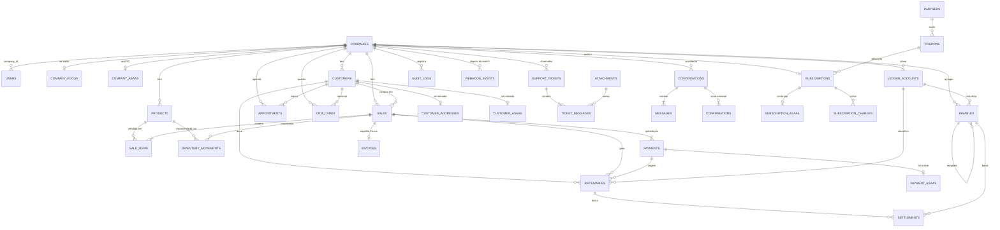

# Esquema PostgreSQL

Catálogo físico do recorte A–J: tabelas, colunas, checagens, índices e RLS.

As **regras** (o que não gravar, convenções, estados da venda, retenção) ficam
em [`dados.md`](dados.md). Este arquivo descreve **o que o Postgres tem hoje**.
SQL versionado: [`packages/db/migrations/0001_init.sql`](../../packages/db/migrations/0001_init.sql).
Tipos Drizzle: [`packages/db/src/schema.ts`](../../packages/db/src/schema.ts).

35 tabelas. Sem PagMaxx. Sem tabela de Split
([DEC-018](../decisoes/README.md#dec-018) — `wallet_id` já está em
`company_asaas`). Focus e Asaas são satélites 1:0..1: a linha só existe quando
há emissão, KYC ou cobrança online.

---

## Convenções que este schema obedece

Detalhe e motivo em [`dados.md`](dados.md#convenções-de-schema). Em resumo:

| Elemento        | Aqui                                                                                          |
| --------------- | --------------------------------------------------------------------------------------------- |
| PK              | `id uuid`, salvo satélite cuja PK é a FK (`company_id`, `customer_id`, `payment_id`, …)       |
| Tenant          | `company_id uuid NOT NULL` nas tabelas de negócio                                             |
| Dinheiro        | `bigint` em centavos                                                                          |
| Percentual      | `numeric(7, 4)`                                                                               |
| Data/hora       | `timestamptz` UTC, sufixo `_at`                                                               |
| Data sem hora   | `date` — vencimento e competência                                                             |
| Enum            | `text` + `CHECK` — nunca `enum` nativo                                                        |
| Índice          | começa por `company_id`                                                                       |

**Exceções de tenant:** `companies` (a PK *é* o tenant); `users.company_id`
nulo até `/app/empresa`; `partners` e `coupons` são da plataforma, sem
`company_id` e sem RLS; `webhook_events.company_id` nulo no insert (inbox ainda
sem tenant).

---

## Mapa



| Grupo                  | Tabelas                                                                                                      | RLS                          |
| ---------------------- | ------------------------------------------------------------------------------------------------------------ | ---------------------------- |
| Empresa e acesso       | `companies`, `users`, `company_focus`, `company_asaas`                                                       | sim (`companies` pela PK)    |
| Cadastros e estoque    | `customers`, `customer_asaas`, `customer_addresses`, `products`, `inventory_movements`                       | sim                          |
| Venda e nota           | `sales`, `sale_items`, `payments`, `payment_asaas`, `invoices`                                               | sim                          |
| Financeiro             | `ledger_accounts`, `receivables`, `payables`, `settlements`                                                  | sim                          |
| Agenda / CRM / suporte | `appointments`, `crm_cards`, `support_tickets`, `ticket_messages`                                            | sim                          |
| Assistente             | `conversations`, `messages`, `confirmations`                                                                 | sim                          |
| Assinatura SaaS        | `subscriptions`, `subscription_asaas`, `subscription_charges`, `partners`, `coupons`                         | `partners` e `coupons` **não** |
| Plataforma             | `attachments`, `idempotency_keys`, `outbox`, `audit_logs`, `webhook_events`                                  | `webhook_events` **não**     |

---

## Empresa e acesso

### `companies`

Cadastro visível e regime. Sem colunas Focus/Asaas. RLS: `id = app.company_id`.

| Coluna                    | Tipo                          | Notas                                                                 |
| ------------------------- | ----------------------------- | --------------------------------------------------------------------- |
| `id`                      | `uuid` PK                     | UUIDv7                                                                |
| `legal_name`              | `text NOT NULL`               |                                                                       |
| `trade_name`              | `text`                        |                                                                       |
| `cnpj`                    | `text NOT NULL`               | `UNIQUE`                                                              |
| `email`                   | `text NOT NULL`               |                                                                       |
| `phone`                   | `text NOT NULL`               |                                                                       |
| `state_registration`      | `text`                        |                                                                       |
| `municipal_registration`  | `text`                        |                                                                       |
| `street`                  | `text NOT NULL`               |                                                                       |
| `street_number`           | `text NOT NULL`               |                                                                       |
| `complement`              | `text`                        |                                                                       |
| `neighborhood`            | `text NOT NULL`               |                                                                       |
| `postal_code`             | `text NOT NULL`               |                                                                       |
| `city`                    | `text NOT NULL`               |                                                                       |
| `state`                   | `text NOT NULL`               |                                                                       |
| `city_ibge_code`          | `text`                        | CEP, não digitado                                                     |
| `tax_regime`              | `text NOT NULL`               | `mei` \| `simples_nacional` \| `lucro_presumido` \| `lucro_real`      |
| `opted_reforma_hibrida`   | `boolean NOT NULL`            | default `false`                                                       |
| `tax_rate`                | `numeric(7, 4)`               | alíquota do cálculo da venda; Focus **não** recebe                    |
| `whatsapp_linked_at`      | `timestamptz`                 |                                                                       |
| `created_at`              | `timestamptz NOT NULL`        | default `now()`                                                       |
| `updated_at`              | `timestamptz NOT NULL`        | default `now()`                                                       |

### `users`

Um usuário, uma empresa ([ADR-0004](../decisoes/adr/0004-usuario-uma-empresa.md)).
`company_id` nulo só entre o cadastro da conta e `/app/empresa`. Insert/attach
nessa janela passam por funções `SECURITY DEFINER` — RLS em `users` exige
tenant.

| Coluna          | Tipo                   | Notas                                              |
| --------------- | ---------------------- | -------------------------------------------------- |
| `id`            | `uuid` PK              |                                                    |
| `company_id`    | `uuid` → `companies`   | nulo até a empresa existir                         |
| `name`          | `text NOT NULL`        |                                                    |
| `email`         | `text NOT NULL`        | `UNIQUE`                                           |
| `phone`         | `text NOT NULL`        |                                                    |
| `password_hash` | `text NOT NULL`        |                                                    |
| `role`          | `text NOT NULL`        | `owner` \| `staff` \| `platform_admin`             |
| `created_at`    | `timestamptz NOT NULL` |                                                    |
| `updated_at`    | `timestamptz NOT NULL` |                                                    |

Índice: `users_company_id_idx (company_id)`.

### `company_focus`

Satélite. Linha **só** quando a empresa encaminha A1/CSC/flags (elegível).
Inelegível não tem satélite.

| Coluna                   | Tipo                   | Notas                                           |
| ------------------------ | ---------------------- | ----------------------------------------------- |
| `company_id`             | `uuid` PK → `companies`|                                                 |
| `focus_company_id`       | `text`                 | resposta `POST /v2/empresas`                    |
| `focus_token_secret_ref` | `text`                 | cofre — nunca o token                           |
| `nfce_enabled`           | `boolean NOT NULL`     | default `false`                                 |
| `nfse_enabled`           | `boolean NOT NULL`     | default `false`                                 |
| `certificate_status`     | `text NOT NULL`        | `missing` \| `valid` \| `expired` \| `rejected` |
| `certificate_expires_at` | `timestamptz`          |                                                 |
| `has_nfce_csc`           | `boolean NOT NULL`     | CSC encaminhado; **não** o valor                |
| `updated_at`             | `timestamptz NOT NULL` |                                                 |

### `company_asaas`

Satélite. Linha **só** quando o lojista inicia o KYC (subconta não-BaaS).

| Coluna                            | Tipo                   | Notas                                                     |
| --------------------------------- | ---------------------- | --------------------------------------------------------- |
| `company_id`                      | `uuid` PK → `companies`|                                                           |
| `onboarding_status`               | `text NOT NULL`        | `not_started` \| `pending` \| `approved` \| `rejected`    |
| `asaas_account_id`                | `text`                 | `UNIQUE` (vários `NULL` permitidos)                       |
| `wallet_id`                       | `text`                 | destinatário de split, se DEC-018 fechar com split        |
| `api_key_secret_ref`              | `text`                 | cofre                                                     |
| `webhook_auth_secret_ref`         | `text`                 | cofre                                                     |
| `platform_customer_id`            | `text`                 | `cus_` na conta-pai (SaaS)                                |
| `estimated_monthly_income_cents`  | `bigint`               | `incomeValue` na criação da subconta                      |
| `updated_at`                      | `timestamptz NOT NULL` |                                                           |

---

## Cadastros e estoque

### `customers`

Documento, telefone e e-mail opcionais (balcão).

| Coluna                   | Tipo                   | Notas                    |
| ------------------------ | ---------------------- | ------------------------ |
| `id`                     | `uuid` PK              |                          |
| `company_id`             | `uuid NOT NULL`        | → `companies`            |
| `name`                   | `text NOT NULL`        |                          |
| `document`               | `text`                 |                          |
| `phone`                  | `text`                 |                          |
| `email`                  | `text`                 |                          |
| `notes`                  | `text`                 |                          |
| `wallet_limit_cents`     | `bigint NOT NULL`      | default `0`              |
| `wallet_balance_cents`   | `bigint NOT NULL`      | default `0`              |
| `collection_consent_at`  | `timestamptz`          | consentimento de cobrança|
| `created_at`             | `timestamptz NOT NULL` |                          |
| `updated_at`             | `timestamptz NOT NULL` |                          |

Índices: `(company_id, created_at DESC)`; `(company_id, document) WHERE document IS NOT NULL`;
`(company_id, phone) WHERE phone IS NOT NULL`.

### `customer_asaas`

Id do cliente na **subconta**. Linha só quando a cobrança precisa de `customer`.
`ON DELETE CASCADE` a partir de `customers`.

| Coluna              | Tipo                    | Notas                                          |
| ------------------- | ----------------------- | ---------------------------------------------- |
| `customer_id`       | `uuid` PK → `customers` |                                                |
| `company_id`        | `uuid NOT NULL`         | → `companies`                                  |
| `asaas_customer_id` | `text NOT NULL`         | `UNIQUE (company_id, asaas_customer_id)`       |

Índice: `(company_id)`.

### `customer_addresses`

Endereço **só** quando tomador/destinatário precisa dele na nota.
`ON DELETE CASCADE` a partir de `customers`.

| Coluna           | Tipo                    | Notas           |
| ---------------- | ----------------------- | --------------- |
| `customer_id`    | `uuid` PK → `customers` |                 |
| `company_id`     | `uuid NOT NULL`         | → `companies`   |
| `street`         | `text NOT NULL`         |                 |
| `street_number`  | `text NOT NULL`         |                 |
| `complement`     | `text`                  |                 |
| `neighborhood`   | `text NOT NULL`         |                 |
| `postal_code`    | `text NOT NULL`         |                 |
| `city`           | `text NOT NULL`         |                 |
| `state`          | `text NOT NULL`         |                 |
| `city_ibge_code` | `text`                  |                 |

Índice: `(company_id)`.

### `products`

Saldo na coluna `stock`. Sem tabelas `categories` / `suppliers` — são `text`.

| Coluna                            | Tipo                   | Notas                                      |
| --------------------------------- | ---------------------- | ------------------------------------------ |
| `id`                              | `uuid` PK              |                                            |
| `company_id`                      | `uuid NOT NULL`        | → `companies`                              |
| `kind`                            | `text NOT NULL`        | `product` \| `service`                     |
| `description`                     | `text NOT NULL`        |                                            |
| `barcode`                         | `text`                 | único por empresa quando preenchido        |
| `unit_of_measure`                 | `text NOT NULL`        |                                            |
| `sale_price_cents`                | `bigint NOT NULL`      |                                            |
| `cost_price_cents`                | `bigint NOT NULL`      |                                            |
| `stock`                           | `integer NOT NULL`     | default `0`                                |
| `min_stock`                       | `integer NOT NULL`     | default `0`                                |
| `tax_rate`                        | `numeric(7, 4)`        |                                            |
| `category`                        | `text`                 |                                            |
| `supplier`                        | `text`                 |                                            |
| `ncm`                             | `text`                 | NFC-e; null em serviço                     |
| `codigo_tributacao_nacional_iss`  | `text`                 | NFS-e; null em mercadoria                  |
| `codigo_nbs`                      | `text`                 | NFS-e; null em mercadoria                  |
| `created_at`                      | `timestamptz NOT NULL` |                                            |
| `updated_at`                      | `timestamptz NOT NULL` |                                            |

Checagem fiscal: produto não leva código de serviço; serviço não leva `ncm`.

Índices: `(company_id, created_at DESC)`; `UNIQUE (company_id, barcode) WHERE barcode IS NOT NULL`.

### `inventory_movements`

Histórico de saldo. `products.stock` continua a fonte da verdade na tela;
cada movimento grava o snapshot **na mesma transação** que atualiza o produto.

`stock_after = stock_before + quantity_delta` (CHECK). Delta positivo entra
(compra / ajuste); negativo sai (venda / ajuste). `sale_id` e `purchase_id`
não convivem na mesma linha (ajuste: os dois nulos).

`purchase_id` ainda **não** tem FK: tabela `purchases` está fora do recorte A–J.

| Coluna           | Tipo                   | Notas                                              |
| ---------------- | ---------------------- | -------------------------------------------------- |
| `id`             | `uuid` PK              |                                                    |
| `company_id`     | `uuid NOT NULL`        | → `companies`                                      |
| `product_id`     | `uuid NOT NULL`        | → `products`                                       |
| `quantity_delta` | `integer NOT NULL`     | + entra, − sai                                     |
| `stock_before`   | `integer NOT NULL`     | saldo imediatamente **antes** do movimento         |
| `stock_after`    | `integer NOT NULL`     | saldo **depois** (`stock_before + quantity_delta`) |
| `reason`         | `text NOT NULL`        |                                                    |
| `sale_id`        | `uuid`                 | → `sales` (depois da criação); baixa de venda      |
| `purchase_id`    | `uuid`                 | entrada por compra; sem FK até existir `purchases` |
| `created_at`     | `timestamptz NOT NULL` | sem `updated_at`                                   |

Índice: `(company_id, created_at DESC)`.

---

## Venda e nota

### `sales`

A tela **compõe** estados das tabelas ligadas — pagamento e nota têm ciclos
independentes. Ver [`dados.md`](dados.md#estados-da-venda). Nunca `DELETE`.

| Coluna                  | Tipo                   | Notas                                           |
| ----------------------- | ---------------------- | ----------------------------------------------- |
| `id`                    | `uuid` PK              |                                                 |
| `company_id`            | `uuid NOT NULL`        | → `companies`                                   |
| `customer_id`           | `uuid`                 | → `customers`                                   |
| `number`                | `integer NOT NULL`     | `UNIQUE (company_id, number)` — MAX+1 na TX     |
| `status`                | `text NOT NULL`        | `open` \| `settled` \| `cancelled` \| `returned`|
| `gross_amount_cents`    | `bigint NOT NULL`      |                                                 |
| `discount_cents`        | `bigint NOT NULL`      | default `0`                                     |
| `tax_amount_cents`      | `bigint NOT NULL`      |                                                 |
| `card_fee_amount_cents` | `bigint NOT NULL`      |                                                 |
| `net_amount_cents`      | `bigint NOT NULL`      |                                                 |
| `notes`                 | `text`                 |                                                 |
| `created_at`            | `timestamptz NOT NULL` |                                                 |
| `updated_at`            | `timestamptz NOT NULL` |                                                 |

Índice: `(company_id, created_at DESC)`.

### `sale_items`

Snapshot fiscal no fechamento. Só preenche o que o item usa (produto vs serviço).

| Coluna                           | Tipo              | Notas              |
| -------------------------------- | ----------------- | ------------------ |
| `id`                             | `uuid` PK         |                    |
| `company_id`                     | `uuid NOT NULL`   | → `companies`      |
| `sale_id`                        | `uuid NOT NULL`   | → `sales`          |
| `product_id`                     | `uuid NOT NULL`   | → `products`       |
| `quantity`                       | `integer NOT NULL`|                    |
| `unit_price_cents`               | `bigint NOT NULL` |                    |
| `discount_cents`                 | `bigint NOT NULL` | default `0`        |
| `ncm`                            | `text`            |                    |
| `codigo_tributacao_nacional_iss` | `text`            |                    |
| `codigo_nbs`                     | `text`            |                    |

Índice: `(company_id, sale_id)`. Sem `created_at`.

### `payments`

Dinheiro e maquininha **não** ganham satélite Asaas.

| Coluna           | Tipo                   | Notas                                                      |
| ---------------- | ---------------------- | ---------------------------------------------------------- |
| `id`             | `uuid` PK              |                                                            |
| `company_id`     | `uuid NOT NULL`        | → `companies`                                              |
| `sale_id`        | `uuid NOT NULL`        | → `sales`                                                  |
| `method`         | `text NOT NULL`        | `cash` \| `pix` \| `boleto` \| `debit` \| `credit` \| `wallet` |
| `amount_cents`   | `bigint NOT NULL`      |                                                            |
| `installments`   | `integer`              |                                                            |
| `brand`          | `text`                 |                                                            |
| `created_at`     | `timestamptz NOT NULL` |                                                            |

Índice: `(company_id, sale_id)`.

### `payment_asaas`

Satélite de Pix/boleto/link/cartão online.

| Coluna                 | Tipo                  | Notas                                                         |
| ---------------------- | --------------------- | ------------------------------------------------------------- |
| `payment_id`           | `uuid` PK → `payments`|                                                               |
| `company_id`           | `uuid NOT NULL`       | → `companies`                                                 |
| `provider_payment_id`  | `text`                | `UNIQUE`                                                      |
| `provider_status`      | `text`                |                                                               |
| `checkout_url`         | `text`                |                                                               |
| `provider_event_id`    | `text`                | `UNIQUE`                                                      |
| `billing_type`         | `text`                | `PIX` \| `BOLETO` \| `CREDIT_CARD` \| `UNDEFINED` (ou `NULL`) |
| `pix_payload`          | `text`                |                                                               |
| `bank_slip_url`        | `text`                |                                                               |
| `identification_field` | `text`                |                                                               |
| `due_date`             | `date`                |                                                               |
| `card_token_ref`       | `text`                | referência no cofre; não o PAN                                |

Índice: `(company_id)`.

### `invoices`

Espelho Focus. Linha **só** quando há emissão. `kind` só `nfce` \| `nfse`. Sem
colunas de NF-e modelo 55.

| Coluna                 | Tipo                   | Notas                                                                      |
| ---------------------- | ---------------------- | -------------------------------------------------------------------------- |
| `id`                   | `uuid` PK              |                                                                            |
| `company_id`           | `uuid NOT NULL`        | → `companies`                                                              |
| `sale_id`              | `uuid NOT NULL`        | → `sales`                                                                  |
| `kind`                 | `text NOT NULL`        | `nfce` \| `nfse`                                                           |
| `status`               | `text NOT NULL`        | `processing` \| `authorized` \| `rejected` \| `contingency` \| `cancelled` |
| `provider_ref`         | `text NOT NULL`        | `UNIQUE (company_id, provider_ref)`                                        |
| `provider_status_code` | `text`                 |                                                                            |
| `provider_message`     | `text`                 |                                                                            |
| `provider_payload`     | `jsonb`                |                                                                            |
| `number`               | `text`                 | NFS-e; NFC-e também pode preencher                                         |
| `xml_path`             | `text`                 | object storage                                                             |
| `danfe_url`            | `text`                 |                                                                            |
| `access_key`           | `text`                 | NFC-e                                                                      |
| `series`               | `text`                 | NFC-e                                                                      |
| `qr_code`              | `text`                 | NFC-e                                                                      |
| `created_at`           | `timestamptz NOT NULL` |                                                                            |
| `updated_at`           | `timestamptz NOT NULL` |                                                                            |

Índice: `(company_id, sale_id)`.

---

## Financeiro

`overdue` é regra em `domain` (RF-056), não coluna. Conta bancária da baixa
(RF-059) fica de fora ([DEC-005](../decisoes/README.md#dec-005)).

### `ledger_accounts`

| Coluna       | Tipo                   | Notas                                                                |
| ------------ | ---------------------- | -------------------------------------------------------------------- |
| `id`         | `uuid` PK              |                                                                      |
| `company_id` | `uuid NOT NULL`        | → `companies`                                                        |
| `code`       | `text NOT NULL`        | `UNIQUE (company_id, code)`                                          |
| `name`       | `text NOT NULL`        |                                                                      |
| `kind`       | `text NOT NULL`        | `revenue` \| `deduction` \| `cost` \| `expense` \| `asset` \| `liability` |
| `is_system`  | `boolean NOT NULL`     | default `false`                                                      |
| `created_at` | `timestamptz NOT NULL` |                                                                      |
| `updated_at` | `timestamptz NOT NULL` |                                                                      |

### `receivables`

| Coluna                     | Tipo                   | Notas                         |
| -------------------------- | ---------------------- | ----------------------------- |
| `id`                       | `uuid` PK              |                               |
| `company_id`               | `uuid NOT NULL`        | → `companies`                 |
| `sale_id`                  | `uuid`                 | → `sales`                     |
| `payment_id`               | `uuid`                 | → `payments`                  |
| `customer_id`              | `uuid`                 | → `customers`                 |
| `ledger_account_id`        | `uuid`                 | → `ledger_accounts`           |
| `origin`                   | `text NOT NULL`        | `sale` \| `manual`            |
| `amount_cents`             | `bigint NOT NULL`      |                               |
| `outstanding_cents`        | `bigint NOT NULL`      |                               |
| `due_date`                 | `date NOT NULL`        |                               |
| `collection_url`           | `text`                 |                               |
| `last_collection_sent_at`  | `timestamptz`          |                               |
| `last_collection_channel`  | `text`                 |                               |
| `created_at`               | `timestamptz NOT NULL` |                               |
| `updated_at`               | `timestamptz NOT NULL` |                               |

Índice parcial: `(company_id, due_date) WHERE outstanding_cents > 0`.

### `payables`

Custo fixo = `is_template`. Sem tabela `suppliers`.

| Coluna              | Tipo                   | Notas                    |
| ------------------- | ---------------------- | ------------------------ |
| `id`                | `uuid` PK              |                          |
| `company_id`        | `uuid NOT NULL`        | → `companies`            |
| `ledger_account_id` | `uuid`                 | → `ledger_accounts`      |
| `template_id`       | `uuid`                 | → `payables` (auto-FK)   |
| `supplier`          | `text`                 |                          |
| `description`       | `text NOT NULL`        |                          |
| `amount_cents`      | `bigint NOT NULL`      |                          |
| `outstanding_cents` | `bigint NOT NULL`      |                          |
| `due_date`          | `date NOT NULL`        |                          |
| `is_template`       | `boolean NOT NULL`     | default `false`          |
| `created_at`        | `timestamptz NOT NULL` |                          |
| `updated_at`        | `timestamptz NOT NULL` |                          |

Índice parcial: `(company_id, due_date) WHERE outstanding_cents > 0 AND is_template = false`.

### `settlements`

Uma baixa aponta para **exatamente um** alvo: recebível **ou** pagável.

| Coluna          | Tipo                   | Notas              |
| --------------- | ---------------------- | ------------------ |
| `id`            | `uuid` PK              |                    |
| `company_id`    | `uuid NOT NULL`        | → `companies`      |
| `receivable_id` | `uuid`                 | → `receivables`    |
| `payable_id`    | `uuid`                 | → `payables`       |
| `amount_cents`  | `bigint NOT NULL`      |                    |
| `settled_at`    | `timestamptz NOT NULL` |                    |
| `reversed_at`   | `timestamptz`          |                    |
| `created_at`    | `timestamptz NOT NULL` |                    |

Índice: `(company_id, created_at DESC)`.

---

## Agenda, CRM e suporte

### `appointments`

| Coluna              | Tipo                   | Notas           |
| ------------------- | ---------------------- | --------------- |
| `id`                | `uuid` PK              |                 |
| `company_id`        | `uuid NOT NULL`        | → `companies`   |
| `customer_id`       | `uuid`                 | → `customers`   |
| `title`             | `text NOT NULL`        |                 |
| `starts_at`         | `timestamptz NOT NULL` |                 |
| `reminder_minutes`  | `integer`              |                 |
| `cancelled_at`      | `timestamptz`          |                 |
| `reminder_sent_at`  | `timestamptz`          |                 |
| `created_at`        | `timestamptz NOT NULL` |                 |
| `updated_at`        | `timestamptz NOT NULL` |                 |

Índice: `(company_id, starts_at)`.

### `crm_cards`

Comentários em `jsonb` — sem tabela `crm_comments`.

| Coluna         | Tipo                   | Notas                                     |
| -------------- | ---------------------- | ----------------------------------------- |
| `id`           | `uuid` PK              |                                           |
| `company_id`   | `uuid NOT NULL`        | → `companies`                             |
| `customer_id`  | `uuid`                 | → `customers`                             |
| `title`        | `text NOT NULL`        |                                           |
| `board_column` | `text NOT NULL`        | `afazer` \| `andamento` \| `concluido`    |
| `comments`     | `jsonb NOT NULL`       | default `[]`                              |
| `created_at`   | `timestamptz NOT NULL` |                                           |
| `updated_at`   | `timestamptz NOT NULL` |                                           |

Índice: `(company_id, board_column)`.

### `support_tickets`

| Coluna       | Tipo                   | Notas                                  |
| ------------ | ---------------------- | -------------------------------------- |
| `id`         | `uuid` PK              |                                        |
| `company_id` | `uuid NOT NULL`        | → `companies`                          |
| `protocol`   | `text NOT NULL`        | `UNIQUE (company_id, protocol)`        |
| `category`   | `text NOT NULL`        |                                        |
| `subject`    | `text NOT NULL`        |                                        |
| `status`     | `text NOT NULL`        | `open` \| `waiting` \| `closed`        |
| `created_at` | `timestamptz NOT NULL` |                                        |
| `updated_at` | `timestamptz NOT NULL` |                                        |

### `ticket_messages`

FK de `attachment_id` é adicionada depois de criar `attachments`.

| Coluna          | Tipo                   | Notas                                       |
| --------------- | ---------------------- | ------------------------------------------- |
| `id`            | `uuid` PK              |                                             |
| `company_id`    | `uuid NOT NULL`        | → `companies`                               |
| `ticket_id`     | `uuid NOT NULL`        | → `support_tickets`                         |
| `author_role`   | `text NOT NULL`        | `owner` \| `staff` \| `platform_admin`      |
| `body`          | `text NOT NULL`        |                                             |
| `attachment_id` | `uuid`                 | → `attachments`                             |
| `read_at`       | `timestamptz`          |                                             |
| `created_at`    | `timestamptz NOT NULL` |                                             |

Índice: `(company_id, ticket_id)`.

---

## Assistente

### `conversations`

| Coluna       | Tipo                   | Notas                            |
| ------------ | ---------------------- | -------------------------------- |
| `id`         | `uuid` PK              |                                  |
| `company_id` | `uuid NOT NULL`        | → `companies`                    |
| `channel`    | `text NOT NULL`        | `whatsapp` \| `web` \| `app`     |
| `peer`       | `text`                 |                                  |
| `created_at` | `timestamptz NOT NULL` |                                  |
| `updated_at` | `timestamptz NOT NULL` |                                  |

Índice: `(company_id, created_at DESC)`.

### `messages`

`tool_calls` em jsonb — sem tabela `tool_calls`.

| Coluna            | Tipo                   | Notas                                  |
| ----------------- | ---------------------- | -------------------------------------- |
| `id`              | `uuid` PK              |                                        |
| `company_id`      | `uuid NOT NULL`        | → `companies`                          |
| `conversation_id` | `uuid NOT NULL`        | → `conversations`                      |
| `role`            | `text NOT NULL`        | `user` \| `assistant` \| `system`      |
| `body`            | `text NOT NULL`        |                                        |
| `tool_calls`      | `jsonb`                |                                        |
| `created_at`      | `timestamptz NOT NULL` |                                        |

Índice: `(company_id, conversation_id)`.

### `confirmations`

Ação sensível do agente, com expiração.

| Coluna            | Tipo                   | Notas                                          |
| ----------------- | ---------------------- | ---------------------------------------------- |
| `id`              | `uuid` PK              |                                                |
| `company_id`      | `uuid NOT NULL`        | → `companies`                                  |
| `conversation_id` | `uuid NOT NULL`        | → `conversations`                              |
| `action`          | `text NOT NULL`        |                                                |
| `payload`         | `jsonb`                |                                                |
| `expires_at`      | `timestamptz NOT NULL` |                                                |
| `resolved_at`     | `timestamptz`          |                                                |
| `decision`        | `text`                 | `accepted` \| `rejected` \| `expired` (ou `NULL`) |

Índice: `(company_id, expires_at)`.

---

## Assinatura SaaS

Cobrança na **conta-pai** Asaas. Parceiro e cupom são da plataforma, sem tenant.
Não é o `partner` de split PagMaxx/Asaas ([DEC-018](../decisoes/README.md#dec-018)).

### `partners`

Quem emite o cupom (Clube X, Associação Comercial). **Sem** `company_id` e **sem** RLS. Um parceiro emite vários cupons.

| Coluna       | Tipo                   | Notas    |
| ------------ | ---------------------- | -------- |
| `id`         | `uuid` PK              |          |
| `name`       | `text NOT NULL`        | `UNIQUE` |
| `created_at` | `timestamptz NOT NULL` |          |
| `updated_at` | `timestamptz NOT NULL` |          |

### `coupons`

**Sem** `company_id` e **sem** RLS.

| Coluna             | Tipo                   | Notas                                                         |
| ------------------ | ---------------------- | ------------------------------------------------------------- |
| `id`               | `uuid` PK              |                                                               |
| `partner_id`       | `uuid NOT NULL`        | → `partners`                                                  |
| `code`             | `text NOT NULL`        | `UNIQUE` — o que o lojista digita no signup                   |
| `kind`             | `text NOT NULL`        | `percent` \| `amount`                                         |
| `percent`          | `numeric(7, 4)`        | obrigatório se `kind = percent`                               |
| `amount_cents`     | `bigint`               | obrigatório se `kind = amount`                                |
| `expires_at`       | `timestamptz`          | nulo = sem validade de calendário                             |
| `revoked_at`       | `timestamptz`          | nulo = vigente; preenchido = código morto sem apagar a linha  |
| `discount_cycles`  | `integer`              | nulo = todos os ciclos; `1` = só o primeiro; `≥ 1` se preenchido |
| `max_redemptions`  | `integer`              |                                                               |
| `redeemed_count`   | `integer NOT NULL`     | default `0`                                                   |
| `created_at`       | `timestamptz NOT NULL` |                                                               |
| `updated_at`       | `timestamptz NOT NULL` |                                                               |

`kind` e valor são mutuamente exclusivos (CHECK). `discount_cycles` nulo ou `≥ 1` (CHECK).

Cupom aceito na aplicação (não é CHECK com `now()`): `revoked_at` nulo, `expires_at` nulo ou futuro, e cota (`max_redemptions`) ainda disponível.

Índice: `(partner_id)`.

### `subscriptions`

Uma assinatura por empresa. `plan_code` em texto — sem tabela `plans`.

| Coluna                   | Tipo                   | Notas                                                          |
| ------------------------ | ---------------------- | -------------------------------------------------------------- |
| `id`                     | `uuid` PK              |                                                                |
| `company_id`             | `uuid NOT NULL`        | → `companies`, `UNIQUE`                                        |
| `plan_code`              | `text NOT NULL`        |                                                                |
| `status`                 | `text NOT NULL`        | `trial` \| `active` \| `overdue` \| `restricted` \| `cancelled`|
| `trial_ends_at`          | `timestamptz`          |                                                                |
| `current_period_ends_at` | `timestamptz`          |                                                                |
| `coupon_id`              | `uuid`                 | → `coupons`                                                    |
| `restricted_at`          | `timestamptz`          |                                                                |
| `cancelled_at`           | `timestamptz`          |                                                                |
| `created_at`             | `timestamptz NOT NULL` |                                                                |
| `updated_at`             | `timestamptz NOT NULL` |                                                                |

### `subscription_asaas`

Satélite. Linha só quando `billing` cria `POST /v3/subscriptions` na conta-pai.

| Coluna                      | Tipo                         | Notas                                          |
| --------------------------- | ---------------------------- | ---------------------------------------------- |
| `subscription_id`           | `uuid` PK → `subscriptions`  |                                                |
| `company_id`                | `uuid NOT NULL`              | → `companies`                                  |
| `provider_subscription_id`  | `text`                       | `UNIQUE`                                       |
| `provider_status`           | `text`                       |                                                |
| `billing_type`              | `text`                       | `PIX` \| `BOLETO` \| `CREDIT_CARD` (ou `NULL`) |
| `next_due_date`             | `date`                       |                                                |
| `provider_event_id`         | `text`                       |                                                |

### `subscription_charges`

| Coluna                | Tipo                   | Notas                                       |
| --------------------- | ---------------------- | ------------------------------------------- |
| `id`                  | `uuid` PK              |                                             |
| `company_id`          | `uuid NOT NULL`        | → `companies`                               |
| `subscription_id`     | `uuid NOT NULL`        | → `subscriptions`                           |
| `amount_cents`        | `bigint NOT NULL`      |                                             |
| `due_date`            | `date NOT NULL`        |                                             |
| `status`              | `text NOT NULL`        | `pending` \| `paid` \| `failed` \| `refunded` |
| `provider_payment_id` | `text`                 |                                             |
| `paid_at`             | `timestamptz`          |                                             |
| `created_at`          | `timestamptz NOT NULL` |                                             |

Índice: `(company_id, due_date)`.

---

## Plataforma

### `attachments`

| Coluna         | Tipo                   | Notas                         |
| -------------- | ---------------------- | ----------------------------- |
| `id`           | `uuid` PK              |                               |
| `company_id`   | `uuid NOT NULL`        | → `companies`                 |
| `storage_path` | `text NOT NULL`        | object storage                |
| `content_type` | `text NOT NULL`        |                               |
| `byte_size`    | `integer NOT NULL`     |                               |
| `entity_type`  | `text NOT NULL`        |                               |
| `entity_id`    | `uuid NOT NULL`        |                               |
| `created_at`   | `timestamptz NOT NULL` |                               |

Índice: `(company_id, entity_type, entity_id)`.

### `idempotency_keys`

| Coluna         | Tipo                   | Notas                           |
| -------------- | ---------------------- | ------------------------------- |
| `id`           | `uuid` PK              |                                 |
| `company_id`   | `uuid NOT NULL`        | → `companies`                   |
| `key`          | `text NOT NULL`        | `UNIQUE (company_id, key)`      |
| `request_hash` | `text NOT NULL`        |                                 |
| `response`     | `jsonb`                |                                 |
| `created_at`   | `timestamptz NOT NULL` |                                 |

### `outbox`

Efeito externo (Focus, Asaas, mensagem) sai da transação de negócio por aqui.

| Coluna         | Tipo                   | Notas              |
| -------------- | ---------------------- | ------------------ |
| `id`           | `uuid` PK              |                    |
| `company_id`   | `uuid NOT NULL`        | → `companies`      |
| `topic`        | `text NOT NULL`        |                    |
| `payload`      | `jsonb NOT NULL`       |                    |
| `created_at`   | `timestamptz NOT NULL` |                    |
| `published_at` | `timestamptz`          | nulo = pendente    |

Índice parcial: `(company_id, created_at) WHERE published_at IS NULL`.

### `audit_logs`

Somente-inserção (RF-124): `naregua_app` não tem `UPDATE`/`DELETE`. Nunca
`DELETE` em auditoria.

| Coluna          | Tipo                   | Notas                                   |
| --------------- | ---------------------- | --------------------------------------- |
| `id`            | `uuid` PK              |                                         |
| `company_id`    | `uuid NOT NULL`        | → `companies`                           |
| `occurred_at`   | `timestamptz NOT NULL` | default `now()`                         |
| `actor_user_id` | `uuid`                 | → `users`                               |
| `channel`       | `text NOT NULL`        | `app` \| `whatsapp` \| `api` \| `job`   |
| `request_id`    | `text`                 | correlaciona com o log (RNF-058)        |
| `entity_type`   | `text NOT NULL`        |                                         |
| `entity_id`     | `uuid NOT NULL`        |                                         |
| `action`        | `text NOT NULL`        |                                         |
| `before`        | `jsonb`                | sem dado pessoal (RNF-034)              |
| `after`         | `jsonb`                |                                         |

Índice: `(company_id, occurred_at DESC)`.

### `webhook_events`

Inbox Focus/Asaas. `company_id` preenchido **depois** de casar o evento. Sem
RLS no insert — a API ainda não tem tenant.

| Coluna         | Tipo                   | Notas                              |
| -------------- | ---------------------- | ---------------------------------- |
| `id`           | `uuid` PK              |                                    |
| `provider`     | `text NOT NULL`        |                                    |
| `event_id`     | `text NOT NULL`        | `UNIQUE (provider, event_id)`      |
| `company_id`   | `uuid`                 | → `companies`, depois do match     |
| `payload`      | `jsonb NOT NULL`       |                                    |
| `received_at`  | `timestamptz NOT NULL` |                                    |
| `processed_at` | `timestamptz`          |                                    |

---

## RLS

Papel da aplicação: `naregua_app` (`NOSUPERUSER`, sem `BYPASSRLS`). Superuser
do container (`naregua`) ignora RLS — a API não o usa.
[ADR-0001](../decisoes/adr/0001-rls-por-linha.md).

Em toda tabela de negócio listada no mapa (exceto `partners`, `coupons` e
`webhook_events`):

```sql
ALTER TABLE … ENABLE ROW LEVEL SECURITY;
ALTER TABLE … FORCE ROW LEVEL SECURITY;

CREATE POLICY tenant_isolation ON …
  USING (company_id = current_setting('app.company_id')::uuid)
  WITH CHECK (company_id = current_setting('app.company_id')::uuid);
```

`companies` usa `id` no lugar de `company_id`. Consulta sem `app.company_id`
**falha** (RF-121). `FORCE` impede o dono da tabela de ignorar a política.

---

## Funções `SECURITY DEFINER`

Jornada A: a conta existe antes da empresa. RLS em `users` exige tenant; estas
funções rodam com o dono da tabela. `PUBLIC` não executa — só `naregua_app`.

| Função                                       | Uso                                              |
| -------------------------------------------- | ------------------------------------------------ |
| `find_login_by_email(email)`                 | login ainda sem tenant                           |
| `register_owner(id, name, email, phone, hash)` | cria `users` com `role = owner` e sem empresa |
| `attach_user_company(user_id, company_id)`   | preenche `company_id` só se ainda for nulo       |

---

## O que este schema não tem

Fundido de propósito ou fora do recorte — lista e motivo em
[`dados.md`](dados.md#agrupamento-por-módulo-dono). Em uma linha: sem
`company_users`, sem `plans`/`categories`/`suppliers` como tabela, sem Split,
sem PagMaxx, sem cofre de PFX no Postgres.

---

## Documentos relacionados

- [Dados](dados.md) — regras, multi-tenant, convenções, estados da venda
- [`packages/db`](../../packages/db/README.md) — migrations, papéis, testes de isolamento
- [ADR-0001](../decisoes/adr/0001-rls-por-linha.md) — RLS por linha
- [ADR-0004](../decisoes/adr/0004-usuario-uma-empresa.md) — um usuário, uma empresa
