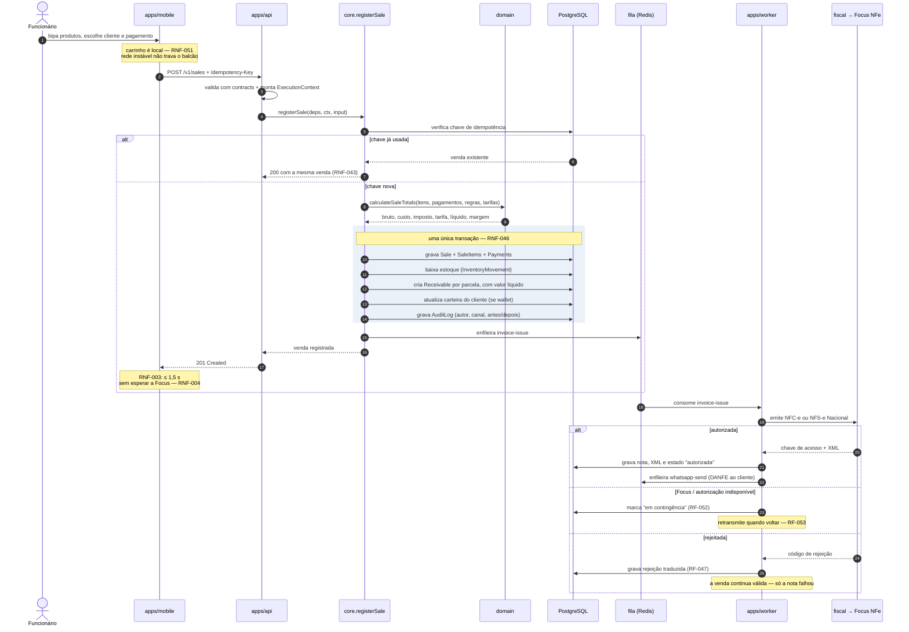
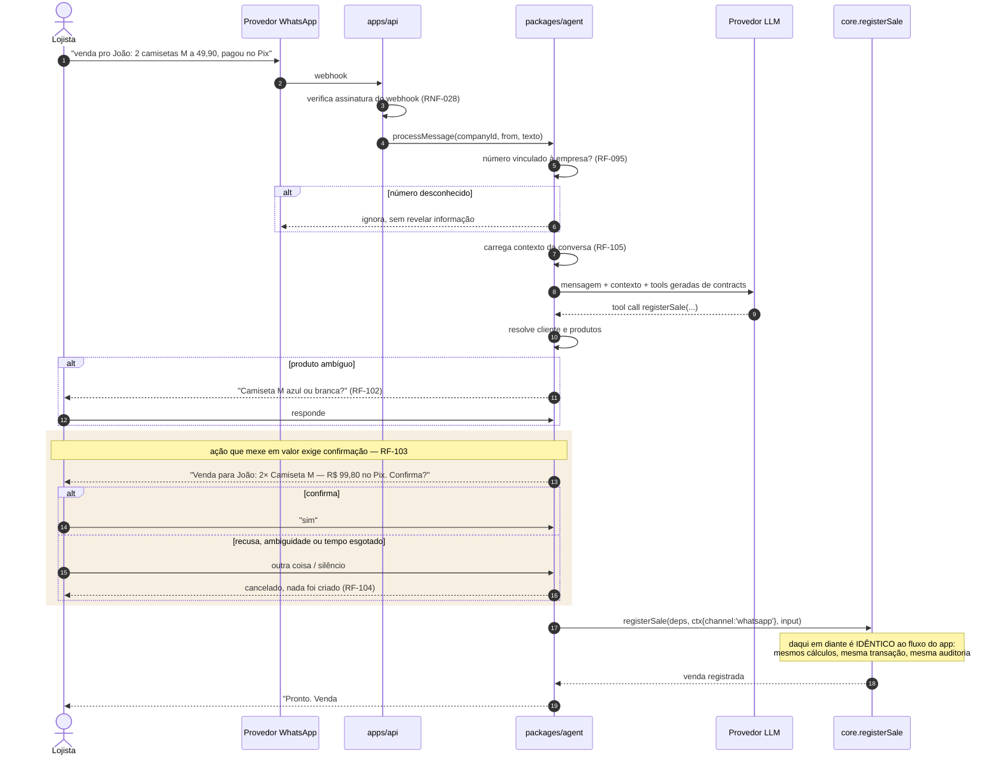
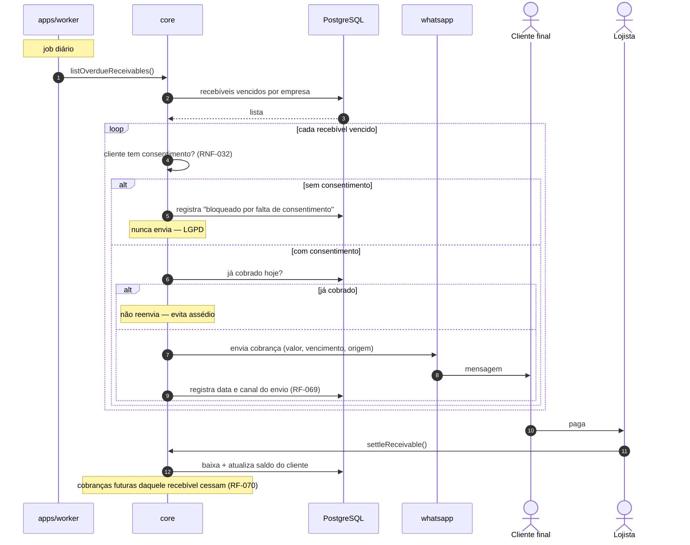
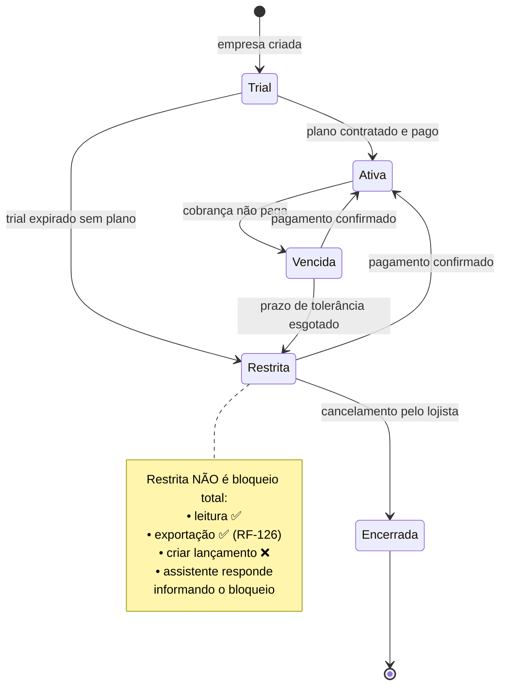
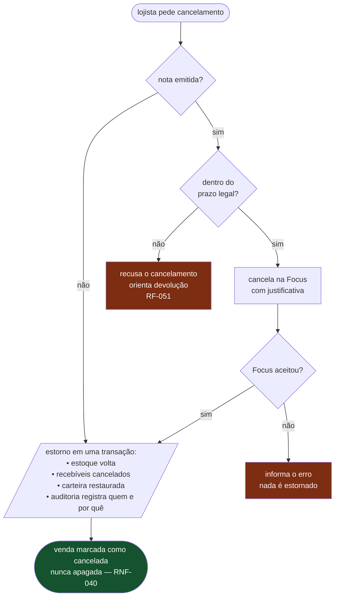
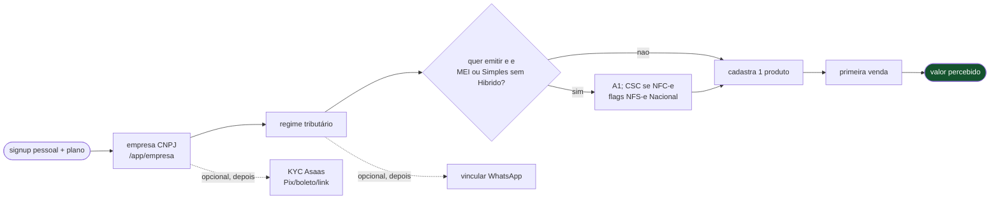

# Fluxos

Sequências ponta a ponta dos caminhos críticos. Mostram os
[princípios](principios.md) em ação — em especial a convergência dos dois canais
no mesmo caso de uso.

---

## Venda completa

O caminho crítico do produto. Requisitos: RF-027 a RF-044 · RNF-003, RNF-004,
RNF-043, RNF-046.

**Três decisões visíveis aqui:**

1. **A venda fecha antes da nota.** A emissão é assíncrona porque a autorização
   fiscal (Focus → SEFAZ ou Ambiente Nacional) é instável e o balcão não pode
   parar por causa disso. NFS-e Nacional quase sempre fica `processing` até o
   webhook.
2. **Uma transação para tudo que muda valor.** Ou venda, estoque, recebível e
   auditoria mudam juntos, ou nada muda.
3. **A idempotência é verificada antes de qualquer cálculo.** Rede ruim gera
   reenvio; reenvio não pode gerar venda dupla.
4. **Estado visível ao lojista é composto**, não um `status` na venda. Nota,
   recebível e falha de job vivem nas tabelas deles — ver
   [`dados.md`](dados.md#estados-da-venda).
   Falha no `registerSale` = nenhuma linha; falha na Focus/Asaas depois = venda
   existe com o estado filho explícito (RF-054, US-025).

## Venda pelo WhatsApp

O mesmo caso de uso, outro canal. Requisitos: RF-100 a RF-104.

### Confirmação de ações sensíveis

A regra que separa consulta de ação:

| Tipo de intenção   | Confirmação    | Exemplo                        |
| ------------------ | -------------- | ------------------------------ |
| Leitura            | ❌ não pede    | "quanto vendi hoje?"           |
| Criação de valor   | ✅ obrigatória | lançar venda, lançar conta     |
| Alteração de valor | ✅ obrigatória | mudar preço, alterar recebível |
| Exclusão / estorno | ✅ obrigatória | cancelar venda, estornar baixa |
| Envio a terceiro   | ✅ obrigatória | enviar cobrança ao cliente     |

Uma confirmação pendente expira. Resposta ambígua conta como **não** — o custo
de errar para o lado do "não" é uma pergunta repetida; para o lado do "sim" é um
lançamento financeiro errado.

## Cobrança de cliente inadimplente

Requisitos: RF-068 a RF-072 · RNF-032.

## Conciliação bancária

Fora do recorte A–J. [DEC-005](../decisoes/README.md#dec-005) adiada. Não
implementar `packages/banking` neste recorte.

## Assinatura e bloqueio por inadimplência

Requisitos: RF-110 a RF-118.

O estado `Restrita` é decisão de produto, não limitação técnica: sequestrar o
dado do lojista para forçar pagamento contradiz o princípio 5 da
[visão](../produto/visao.md#princípios-de-produto), e transforma um cliente
inadimplente em detrator.

## Cancelamento de venda com nota emitida

Requisitos: RF-043, RF-050, RF-051.

**A ordem importa:** cancela a nota **antes** de estornar. O contrário deixaria
o sistema estornado e a Focus/SEFAZ com nota válida.

## Onboarding até a primeira venda

Alvo: 15 minutos ([M3](../produto/visao.md#métricas-de-sucesso)).

Tudo que não está no caminho principal é adiável. O certificado na Focus é
pulável: venda e estoque funcionam; a nota fica `not_configured`. Empresa
inelegível para emitir ([DEC-017](../decisoes/README.md#dec-017)) segue o mesmo
caminho sem A1. Staff e Open Finance não entram neste fluxo.

## Documentos relacionados

- [Princípios](principios.md) — as regras que estes fluxos respeitam
- [Visão geral](visao-geral.md) — os containers envolvidos
- [Dados](dados.md) — as tabelas tocadas por estas transações
- [Esquema PostgreSQL](esquema-postgresql.md) — catálogo físico
- [User Stories](../produto/user-stories.md) — os critérios de aceite
