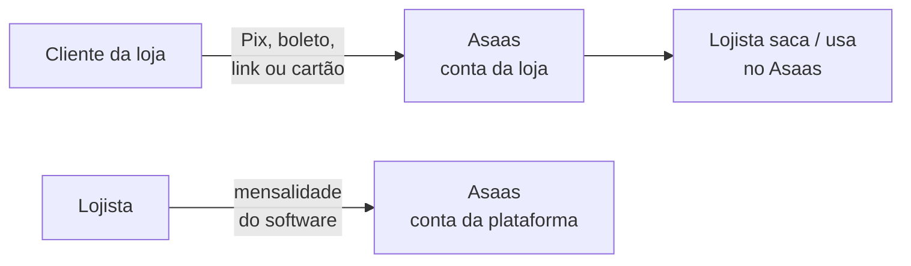

# Asaas — o que a plataforma faz com o dinheiro

O Asaas é o **caixa eletrônico da internet** desta plataforma: quem recebe Pix,
boleto, link e cartão online das vendas, e quem cobra a **nossa** mensalidade.

Este texto diz **o que nós mandamos** e **o que nós gravamos**. Não substitui a
[documentação do Asaas](https://docs.asaas.com). Recursos deles que não usamos
(BaaS, Escrow, Pix Automático, negativação, antecipação, nota fiscal do Asaas)
ficam de fora de propósito.

| Quer…                                       | Leia                                                    |
| ------------------------------------------- | ------------------------------------------------------- |
| A ordem no tempo (cadastro → venda → aviso) | [`fluxo-asaas.md`](fluxo-asaas.md)                      |
| Se a plataforma fica com uma fatia da venda | [`split-decision.md`](split-decision.md) (ainda aberto) |

Decisões: [ADR-0004](../../decisoes/adr/0004-asaas.md) (PSP + mensalidade),
[ADR-0005](../../decisoes/adr/0005-subconta-asaas-nao-baas.md) (uma conta Asaas
por loja). Origem: [DEC-006](../../decisoes/README.md#dec-006),
[DEC-010](../../decisoes/README.md#dec-010),
[DEC-015](../../decisoes/README.md#dec-015).

---

## Em uma frase

**Nós não ficamos com o dinheiro da venda.** O cliente paga o Asaas na conta da
**loja**. Dinheiro em espécie e maquininha da loja só são **anotados** no ERP —
não passam pelo Asaas. A mensalidade do software é outra conta Asaas: a **nossa**.

---

## Termos em uma linha

| Falamos…      | Quer dizer                                                                                                  |
| ------------- | ----------------------------------------------------------------------------------------------------------- |
| **PSP**       | Empresa que processa o pagamento (aqui: Asaas).                                                             |
| **Conta-pai** | A conta Asaas **nossa** (CNPJ da plataforma). Cria as contas das lojas e cobra a mensalidade.               |
| **Subconta**  | A conta Asaas **da loja**. É nela que cai o Pix/boleto/cartão da venda.                                     |
| **KYC**       | O Asaas conferindo se a loja é quem diz ser (documentos). Sem isso aprovado, não processa pagamento.        |
| **Não-BaaS**  | A loja entra no site/app do Asaas, cria senha e manda documento **lá**. Nós não fazemos isso por ela.       |
| **BaaS**      | O KYC inteiro dentro do _nosso_ app. Fora deste recorte.                                                    |
| **Webhook**   | O Asaas nos avisa sozinho (“o Pix caiu”, “o boleto compensou”).                                             |
| **Split**     | Dividir o valor da venda na hora: uma fatia para a plataforma, o resto para a loja. **Ainda não decidido.** |
| **Take-rate** | Essa fatia nossa por venda, se o Split existir.                                                             |

---

## O que o lojista vê no dia a dia

| Na loja                          | O que acontece de verdade                                                             |
| -------------------------------- | ------------------------------------------------------------------------------------- |
| Pix, boleto, link, cartão online | Só depois do Asaas **aprovar** a loja. O dinheiro cai na conta Asaas **dela**.        |
| Dinheiro ou maquininha           | Só registro no ERP. O Asaas nem é chamado.                                            |
| Mensalidade do ZapGestor         | Cobra na **nossa** conta Asaas, independente da conta da loja.                        |
| Cadastro da empresa no ERP       | **Não** obriga Asaas. Quem não vai usar Pix/boleto/link/cartão opera só com registro. |

**Trava:** Pix, boleto, link e cartão só se `company_integrations.payments_onboarding_status =
approved` (no Asaas, `accountStatus.general = APPROVED`). Sem isso, a venda
fecha mesmo assim — só que nesses meios o sistema recusa e aponta dinheiro /
maquininha.

O navegador **nunca** fala com o Asaas. Tudo passa pela nossa API.

---

## Duas contas, dois problemas

Parece o mesmo fornecedor. São **dois negócios**.

| Problema                    | Conta Asaas      | Pacote nosso | Analogia             |
| --------------------------- | ---------------- | ------------ | -------------------- |
| Cliente pagou a **loja**    | Subconta da loja | `payments`   | O caixa da mercearia |
| Loja pagou a **plataforma** | Conta-pai        | `billing`    | O aluguel do sistema |

O lojista na conta-pai é um **cliente** Asaas (`cus_`), não uma subconta. Não
misturar os dois ids.

`company_integrations.payments_wallet_id` é o endereço da carteira da subconta — só entra em
jogo se [DEC-018](../../decisoes/README.md#dec-018) escolher Split. Até lá
**não** enviamos `split[]`.

---

## KYC: o Asaas aprova a loja, não nós

No MVP a loja **tem** que abrir o Asaas (e-mail de ativação + senha +
documentos **no Asaas**). Isso é o modelo **não-BaaS**. Fazer o KYC inteiro
dentro do nosso app (BaaS) fica para depois.

| Modelo       | Quem manda o documento             | Neste recorte |
| ------------ | ---------------------------------- | ------------- |
| **Não-BaaS** | Lojista no site/app do Asaas       | **MVP**       |
| **BaaS**     | Jornada nossa, com BaaS contratado | Fora          |

Criar a subconta pela API **sem** BaaS contratado já nasce não-BaaS. Não existe
um campo no JSON que “vire” BaaS depois.

A conta-pai precisa ser **empresa (CNPJ)**. Conta de CPF **não** cria subconta.

---

## Ambiente e autenticação

Dois mundos. Chave de um **não** funciona no outro (`401` `invalid_environment`).

| Ambiente | URL base                           | Para quê                 |
| -------- | ---------------------------------- | ------------------------ |
| Sandbox  | `https://api-sandbox.asaas.com/v3` | Teste, sem dinheiro real |
| Produção | `https://api.asaas.com/v3`         | Loja de verdade          |

Toda chamada: header `access_token` (a chave da **conta que está operando** —
pai ou subconta) + `User-Agent` (quem somos) + `Content-Type: application/json`.

Prefixo da chave: `$aact_hmlg_` no sandbox, `$aact_prod_` em produção.

[Autenticação](https://docs.asaas.com/docs/autenticação-1) ·
[Sandbox](https://docs.asaas.com/docs/sandbox)

A chave da **conta-pai** vive em `ASAAS_API_KEY` (variável de ambiente). A chave
da **subconta** volta em `accessToken.apiKey` quando criamos a conta
(`POST /v3/accounts`) e vai para o **cofre**, apontada por
`company_integrations.payments_api_key_secret_ref` — nunca no Postgres em claro, nunca no log.
**Capturar na hora:** o Asaas some com a chave da resposta depois.

---

## O que pedimos ao Asaas

| Em português                        | Método / rota                                              | Quando                                          |
| ----------------------------------- | ---------------------------------------------------------- | ----------------------------------------------- |
| Abrir a conta da loja               | `POST /v3/accounts`                                        | Lojista pede Pix/boleto/link/cartão (jornada G) |
| Reenviar o e-mail de senha          | `POST /v3/accounts/{id}/resendActivationLink`              | E-mail de ativação perdido                      |
| “A loja já foi aprovada?”           | `GET /v3/myAccount/status`                                 | Webhook atrasou; tela Empresa                   |
| Cadastrar o cliente da loja         | `POST /v3/customers`                                       | Antes da primeira cobrança daquele cliente      |
| Gerar Pix / boleto / cartão         | `POST /v3/payments`                                        | Venda **já** gravada no ERP                     |
| QR / copia-e-cola do Pix            | `GET /v3/payments/{id}/pixQrCode`                          | `billingType=PIX`                               |
| Linha digitável do boleto           | `GET /v3/payments/{id}/identificationField`                | `billingType=BOLETO`                            |
| Conferir se pagou                   | `GET /v3/payments/{id}`                                    | Timeout, conciliação, aviso perdido             |
| Estornar                            | `POST /v3/payments/{id}/refund`                            | Cancelamento / devolução que passou pelo Asaas  |
| Link para cobrar à distância        | `POST /v3/paymentLinks`                                    | Ex.: WhatsApp                                   |
| Guardar cartão sem guardar o número | `POST /v3/creditCard/tokenizeCreditCard`                   | Cartão online — PAN nunca no nosso banco        |
| Tarifas da conta da loja            | `GET /v3/myAccount/fees/`                                  | Job periódico → tabela local de tarifa          |
| Cobrar a mensalidade                | `POST /v3/subscriptions`                                   | Conta-pai; o “cliente” é o lojista              |
| Avisos automáticos                  | `webhooks` no POST da subconta; `POST /v3/webhooks` na pai | Ao criar a subconta e uma vez na pai            |

**Não usamos neste recorte:** BaaS / white-label, Escrow, Pix Automático,
negativação (`paymentDunnings`), antecipação, pagamento de contas, recarga,
notas fiscais do Asaas (`/v3/invoices` — a NF é da Focus), Split (até
DEC-018).

---

## Abrir a subconta — o que enviamos

`POST /v3/accounts` com a chave da **conta-pai**. É o cadastro da loja no Asaas,
não o cadastro no nosso ERP (esse já existe).

| Campo Asaas     | De onde vem                                                                                   | Gravamos?                 |
| --------------- | --------------------------------------------------------------------------------------------- | ------------------------- |
| `name`          | `companies.legal_name`                                                                        | sim (cadastro)            |
| `email`         | `companies.email` (o e-mail de ativação chega **aqui**)                                       | sim                       |
| `cpfCnpj`       | `companies.cnpj`                                                                              | sim                       |
| `mobilePhone`   | `companies.phone`                                                                             | sim                       |
| `incomeValue`   | faturamento mensal estimado, em reais — **perguntamos no início do KYC**, não em toda empresa | sim, em centavos          |
| `address`       | `companies.street`                                                                            | sim                       |
| `addressNumber` | `companies.street_number`                                                                     | sim                       |
| `province`      | `companies.neighborhood`                                                                      | sim                       |
| `postalCode`    | `companies.postal_code`                                                                       | sim                       |
| `complement`    | `companies.complement`                                                                        | sim                       |
| `phone`         | opcional                                                                                      | —                         |
| `companyType`   | MEI → `MEI`; demais PJ → `LIMITED`                                                            | não (sai do regime)       |
| `webhooks`      | URL nossa + senha de aviso (`authToken`, 32–255 caracteres, **não** é a chave da API)         | `webhook_auth_secret_ref` |

`incomeValue` chega decimal. Converter na borda com `Money`.

Sandbox: até 20 subcontas por dia. E-mails de subconta no sandbox vão para o
e-mail da **conta raiz** (a nossa), não para o da loja.

---

## Abrir a subconta — o que recebemos e gravamos

Linha em `company_integrations` **só** quando o lojista começa o KYC (ou o fiscal).
Loja que nunca pediu Pix não ganha `payments_*` preenchidos.

| O Asaas devolve                   | Onde fica                                        |
| --------------------------------- | ------------------------------------------------ |
| `id` da subconta                  | `company_integrations.payments_account_id`       |
| `walletId` (carteira)             | `company_integrations.payments_wallet_id`        |
| `accessToken.apiKey`              | cofre — **não** coluna em claro                  |
| `accountStatus.general`           | `payments_onboarding_status` (traduzido abaixo)  |
| `cus_` na conta-pai (mensalidade) | `billing_customer_id` quando o billing cadastrar |

Tradução do `general`:

| Asaas diz                       | Nós gravamos  | Lojista entende       |
| ------------------------------- | ------------- | --------------------- |
| _(ainda não criou)_             | `not_started` | Nem começou           |
| `PENDING` / `AWAITING_APPROVAL` | `pending`     | Esperando o Asaas     |
| `APPROVED`                      | `approved`    | Pode receber Pix etc. |
| `REJECTED`                      | `rejected`    | Recusado; dinheiro ok |

Aprovação chega pelo aviso `ACCOUNT_STATUS_GENERAL_APPROVAL_APPROVED` ou
perguntando `GET /v3/myAccount/status` com a chave da subconta. **Não existe**
aviso de “conta criada”: o POST já devolve o id na hora. O que demora é o KYC.

---

## Cliente da loja no Asaas

O Asaas exige um `customer` para gerar cobrança e **aceita cadastro duplicado**.
Por isso reutilizamos o id em `customers.payments_customer_id`.

| Campo Asaas   | De onde vem                    | Gravamos?                        |
| ------------- | ------------------------------ | -------------------------------- |
| `name`        | `customers.name`               | sim (cadastro)                   |
| `cpfCnpj`     | `customers.document` se houver | sim                              |
| `email`       | `customers.email`              | sim                              |
| `mobilePhone` | `customers.phone`              | sim                              |
| `id` (`cus_`) | resposta                       | `customers.payments_customer_id` |

Venda de balcão sem cliente: cadastrar um pagador genérico da loja **ou**
mandar um **link** (`paymentLinks`), em que o pagador preenche os dados.

---

## Cobrança da venda — o que enviamos

A venda **já está no banco** quando isso roda. Montamos em `packages/payments`.
`externalReference` = id da nossa linha `payments` (para casar o aviso depois).

| Campo Asaas         | De onde vem                                                    |
| ------------------- | -------------------------------------------------------------- |
| `customer`          | `customers.payments_customer_id`                               |
| `billingType`       | `PIX` \| `BOLETO` \| `CREDIT_CARD`                             |
| `value`             | `Money` → decimal na borda                                     |
| `dueDate`           | obrigatório; no boleto é o vencimento                          |
| `description`       | número da venda                                                |
| `externalReference` | `payments.id`                                                  |
| `split`             | **não enviar** até [DEC-018](../../decisoes/README.md#dec-018) |

[Criar cobrança](https://docs.asaas.com/docs/guia-de-cobrancas) ·
[Pix](https://docs.asaas.com/docs/cobrancas-via-pix) ·
[Boleto](https://docs.asaas.com/docs/cobrancas-via-boleto) ·
[Cartão](https://docs.asaas.com/docs/cobrancas-via-cartao-de-credito)

### Boleto

`GET /v3/payments/{id}/identificationField` devolve a linha digitável
(`identificationField`), o código de barras e o nosso número. Se valor ou
vencimento mudar, buscar de novo. O PDF vem em `bankSlipUrl`.

Desconto, juros e multa do boleto existem na API; a tela ainda não fecha
regra de produto — o contrato admite.

### Pix

`GET /v3/payments/{id}/pixQrCode` — o copia-e-cola vai em
`payments.pix_payload`. **Gerar o QR não é o cliente ter pago.**

### Cartão

Tokenizar (`POST /v3/creditCard/tokenizeCreditCard`) e gravar só
`card_token_ref`. Número e CVV **não** ficam conosco. Parcelas:
`installmentCount` / `installmentValue` quando o produto pedir.

---

## Cobrança da venda — o que recebemos e gravamos

Colunas de provedor **só** na linha online (Pix, boleto, link, cartão) em
`payments`. Dinheiro e maquininha deixam `provider_*` nulos.

| O Asaas fala                 | Coluna nossa                     |
| ---------------------------- | -------------------------------- |
| `id` (`pay_…`)               | `provider_payment_id`            |
| `status`                     | `provider_status`                |
| `invoiceUrl` / URL do link   | `checkout_url`                   |
| `billingType`                | traduzido para `payments.method` |
| id do aviso (`evt_…`)        | `provider_event_id` (único)      |
| copia-e-cola Pix             | `pix_payload`                    |
| `bankSlipUrl`                | `bank_slip_url`                  |
| linha digitável              | `identification_field`           |
| `dueDate`                    | `due_date`                       |
| `creditCard.creditCardToken` | `card_token_ref`                 |

`value` / `netValue` vêm decimal (`129.9`). Converter com `Money.parse` na
borda — nunca `parseFloat`.

A tela da venda **monta** o estado a partir disto (não existe um
`sales.status` “pago no Asaas”):

| Lojista quer saber | Aviso que **baixa** o recebível da venda | Cuidado                                                                                        |
| ------------------ | ---------------------------------------- | ---------------------------------------------------------------------------------------------- |
| Pix pago           | `PAYMENT_RECEIVED`                       | —                                                                                              |
| Boleto compensado  | `PAYMENT_CONFIRMED`                      | `PAYMENT_RECEIVED` aqui é o dinheiro **caindo na conta** (D+), não o “pode dar baixa na venda” |
| Cartão autorizado  | `PAYMENT_CONFIRMED`                      | idem: `PAYMENT_RECEIVED` é crédito na conta                                                    |
| Boleto vencido     | `PAYMENT_OVERDUE`                        | A venda **continua existindo**                                                                 |
| Estornado          | `PAYMENT_REFUNDED`                       | —                                                                                              |

Pix no fluxo feliz **não** dispara `CONFIRMED`. Cada meio tem o aviso certo —
trocar os dois é o bug mais caro desta integração.

---

## Link de pagamento

`POST /v3/paymentLinks`. O pagador preenche os dados. `billingType`
`UNDEFINED` deixa escolher Pix, boleto ou cartão. A cobrança gerada traz
`paymentLink`; casamos pelo aviso + `externalReference` se enviarmos.

O Asaas **não** aceita Split em link. Se DEC-018 escolher fatia por venda,
cobrança a distância usa `POST /v3/payments` + `invoiceUrl`, não este recurso.
Detalhe em [`split-decision.md`](split-decision.md).

---

## Mensalidade (conta-pai)

`packages/billing` entra com `ASAAS_API_KEY`. Cadastra o lojista como cliente
na conta-pai (`company_integrations.billing_customer_id`) e cria
`POST /v3/subscriptions` (Pix, boleto ou cartão, conforme o plano).

**Criar a assinatura não é “já pagou”.** Os avisos `SUBSCRIPTION_*` e
`PAYMENT_*` vêm da **conta-pai**. Trial, atraso e o estado Restrita são regra
nossa ([`fluxos.md`](../fluxos.md#assinatura-e-bloqueio-por-inadimplência)).

[Assinaturas](https://docs.asaas.com/docs/assinaturas)

---

## Split (só o formato; não implementar)

Na cobrança, um array: carteira (`walletId`) + valor fixo **ou** percentual
sobre o líquido (`netValue`). O que sobrar fica na conta que emitiu. Até
DEC-018 **não enviamos**. Decisão: [`split-decision.md`](split-decision.md).

---

## Como o Asaas nos avisa (webhooks)

Pense num correio: o Asaas entrega o recado na nossa URL. Nós respondemos
“recebi” na hora e lemos o conteúdo depois, na fila.

- Autenticação: header `asaas-access-token` = o `authToken` que **nós**
  cadastramos (32–255 caracteres, sem espaço). **Não** é a chave da API.
  Sem esse header certo, ignorar.
- Cada recado tem um id (`evt_…`). Gravamos em `webhook_events` — o mesmo id
  duas vezes não processa de novo.
- Responder **200** imediatamente; trabalhar na fila `webhook-process`.
- O Asaas pode entregar o **mesmo** recado mais de uma vez. Depois de 15
  falhas seguidas, **pausa** a fila — por isso também consultamos a API se o
  aviso não vier.
- O JSON pode ganhar campo novo amanhã. O leitor não pode quebrar.
- Avisos `PAYMENT_SPLIT_*` só importam se DEC-018 fechar com Split.
- Situação da loja: `ACCOUNT_STATUS_*`. Aprovação geral:
  `ACCOUNT_STATUS_GENERAL_APPROVAL_APPROVED`.

[Receber eventos](https://docs.asaas.com/docs/receba-eventos-do-asaas-no-seu-endpoint-de-webhook) ·
[Cobranças](https://docs.asaas.com/docs/webhook-para-cobrancas) ·
[Situação da conta](https://docs.asaas.com/docs/webhook-para-verificar-situacao-da-conta)

URL sugerida: `/v1/webhooks/asaas`. Separar pai e loja pelo `account.id` **ou**
por caminhos `/webhooks/asaas/platform` e `/webhooks/asaas/subaccounts`.
Token da pai em `ASAAS_WEBHOOK_AUTH_TOKEN`; token da loja no cofre.

---

## Tarifas de cartão

`GET /v3/myAccount/fees/` na **subconta** alimenta a tabela local
(`CardFeeTable`) **fora** da hora da venda
([RNF-003](../../produto/requisitos-nao-funcionais.md),
[RNF-041](../../produto/requisitos-nao-funcionais.md)). Não ligar para
`POST /v3/payments/simulate` enquanto o lojista espera o cupom.

---

## Variáveis de ambiente

| Variável                   | Uso                                            |
| -------------------------- | ---------------------------------------------- |
| `PAYMENTS_PROVIDER`        | `fake` \| `asaas` — vendas da loja             |
| `BILLING_PROVIDER`         | `fake` \| `asaas` — nossa mensalidade          |
| `ASAAS_BASE_URL`           | sandbox ou produção                            |
| `ASAAS_API_KEY`            | chave da **conta-pai**                         |
| `ASAAS_USER_AGENT`         | identificar a aplicação                        |
| `ASAAS_WEBHOOK_AUTH_TOKEN` | senha dos avisos da conta-pai                  |
| `ASAAS_WALLET_ID`          | carteira da pai — só se DEC-018 escolher Split |

Chave e senha de aviso **por loja** não são env global: são segredo por
`company_id`.

Matriz completa: [`ambientes.md`](../../engenharia/ambientes.md).

---

## Adapter

`packages/payments` fala com o Asaas pelas **vendas**. `packages/billing` fala
pelas **mensalidades**. Com `fake`, o sistema sobe sem conta Asaas e ainda
simula: KYC ok / recusado, timeout, Pix pago, boleto confirmado, cartão
confirmado, inadimplência.

A porta pode aceitar `split` opcional; o adapter real só manda o array quando
DEC-018 fechar. Não escrever no código “nunca vai ter split”.

## Documentos relacionados

- [`fluxo-asaas.md`](fluxo-asaas.md) — ordem no tempo e lista de rotas
- [`split-decision.md`](split-decision.md) — fatia por venda, sim ou não
- [ADR-0004](../../decisoes/adr/0004-asaas.md)
- [ADR-0005](../../decisoes/adr/0005-subconta-asaas-nao-baas.md)
- [`packages/payments`](../../../packages/payments/README.md)
- [`packages/billing`](../../../packages/billing/README.md)
- [`dados.md`](../dados.md)
