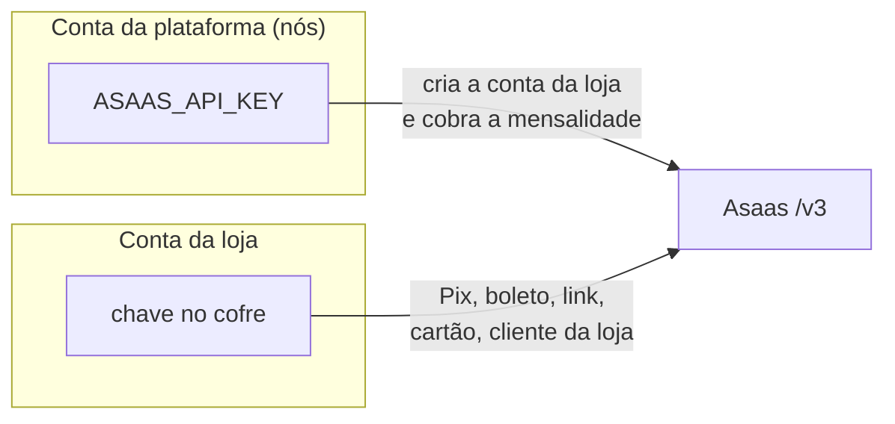
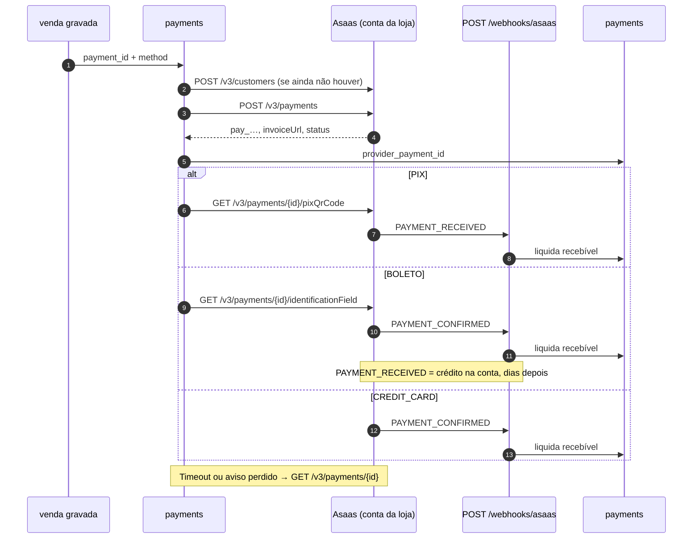
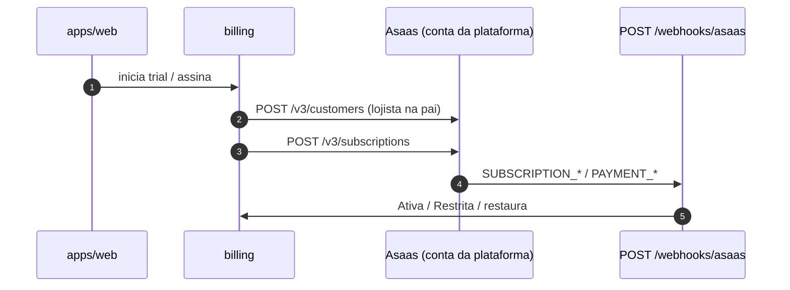

# Fluxo Asaas — a ordem das coisas

O contrato (o que gravamos em cada coluna) está em [`asaas.md`](asaas.md).
Aqui é o **quando**: abrir a conta da loja, cobrar a venda, cobrar a
mensalidade, e o que o Asaas nos avisa sozinho.

Termos (conta-pai, subconta, KYC, webhook): tabela no
[`asaas.md`](asaas.md#termos-em-uma-linha). Split:
[`split-decision.md`](split-decision.md). Fonte oficial:
[docs.asaas.com](https://docs.asaas.com).

Neste recorte: **Pix, boleto, link, cartão online** + mensalidade na conta da
plataforma. Fora: BaaS, Escrow, Pix Automático, maquininha/TEF, nota fiscal do
Asaas. Ver [ADR-0007](../../decisoes/adr/0007-asaas.md) e
[ADR-0008](../../decisoes/adr/0008-subconta-asaas-nao-baas.md).

O navegador **nunca** chama o Asaas. Cadastro, cobrança e tokenização passam
pela nossa API / worker.

---

## Quatro ideias que costumam estar erradas

1. **Abrir a conta é na hora; ser aprovado não é.** Pedimos `POST /v3/accounts`
   e o Asaas já devolve o número da conta, a carteira e a chave. Depois a loja
   recebe e-mail, cria senha e manda documento **no Asaas**. Não existe aviso
   de “conta criada”. Existe aviso de **“documentos aprovados / recusados”**.
2. **A chave do Asaas não é o login do lojista no nosso app.** Há a chave
   **nossa** (`ASAAS_API_KEY`: só criar contas de loja e cobrar mensalidade) e
   a chave **da loja** (as vendas). São senhas diferentes.
3. **Gerar o Pix/boleto não é o cliente ter pago.** Pix “caiu”:
   `PAYMENT_RECEIVED`. Boleto compensado ou cartão autorizado:
   `PAYMENT_CONFIRMED`. No boleto/cartão, `PAYMENT_RECEIVED` é o dinheiro
   **entrando na conta Asaas** (dias depois) — não é o sinal para dar baixa na
   venda.
4. **Venda da loja e mensalidade nossa não se misturam.** Uma conta Asaas para
   cada. Cliente Asaas (`cus_`) e avisos também são de contas diferentes.

O aviso automático **não** se cadastra “para o POST que cria a conta”.
Cadastra-se para: situação da loja, cobrança paga, e (na nossa conta)
assinatura.

---

## O que vale em toda chamada

| Tema        | Regra                                                                                         |
| ----------- | --------------------------------------------------------------------------------------------- |
| Sandbox     | `https://api-sandbox.asaas.com/v3` — brinquedo, sem valor real                                |
| Produção    | `https://api.asaas.com/v3`                                                                    |
| Auth        | Header `access_token` + `User-Agent`                                                          |
| Chaves      | `$aact_hmlg_` só no sandbox; `$aact_prod_` só em produção                                    |
| Dinheiro    | `value` / `netValue` / `incomeValue` entram decimal → `Money.parse` na porta da frente        |
| Aviso repetido | o campo `id` do evento (`evt_…`) — o mesmo recado duas vezes não baixa duas vezes          |

Nós usamos `ASAAS_BASE_URL` + `ASAAS_API_KEY` (pai). Chave da loja: cofre, uma
por `company_id`.

[Autenticação](https://docs.asaas.com/docs/autenticação-1) ·
[Sandbox](https://docs.asaas.com/docs/sandbox)

---

## Quem usa qual chave



| Quem autentica     | Serve para                                                              |
| ------------------ | ----------------------------------------------------------------------- |
| Conta da plataforma | Criar/listar contas de loja; cliente+assinatura SaaS; avisos da pai    |
| Conta da loja      | Clientes da mercearia, cobranças, links, Pix/boleto, tarifas, “já aprovou?” |

Guardamos em `company_integrations`: número da conta, carteira, ponteiro da chave no
cofre, ponteiro da senha de aviso.

---

## Fluxo 1 — a loja pede para receber Pix (opcional)

Cadastrar a empresa no ERP **não** exige Asaas. Este fluxo só roda quando o
lojista quer Pix, boleto, link ou cartão. Enquanto isso (ou se o Asaas recusar),
dinheiro e maquininha continuam.

Na prática: o lojista informa o faturamento mensal estimado → nós abrimos a
conta no Asaas → o Asaas manda e-mail → a loja cria senha e envia documento
**lá** → quando o Asaas aprova, o ERP libera os meios online.

```mermaid
sequenceDiagram
    autonumber
    actor L as Lojista
    participant W as apps/web
    participant A as apps/api
    participant S as Asaas (conta da plataforma)
    participant Sub as Asaas (conta da loja)
    participant WH as POST /webhooks/asaas

    L->>W: pede para receber Pix etc. (informa faturamento estimado)
    W->>A: grava company_integrations (payments_onboarding_status=pending)
    A->>S: POST /v3/accounts (+ webhooks)
    S-->>A: id, walletId, apiKey
    A->>A: guarda a chave no cofre
    Note over S,L: e-mail de ativação
    L->>Sub: cria senha e envia documentos no Asaas
    Sub->>WH: ACCOUNT_STATUS_*
    WH->>A: payments_onboarding_status
    alt general APPROVED
        A-->>W: Pix/boleto/link/cartão liberados
    else REJECTED
        A-->>W: recusado; dinheiro/maquininha ok
    end
```

Campos do corpo: [`asaas.md`](asaas.md). Além do cadastro que a loja já tem:

| Precisa                         | Para                                        |
| ------------------------------- | ------------------------------------------- |
| `incomeValue`                   | o Asaas exige para abrir a conta            |
| `webhooks` já na criação        | começar a ouvir “aprovado/recusado” no dia 1 |
| E-mail da empresa que a loja lê | senha de ativação                           |

Se o e-mail se perder: `POST /v3/accounts/{id}/resendActivationLink`.

**Produção, primeiras lojas** (período de avaliação do Asaas): até **10**
subcontas, **R$ 2.000** por subconta, **60 dias**. Estourar qualquer limite
trava criar conta e emitir cobrança até a homologação regulatória.
[FAQ](https://docs.asaas.com/docs/faq-periodo-de-avaliacao).

Depois disso, gerir chaves de lojas com CNPJ **diferente** do nosso pode exigir
BaaS ou filial. Por isso **capturamos a chave na criação**. BaaS fica no
“quando revisitar” da ADR-0008.

---

## Fluxo 2 — cobrar uma venda que já fechou

A venda **não espera** o Asaas ([`fluxos.md`](../fluxos.md)): estoque e
recebível já existem. Sem KYC aprovado **não** chamamos o Asaas (RF-140) — a
loja usa dinheiro/maquininha. Com KYC ok, o worker entra com a chave **da loja**.

Na prática: geramos a cobrança → mostramos QR, boleto ou pedido de cartão →
o Asaas avisa quando pagou → damos baixa no recebível. Se o aviso não vier,
perguntamos.



| Meio   | Pedido                       | Extra                         | Quando a venda está **paga** |
| ------ | ---------------------------- | ----------------------------- | ---------------------------- |
| Pix    | `/v3/payments` `PIX`         | `GET …/pixQrCode`             | `PAYMENT_RECEIVED`           |
| Boleto | `/v3/payments` `BOLETO`      | `GET …/identificationField`   | `PAYMENT_CONFIRMED`          |
| Cartão | `/v3/payments` `CREDIT_CARD` | tokenização                   | `PAYMENT_CONFIRMED`          |
| Link   | `/v3/paymentLinks`           | pagador preenche              | o mesmo do meio que ele escolheu |

Estorno: `POST /v3/payments/{id}/refund` **antes** de desfazer estoque/recebível,
se a cobrança Asaas existir.

`externalReference` = id da nossa `payments`. Um `pay_` por linha.

---

## Fluxo 3 — a loja paga o software (conta da plataforma)

Independente do KYC da conta da loja. O signup pode cobrar o plano **antes**
de existir subconta.

Na prática: trial ou assinatura → cadastramos o lojista como cliente **nosso**
no Asaas → criamos a assinatura → os avisos ligam/desligam o estado Restrita.



---

## Quais avisos cadastrar

| Evento Asaas                         | Cadastrar? | Em português                                 |
| ------------------------------------ | ---------- | -------------------------------------------- |
| _(criação da conta da loja)_         | **Não**    | A resposta do POST já traz o id              |
| `ACCOUNT_STATUS_GENERAL_APPROVAL_*`  | **Sim**    | Loja aprovada ou recusada                    |
| `ACCOUNT_STATUS_DOCUMENT_*` etc.     | Sim        | Tela de “o que falta no KYC”                 |
| `PAYMENT_CREATED`                    | Opcional   | Auditoria                                    |
| `PAYMENT_RECEIVED`                   | **Sim**    | Pix pago; no boleto/cartão = dinheiro na conta |
| `PAYMENT_CONFIRMED`                  | **Sim**    | Boleto e cartão: pode dar baixa na venda     |
| `PAYMENT_OVERDUE`                    | **Sim**    | Boleto venceu                                |
| `PAYMENT_REFUNDED` / chargeback      | **Sim**    | Estorno                                      |
| `SUBSCRIPTION_*`                     | **Sim** na pai | Mensalidade                               |
| `PAYMENT_SPLIT_*`                    | Só se DEC-018 fechar com Split | fatia por venda           |

Na conta da loja, preferir o array `webhooks` já no `POST /v3/accounts`.
`authToken` nosso, header `asaas-access-token`. `sendType`: `SEQUENTIALLY`.
`apiVersion`: 3.

Responder **2xx** na hora; processar na fila `webhook-process`. Idempotência:
`evt_…`. Se o POST falhar, o Asaas tenta de novo até pausar a fila — por isso
o worker também **pergunta** (`GET /v3/payments/{id}` e
`GET /v3/myAccount/status`).

---

## Lista de rotas (quem for implementar)

Prefixo: `{ASAAS_BASE_URL}` (`/v3`). A coluna da direita é a página oficial.

### 1. Contas de loja — chave da plataforma

| Uso nosso              | Método | Rota                                      | Doc |
| ---------------------- | ------ | ----------------------------------------- | --- |
| Criar                  | `POST` | `/accounts`                               | [Criar subconta](https://docs.asaas.com/reference/criar-subconta) |
| Listar                 | `GET`  | `/accounts`                               | [Listar](https://docs.asaas.com/reference/listar-subcontas) |
| Consultar              | `GET`  | `/accounts/{id}`                          | [Consultar](https://docs.asaas.com/reference/recuperar-uma-unica-subconta) |
| Reenviar ativação      | `POST` | `/accounts/{id}/resendActivationLink`     | não-BaaS |

[Subcontas](https://docs.asaas.com/docs/subcontas) ·
[Criação](https://docs.asaas.com/docs/criacao-de-subcontas) ·
[Aprovação](https://docs.asaas.com/docs/detalhamento-do-fluxo-de-aprovação-de-subcontas)

### 2. “Já aprovou?” e tarifas — chave da loja

| Uso nosso        | Método | Rota                    | Doc |
| ---------------- | ------ | ----------------------- | --- |
| Situação KYC     | `GET`  | `/myAccount/status/`    | [Situação cadastral](https://docs.asaas.com/reference/consultar-situacao-cadastral-da-conta) |
| Tarifas          | `GET`  | `/myAccount/fees/`      | [Taxas](https://docs.asaas.com/reference/recuperar-taxas-da-conta) |
| Carteira         | `GET`  | `/wallets/`             | conferência do `walletId` |

### 3. Clientes e cobranças — chave da loja (vendas) ou da plataforma (SaaS)

| Uso nosso            | Método | Rota                                 | Doc |
| -------------------- | ------ | ------------------------------------ | --- |
| Criar cliente        | `POST` | `/customers`                         | [Criar](https://docs.asaas.com/reference/criar-novo-cliente) |
| Criar cobrança       | `POST` | `/payments`                          | [Criar](https://docs.asaas.com/reference/criar-nova-cobranca) |
| Consultar            | `GET`  | `/payments/{id}`                     | [Consultar](https://docs.asaas.com/reference/recuperar-uma-unica-cobranca) |
| QR Pix               | `GET`  | `/payments/{id}/pixQrCode`           | [QR Code](https://docs.asaas.com/reference/obter-qr-code-para-pagamentos-via-pix) |
| Linha digitável      | `GET`  | `/payments/{id}/identificationField` | [Boleto](https://docs.asaas.com/reference/obter-linha-digitavel-do-boleto) |
| Estornar             | `POST` | `/payments/{id}/refund`              | [Estorno](https://docs.asaas.com/reference/estornar-cobranca) |
| Tokenizar cartão     | `POST` | `/creditCard/tokenizeCreditCard`     | [Tokenização](https://docs.asaas.com/reference/tokenizacao-de-cartao-de-credito) |
| Link                 | `POST` | `/paymentLinks`                      | [Links](https://docs.asaas.com/docs/criando-um-link-de-pagamentos) |
| Assinatura           | `POST` | `/subscriptions`                     | [Assinaturas](https://docs.asaas.com/docs/criando-uma-assinatura) |

### 4. Avisos

| Uso nosso | Método   | Rota            | Doc |
| --------- | -------- | --------------- | --- |
| Criar     | `POST`   | `/webhooks`     | [Criar](https://docs.asaas.com/docs/criar-novo-webhook-pela-api) |
| Preferir  | no body  | `POST /accounts` `webhooks[]` | na criação da conta da loja |

---

## Fora deste mapa (de propósito)

BaaS (`onboardingUrl`, gestão de keys depois da avaliação), Escrow, Pix
Automático, negativação, antecipação, `/v3/invoices` (NF Asaas), pagamento de
boleto de terceiro, recarga. Split: formato em [`asaas.md`](asaas.md), decisão
em [`split-decision.md`](split-decision.md) — **não** está neste mapa até
DEC-018.

---

## Documentos relacionados

- [`asaas.md`](asaas.md) — o que mandamos, o que gravamos
- [`split-decision.md`](split-decision.md)
- [ADR-0007](../../decisoes/adr/0007-asaas.md)
- [ADR-0008](../../decisoes/adr/0008-subconta-asaas-nao-baas.md)
- [`fluxos.md`](../fluxos.md) — a venda fecha antes do Asaas
- [`packages/payments`](../../../packages/payments/README.md)
