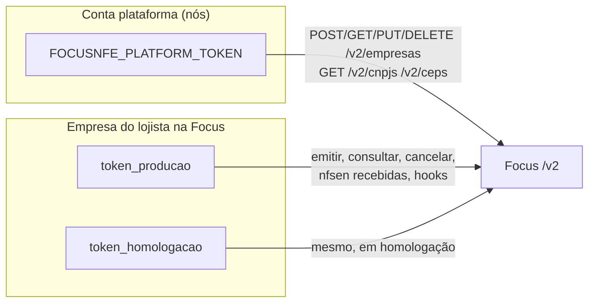
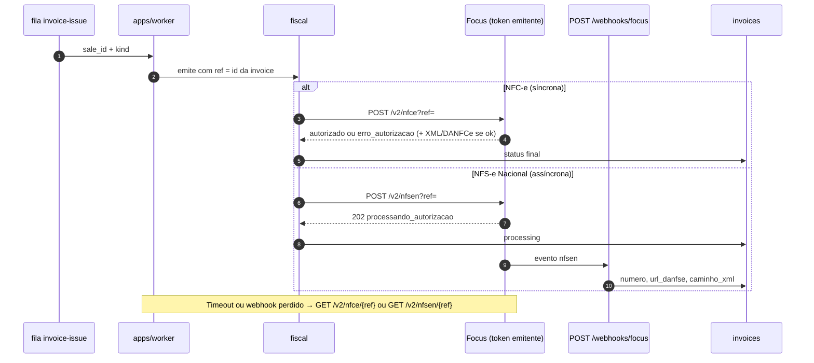

# Fluxo Focus NFe

Como a integração **acontece no tempo**: cadastro do emitente, tokens,
emissão, webhooks e NFS-e Nacional recebidas. O contrato send/receive (o que
gravamos em coluna) continua em [`focusnfe.md`](focusnfe.md). Fonte oficial:
[doc.focusnfe.com.br](https://doc.focusnfe.com.br/reference/introducao.md).

Recorte: **NFC-e** + **NFS-e Nacional** (`/v2/nfsen`). Fora: NF-e (modelo 55),
NFS-e municipal (`/v2/nfse`), CT-e, MDF-e, NFCom, DCe, NFGás, NF-e recebidas e
Comunicador Offline. Ver [`focusnfe.md`](focusnfe.md).
Emissão só se a empresa for MEI ou Simples **sem** Híbrido
([`focusnfe.md`](focusnfe.md)).

O browser **nunca** chama a Focus. Autocomplete, cadastro e emissão passam
pela nossa API / worker.

---

## Correções do modelo mental

Três pontos costumam sair errados. O fluxo real:

1. **Cadastro da empresa na Focus é síncrono.** Mandamos dados + A1 no
   `POST /v2/empresas`. A Focus responde **na mesma requisição**: 200 com `id`,
   `token_producao`, `token_homologacao` e validade do certificado; ou 422
   (senha, CNPJ divergente, A1 vencido). **Não existe webhook de “conta
   aprovada”.** Não há fila nem espera em minutos. “Aprovado” aqui é só a
   Focus ter aceito o JSON e o PFX — **não** é credenciamento na SEFAZ nem
   no emissor nacional.
2. **O token não é do usuário.** É o token da **empresa emitente** na Focus
   (`token_producao` / `token_homologacao`). Login do lojista no EiBuddy é
   outro assunto. Há ainda o **token da conta plataforma** (revenda /
   integração multi-CNPJ), usado só em `/v2/empresas` e nas APIs acessórias.
3. **Emissão não devolve sempre a nota pronta.** NFC-e é síncrona (autorização
   ou rejeição no POST). NFS-e Nacional é assíncrona: o POST devolve `202` /
   `processando_autorizacao`; XML, número e DANFSe vêm depois, por **webhook**
   ou `GET`.

Webhook **não** se configura para o cadastro. Configura-se para autorização
de NFS-e Nacional, contingência de NFC-e e NFS-e Nacional recebidas.

---

## Getting Started (o que vale em toda chamada)

| Tema        | Regra                                                                                                                  |
| ----------- | ---------------------------------------------------------------------------------------------------------------------- |
| Homologação | `https://homologacao.focusnfe.com.br` — documento **sem** valor fiscal                                                 |
| Produção    | `https://api.focusnfe.com.br`                                                                                          |
| Prefixo     | `/v2`                                                                                                                  |
| Auth        | HTTP Basic: usuário = token, **senha vazia** (`Authorization: Basic base64(token:)`)                                   |
| `ref`       | Alfanumérico, único **por token**. Reusa se a nota foi rejeitada; **não** reusa depois de autorizada (mesmo cancelada) |
| SSL         | HTTPS obrigatório; em Java pode ser preciso importar a cadeia                                                          |

Nós usamos `FISCAL_ENVIRONMENT` + `FOCUSNFE_BASE_URL`. Token de plataforma:
`FOCUSNFE_PLATFORM_TOKEN`. Token do emitente: secret ref por `company_id`,
nunca coluna em claro, nunca log.

A API de **Empresas**, na documentação da Focus, “opera exclusivamente no
ambiente de produção”; testes de cadastro usam `?dry_run=1`. Emissão de notas
usa homologação ou produção conforme a URL base.

[Ambiente](https://doc.focusnfe.com.br/reference/ambiente.md) ·
[Autenticação](https://doc.focusnfe.com.br/reference/autenticacao.md) ·
[Referência (ref)](https://doc.focusnfe.com.br/reference/referencia.md) ·
[Introdução](https://doc.focusnfe.com.br/reference/introducao.md)

---

## Dois tokens



| Quem autentica                      | Onde                                                                     |
| ----------------------------------- | ------------------------------------------------------------------------ |
| Token plataforma                    | Empresas + CNPJ/CEP (e demais acessórias se usarmos)                     |
| Token do emitente                   | NFC-e, NFS-e Nacional, NFS-e Nacional recebidas, reenvio de hook da nota |
| Token do emitente **ou** plataforma | `POST /v2/hooks` (gatilhos), conforme o cadastro do CNPJ                 |

Guardamos `company_integrations.fiscal_company_id` e `company_integrations.fiscal_token_secret_ref`.
Os dois tokens (homologação e produção) podem viver no mesmo cofre, chaveados
pelo ambiente.

---

## Fluxo 1 — cadastrar o emitente (jornada G)

Não é onboarding assíncrono. É um POST (ou PUT de atualização) e a tela
mostra o resultado na hora.

Gravar a empresa no ERP **não** exige Focus. O POST abaixo só roda se
`isEligibleForFiscalEmission` for verdadeiro **e** o lojista pediu para emitir.
Inelegível: mensagem de produto (RF-146); nada de A1 na rede da Focus.

```mermaid
sequenceDiagram
    autonumber
    actor L as Lojista
    participant W as apps/web
    participant A as apps/api
    participant F as Focus (token plataforma)

    L->>W: CNPJ / CEP no cadastro
    W->>A: GET nosso autocomplete
    A->>F: GET /v2/cnpjs/{cnpj} e/ou GET /v2/ceps/{cep}
    F-->>A: razão social, endereço, IBGE, dica MEI/Simples
    A-->>W: formulário preenchido (browser não fala com a Focus)

    L->>W: salva empresa (regime + declaração Híbrido)
    W->>A: persiste companies
    alt inelegível
        A-->>W: ERP ok; Focus recusada
    else elegível e quer emitir
        L->>W: A1 + senha (+ CSC se NFC-e)
        W->>A: HTTPS (PFX transita, não grava)
        A->>F: POST /v2/empresas
        alt 200
            F-->>A: id, token_producao, token_homologacao, certificado_valido_ate, flags
            A->>A: grava company_integrations (fiscal_company_id, secret ref, fiscal_certificate_status=valid)
            A-->>W: pronto para emitir
        else 422
            F-->>A: senha / CNPJ / A1 vencido
            A-->>W: mensagem da Focus; nada fica valid
        end
    end
```

Campos do corpo e flags: ver [`focusnfe.md`](focusnfe.md).
Para este mapa, o mínimo além do cadastro visível:

| Precisa                                                          | Para                                                                                           |
| ---------------------------------------------------------------- | ---------------------------------------------------------------------------------------------- |
| A1 (`arquivo_certificado_base64` + `senha_certificado`)          | NFC-e e NFS-e Nacional                                                                         |
| `habilita_nfce`                                                  | emissão modelo 65                                                                              |
| `habilita_nfsen_homologacao` e `habilita_nfsen_producao`         | NFS-e Nacional — **não** ligue `habilita_nfse` (municipal) junto com `habilita_nfsen_producao` |
| `habilita_nfsen_recebidas_*` (+ `data_inicio_recebimento_nfsen`) | NFS-e Nacional recebidas                                                                       |
| CSC + `id_token` do ambiente                                     | NFC-e                                                                                          |

Não enviamos `habilita_nfe`. CSC e A1 **não** voltam na nossa API ao cliente;
só `has_nfce_csc` e `certificate_status`.

Depois do 200, cadastramos os gatilhos (`POST /v2/hooks`) **uma vez** por
CNPJ/evento — não a cada nota.

`PUT /v2/empresas/{id}` atualiza cadastro, troca A1, liga flags. `GET` lista /
consulta para reconciliação. `DELETE` é irreversível — só se produto decidir
encerrar o emitente na Focus; não é o fluxo do lojista no dia a dia.

---

## Fluxo 2 — emitir (venda já fechou)

A venda **não espera** a Focus ([`fluxos.md`](../fluxos.md)). Empresa inelegível
**não** entra na fila (RF-146). O worker pega `invoice-issue`, monta o JSON em
`packages/fiscal` e autentica com o **token do emitente**.



| Documento      | POST             | Resposta imediata                 | Como fecha                                                                            |
| -------------- | ---------------- | --------------------------------- | ------------------------------------------------------------------------------------- |
| NFC-e          | `/v2/nfce?ref=`  | Autorização ou rejeição           | Mesmo POST; GET se timeout; hooks só `nfce_contingencia` / `nfce_consulta_automatica` |
| NFS-e Nacional | `/v2/nfsen?ref=` | `202` + `processando_autorizacao` | Hook `nfsen` ou GET `/v2/nfsen/{ref}`                                                 |

Não reimplementamos XML. A Focus assina e fala com a SEFAZ (NFC-e) ou com o
Ambiente Nacional (NFS-e).

Cancelamento: `DELETE` no mesmo `{ref}`, só com status `autorizado`. NFC-e:
prazo típico **30 min**. NFS-e Nacional: regras do emissor nacional; cidades
aderentes aceitam cancelamento por WS.

`ref` da nossa `invoices` (sem hífen, ou `inv` + id compacto). Um `ref` por
linha; NFC-e e NFS-e da mesma venda são invoices distintas.

---

## Fluxo 3 — NFS-e Nacional recebidas

Não nasce de uma venda nossa. O Ambiente Nacional distribui a nota contra o
CNPJ do lojista; a Focus guarda; nós puxamos por cursor `versao` **ou**
recebemos hook `nfsen_recebida`.

```mermaid
sequenceDiagram
    autonumber
    participant Rec as Ambiente Nacional
    participant F as Focus
    participant WH as POST /webhooks/focus
    participant W as worker
    participant DB as nosso espelho

    Rec->>F: NFS-e Nacional contra o CNPJ do lojista
    F->>WH: nfsen_recebida
    WH->>W: 200 imediato, processa na fila
    W->>F: GET detalhe / XML / PDF se precisar
    W->>DB: grava resumo + paths

    Note over W,F: Fallback: GET /v2/nfsens_recebidas?cnpj=&versao=<última><br/>100 por página; próximo corte = header X-Max-Version
```

NFS-e Nacional recebida já vem com XML completo. Não há manifestação de
destinatário nesse conjunto. Guardar **um** `versao` por CNPJ basta para não
reprocessar o que já vimos.

NF-e recebidas (distribuição DFe / MDe) **não** entram neste recorte.

---

## Webhooks — quando sim, quando não

| Evento Focus               | Cadastrar?                              | Por quê                                                 |
| -------------------------- | --------------------------------------- | ------------------------------------------------------- |
| _(cadastro de empresa)_    | **Não**                                 | Resposta síncrona do POST/PUT                           |
| `nfsen`                    | **Sim**                                 | Autorização / rejeição / cancelamento da NFS-e Nacional |
| `nfce_contingencia`        | Sim se usarmos contingência offline     | NFC-e autorizada no POST; hook é o extra                |
| `nfce_consulta_automatica` | Opcional                                | Complementa timeout de NFC-e                            |
| `nfsen_recebida`           | **Sim** se usarmos recebidas de serviço |                                                         |
| `nfe` / `nfe_recebida`     | **Não**                                 | Fora do recorte                                         |
| `nfse`                     | **Não**                                 | Municipal `/v2/nfse`, não Nacional                      |
| `inutilizacao`             | Se usarmos inutilizar NFC-e             |                                                         |

Cadastro: `POST /v2/hooks` com `event`, `url` nossa (`/v1/webhooks/focus` ou
equivalente), `cnpj`, e `authorization` + `authorization_header` para
validarmos o POST deles (RNF-028). Responder **2xx** na hora; processar na
fila `webhook-process`. Idempotência: `ref` + status (emitidas) ou
`chave` + `versao` (recebidas).

Se o POST deles falhar, a Focus reenvia: 1 min, 30 min, 1 h, 3 h, 24 h — e
para. Por isso o worker também **consulta** (`GET …/{ref}`) em timeout e em
job de reconciliação. Dá para forçar reenvio: `POST /v2/nfsen/{ref}/hook`.

Não existe evento `nfce` genérico de autorização: a NFC-e “já voltou” no POST.

---

## Mapa de rotas que usamos

Prefixo implícito: `{FOCUSNFE_BASE_URL}/v2`. Doc de cada operação: link na
última coluna.

### 1. APIs acessórias — CNPJ e CEP (autocomplete)

O browser chama **a nossa** API; o backend usa o token de plataforma.

| Uso nosso                             | Método | Rota            | Doc                                                                                |
| ------------------------------------- | ------ | --------------- | ---------------------------------------------------------------------------------- |
| Autofill por CNPJ                     | `GET`  | `/cnpjs/{cnpj}` | [Consultar CNPJ](https://doc.focusnfe.com.br/reference/consultar_cnpj.md)          |
| Autofill por CEP (8 dígitos)          | `GET`  | `/ceps/{cep}`   | [Consultar CEP](https://doc.focusnfe.com.br/reference/consultar_cep_por_codigo.md) |
| Busca de CEP (logradouro / IBGE / UF) | `GET`  | `/ceps`         | [Consultar CEPs](https://doc.focusnfe.com.br/reference/consultar_ceps.md)          |

Devolvem razão social, CNAE, Simples/MEI, logradouro, bairro, UF, `codigo_ibge`
— o bastante para `/app/empresa` e `companies.city_ibge_code`.

CFOP, CNAE, NCM e Municípios existem na Focus; **não** estão neste mapa até
o cadastro de produto pedir (NCM/CFOP já podem ser campo nosso, não proxy).

### 2. Empresas

Auth: token **plataforma**. Servidor documentado: **produção** (`dry_run=1`
para simular).

| Uso nosso                             | Método   | Rota                                     | Doc                                                                                   |
| ------------------------------------- | -------- | ---------------------------------------- | ------------------------------------------------------------------------------------- |
| Criar emitente                        | `POST`   | `/empresas` (`?dry_run=1` opcional)      | [Criar](https://doc.focusnfe.com.br/reference/criar_empresa.md)                       |
| Listar (reconciliação, até 50/página) | `GET`    | `/empresas`                              | [Listar](https://doc.focusnfe.com.br/reference/listar_empresas.md)                    |
| Consultar                             | `GET`    | `/empresas/{id}`                         | [Consultar por ID](https://doc.focusnfe.com.br/reference/consultar_empresa_por_id.md) |
| Atualizar (A1, CSC, flags)            | `PUT`    | `/empresas/{id}` (`?dry_run=1` opcional) | [Atualizar](https://doc.focusnfe.com.br/reference/atualizar_empresa.md)               |
| Excluir (irreversível)                | `DELETE` | `/empresas/{id}`                         | [Excluir](https://doc.focusnfe.com.br/reference/excluir_empresa.md)                   |

[Empresas](https://doc.focusnfe.com.br/reference/empresas.md)

### 3. Documentos fiscais emitidos

Auth: token **do emitente**. `ref` na query do POST de emissão.

#### NFC-e — [visão](https://doc.focusnfe.com.br/reference/nfce.md)

Todos os processos de NFC-e na API cloud são **síncronos** (exceto o que o
hook de contingência / consulta automática cobre).

| Uso nosso                                 | Método   | Rota                                          | Doc                                                                                              |
| ----------------------------------------- | -------- | --------------------------------------------- | ------------------------------------------------------------------------------------------------ |
| Emitir                                    | `POST`   | `/nfce?ref=`                                  | [Emitir](https://doc.focusnfe.com.br/reference/emitir_nfce.md)                                   |
| Consultar                                 | `GET`    | `/nfce/{referencia}`                          | [Consultar](https://doc.focusnfe.com.br/reference/consultar_nfce.md)                             |
| Cancelar (≤ 30 min, justificativa 15–255) | `DELETE` | `/nfce/{referencia}`                          | [Cancelar](https://doc.focusnfe.com.br/reference/cancelar_nfce.md)                               |
| Enviar por e-mail (máx. 10)               | `POST`   | `/nfce/{referencia}/email`                    | [E-mail](https://doc.focusnfe.com.br/reference/enviar_nfce_email.md)                             |
| Inutilizar faixa                          | `POST`   | `/nfce/inutilizacao`                          | [Inutilizar](https://doc.focusnfe.com.br/reference/inutilizar_numeracao_nfce.md)                 |
| Consultar inutilizações                   | `GET`    | `/nfce/inutilizacoes`                         | [Consultar inutilizações](https://doc.focusnfe.com.br/reference/consultar_inutilizacoes_nfce.md) |
| Registrar ECONF                           | `POST`   | `/nfce/{referencia}/econf`                    | [Registrar ECONF](https://doc.focusnfe.com.br/reference/registrar_econf_nfce.md)                 |
| Consultar ECONF                           | `GET`    | `/nfce/{referencia}/econf/{numero_protocolo}` | [Consultar ECONF](https://doc.focusnfe.com.br/reference/consultar_econf_nfce.md)                 |
| Cancelar ECONF                            | `DELETE` | `/nfce/{referencia}/econf/{numero_protocolo}` | [Cancelar ECONF](https://doc.focusnfe.com.br/reference/cancelar_econf_nfce.md)                   |

Numeração: a Focus controla; inutilização só em furo excepcional.

#### NFS-e Nacional — [visão](https://doc.focusnfe.com.br/reference/nfse-nacional.md)

**Não** é `/v2/nfse` (municipal). DPS nacional: `/v2/nfsen`.

| Uso nosso            | Método   | Rota                        | Doc                                                                           |
| -------------------- | -------- | --------------------------- | ----------------------------------------------------------------------------- |
| Emitir DPS           | `POST`   | `/nfsen?ref=`               | [Emitir](https://doc.focusnfe.com.br/reference/emitir_dps_nacional.md)        |
| Consultar            | `GET`    | `/nfsen/{referencia}`       | [Consultar](https://doc.focusnfe.com.br/reference/consultar_nfse_nacional.md) |
| Cancelar             | `DELETE` | `/nfsen/{referencia}`       | [Cancelar](https://doc.focusnfe.com.br/reference/cancelar_nfse_nacional.md)   |
| Reenviar e-mail      | `POST`   | `/nfsen/{referencia}/email` | [E-mail](https://doc.focusnfe.com.br/reference/reenviar_email_nfsen.md)       |
| Reenviar notificação | `POST`   | `/nfsen/{referencia}/hook`  | [Reenviar hook](https://doc.focusnfe.com.br/reference/reenviar_hook_nfsen.md) |

Quando autorizada, a consulta traz `numero`, `codigo_verificacao`, `url`
(portal nacional), `url_danfse`, `caminho_xml_nota_fiscal`.

Campos da DPS: [EmissaoDPSXml](https://campos.focusnfe.com.br/nfse_nacional/EmissaoDPSXml.html).

### 4. NFS-e Nacional recebidas

Auth: token do **emitente** (destinatário). Empresa precisa das flags
`habilita_nfsen_recebidas_*` e A1 com o **mesmo** CNPJ.

[Visão](https://doc.focusnfe.com.br/reference/nfsen-recebidas.md)

| Uso nosso                     | Método | Rota                             | Doc                                                                                       |
| ----------------------------- | ------ | -------------------------------- | ----------------------------------------------------------------------------------------- |
| Listar (`versao`, 100/página) | `GET`  | `/nfsens_recebidas`              | [Consultar](https://doc.focusnfe.com.br/reference/consultar_nfsen_recebidas.md)           |
| JSON                          | `GET`  | `/nfsens_recebidas/{chave}.json` | [JSON](https://doc.focusnfe.com.br/reference/consultar_nfsen_recebida_individual_json.md) |
| XML                           | `GET`  | ver doc                          | [XML](https://doc.focusnfe.com.br/reference/consultar_nfsen_recebida_individual_xml.md)   |
| DANFSe PDF (302)              | `GET`  | ver doc                          | [PDF](https://doc.focusnfe.com.br/reference/consultar_nfsen_recebida_individual_pdf.md)   |
| DANFSe HTML                   | `GET`  | ver doc                          | [HTML](https://doc.focusnfe.com.br/reference/consultar_nfsen_recebida_individual_html.md) |
| Reenviar notificação          | `POST` | ver doc                          | [Hook](https://doc.focusnfe.com.br/reference/reenviar_hook_nfsen_recebida.md)             |

Headers da listagem: `X-Total-Count`, `X-Max-Version`.

### 5. Gatilhos (Getting Started — ser notificado)

| Uso nosso | Método   | Rota          | Doc                                                                     |
| --------- | -------- | ------------- | ----------------------------------------------------------------------- |
| Criar     | `POST`   | `/hooks`      | [Criar](https://doc.focusnfe.com.br/reference/criar_webhook.md)         |
| Listar    | `GET`    | `/hooks`      | [Listar](https://doc.focusnfe.com.br/reference/listar_webhooks.md)      |
| Consultar | `GET`    | `/hooks/{id}` | [Consultar](https://doc.focusnfe.com.br/reference/consultar_webhook.md) |
| Excluir   | `DELETE` | `/hooks/{id}` | [Excluir](https://doc.focusnfe.com.br/reference/excluir_webhook.md)     |

[Webhooks](https://doc.focusnfe.com.br/reference/webhooks.md)

---

## Fora deste mapa (de propósito)

NF-e (modelo 55) emitida e recebida, NFS-e **municipal** (`/v2/nfse`), CT-e /
CT-e OS / simplificado, MDF-e, NFCom, DCe, NFGás, CT-e recebidas, backups,
e-mails bloqueados, Comunicador Offline.

NFS-e municipal e NFS-e Nacional **não** ligam as duas flags de produção ao
mesmo tempo. Nós só ligamos as de Nacional.

---

## Documentos relacionados

- [`focusnfe.md`](focusnfe.md) — send/receive e persistência
- [`focusnfe.md`](focusnfe.md)
- [`fluxos.md`](../fluxos.md) — venda fecha antes da nota
- [`packages/fiscal`](../../../packages/fiscal/README.md)
- [Índice oficial](https://doc.focusnfe.com.br/llms.txt)
