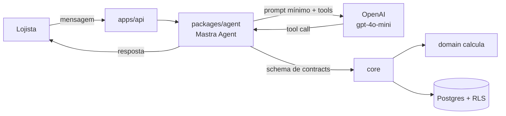

# Mastra + OpenAI — o runtime do assistente

O lojista manda uma mensagem. O Mastra interpreta a intenção e escolhe uma
_tool_. A tool chama um caso de uso de `core`. `domain` calcula. O lojista
recebe um número que é o mesmo do relatório.

Este texto diz **o que o Mastra faz aqui** e **o que ele está proibido de
fazer**. Não substitui a [documentação do Mastra](https://mastra.ai/docs).

Decisão: [ADR-0010](../../decisoes/adr/0010-mastra-e-gpt-4o-mini.md)
([DEC-007](../../decisoes/README.md#dec-007)). Origem das regras de negócio:
[RF-096 a RF-109](../../produto/requisitos-funcionais.md), README de
[`packages/agent`](../../../packages/agent/README.md).

---

## Em uma frase

**O Mastra é biblioteca dentro de `packages/agent`, não é um serviço.** O
modelo inicial é `openai/gpt-4o-mini`. Dado financeiro nunca passa por busca
semântica.

## O que entra e o que não entra

| Entra                                                              | Não entra                                                         |
| ------------------------------------------------------------------ | ----------------------------------------------------------------- |
| `Agent` + `createTool` do `@mastra/core`                           | `MastraServer` / `@mastra/fastify` expondo `/api/agents`          |
| `inputSchema` = schema Zod de `contracts`                          | Tool escrita à mão, paralela à rota HTTP                          |
| `agent.generate()` (ou equivalente) chamado por `processMessage()` | Processo Mastra na porta 4111                                     |
| Modelo `openai/gpt-4o-mini` via `AGENT_MODEL`                      | RAG / _semantic recall_ sobre venda, estoque, cliente, financeiro |
| `AGENT_PROVIDER=fake` no local                                     | Chave da OpenAI obrigatória para `pnpm dev`                       |
| Confirmação de valor na tabela `confirmations`                     | "Confirma?" resolvido só pelo prompt                              |

A confirmação explícita ([RF-103](../../produto/requisitos-funcionais.md)) é
máquina de estados nossa. O modelo sugere a tool; o lojista confirma; só então
`core` executa. Resposta ambígua conta como não
([RF-104](../../produto/requisitos-funcionais.md)).

## Fronteira com o resto do sistema

O runtime mora em `apps/api` — ver
[visão geral](../visao-geral.md#o-runtime-do-agente-mora-na-api). Motivo: o
mesmo `ExecutionContext`, a mesma autenticação, as mesmas portas. Um servidor
Mastra ao lado criaria uma segunda composição, e os dois canais (app e
WhatsApp) começariam a divergir.

`packages/agent` importa `core`, `contracts` e `money`. **Não** importa `db`
nem `domain`. O Mastra não fura essa matriz.

O agente **nunca calcula**. Se alguém ligar uma tool de calculadora, ou deixar
o modelo "somar os itens", isso viola [RF-101](../../produto/requisitos-funcionais.md)
e a linha mais importante de [`seguranca.md`](../seguranca.md#segurança-do-assistente).

## Modelo

| Variável         | Valor inicial                       | Notas                                      |
| ---------------- | ----------------------------------- | ------------------------------------------ |
| `AGENT_PROVIDER` | `fake` no local, `mastra` com chave | Sem chave, o sistema sobe no falso         |
| `AGENT_MODEL`    | `openai/gpt-4o-mini`                | Formato Mastra `provedor/modelo`           |
| `OPENAI_API_KEY` | vazia no local                      | Obrigatória só com `AGENT_PROVIDER=mastra` |

Trocar o modelo (tamanho ou provedor que o Mastra roteie) é configuração. Trocar
o framework reabre a [ADR-0010](../../decisoes/adr/0010-mastra-e-gpt-4o-mini.md).

## Memória

As tabelas `conversations`, `messages` e `confirmations` já existem, com RLS.
O que é lembrado, por quanto tempo e se o Mastra Memory entra no caminho
**ainda é a [DEC-011](../../decisoes/README.md#dec-011)**.

Até ela fechar: nenhum `PostgresStore` / `Memory` do Mastra grava em `public`.
Tabelas sem `company_id` quebram a [ADR-0001](../../decisoes/adr/0001-rls-por-linha.md).
O precedente, se um dia o Mastra precisar de schema próprio, é o `identidade`
do Better Auth ([ADR-0003](../../decisoes/adr/0003-better-auth-como-prova-de-identidade.md)).

## Dado que viaja para a OpenAI

[RNF-075](../../produto/requisitos-nao-funcionais.md): o contexto enviado é o
mínimo necessário. Na prática:

- a tool devolve o resultado já calculado por `core` / `domain`;
- o prompt não leva extrato, lista de clientes nem XML;
- consumo medido por empresa desde o primeiro dia
  ([RNF-073](../../produto/requisitos-nao-funcionais.md)).

A OpenAI é subprocessador. Declarar isso na política é a [DEC-016](../../decisoes/README.md#dec-016).

## Canal

Esta página não escolhe WhatsApp. Sem o adapter real ([DEC-003](../../decisoes/README.md#dec-003))
o runtime se exercita pelo `POST /agent/messages` (sessão autenticada) e
`AGENT_PROVIDER=fake`. O webhook entra atrás da mesma `processMessage`.
