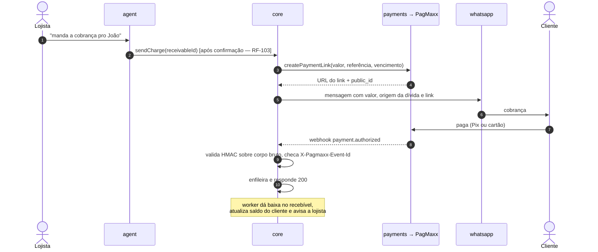

# PagMaxx — gateway de pagamento

> **Histórico.** A [DEC-006](../../decisoes/README.md#dec-006) e a
> [DEC-010](../../decisoes/README.md#dec-010) fecharam com Asaas
> ([ADR-0004](../../decisoes/adr/0004-asaas.md)). Este arquivo é a avaliação
> que ficou para trás. Contrato vigente:
> [`asaas.md`](asaas.md).

Avaliação da [documentação da API](../../assets/pagmaxx-api.md) (132 páginas,
portal de 24/08/2026) e desenho da integração.

**Veredito:** adequado para Pix, link de pagamento, cartão online e assinatura
SaaS. **Não cobre venda presencial com cartão** — e essa é a principal via de
venda do nosso MVP. Ver [a lacuna](#a-lacuna-não-há-api-de-venda-presencial).

Decisões afetadas: [DEC-006](../../decisoes/README.md#dec-006) (PSP) e
[DEC-010](../../decisoes/README.md#dec-010) (cobrança SaaS).

---

## O que a PagMaxx é

Gateway REST/JSON sobre HTTPS, prefixo `/api`, compatível com PCI-DSS.

| Ambiente    | Base URL                              |
| ----------- | ------------------------------------- |
| Homologação | `https://api.homolog.pagmaxx.com/api` |
| Produção    | `https://api.prod.pagmaxx.com/api`    |

| Serviço                | Endpoints                                                | Serve a                                                                                                             |
| ---------------------- | -------------------------------------------------------- | ------------------------------------------------------------------------------------------------------------------- |
| Cartão de crédito      | `/payments/pay`, `/payments/pay-secure`                  | venda online                                                                                                        |
| Estorno / cancelamento | `/payments/void`                                         | [RF-043](../../produto/requisitos-funcionais.md)                                                                    |
| Pix                    | `/payments/pix/sale`, `/payments/pix/get-sale/{id}`      | [RF-034](../../produto/requisitos-funcionais.md), cobrança                                                          |
| Link de pagamento      | `/payment-link/*` (legado), `/payment-links` (com split) | [RF-068](../../produto/requisitos-funcionais.md) cobrança por WhatsApp                                              |
| Tokenização            | `/payments/tokenize-card` (`slugToken`)                  | cartão salvo, recorrência                                                                                           |
| 3D Secure 2.x          | `/payments/3ds/*`                                        | antifraude, transfere responsabilidade ao emissor                                                                   |
| Simulação de taxa      | `/payments/simulate-fee`                                 | [RF-007](../../produto/requisitos-funcionais.md), [RF-040](../../produto/requisitos-funcionais.md) tarifa e líquido |
| Assinaturas            | `/subscriptions/*`                                       | [E12](../../produto/user-stories.md#e12--assinatura--cobrança-saas) mensalidade                                     |
| Credenciamento         | `/customer/documents/`, `/partners/{id}/documents`       | onboarding/KYC do lojista                                                                                           |
| Webhooks               | POST na URL cadastrada                                   | atualização de estado                                                                                               |

## O que está bom

### Webhooks são bem projetados

Raro numa API brasileira desse porte, e resolve requisitos nossos direto:

| Recurso                                                         | Atende                                                             |
| --------------------------------------------------------------- | ------------------------------------------------------------------ |
| `X-Pagmaxx-Signature` — HMAC-SHA256 hex sobre o **corpo bruto** | [RNF-028](../../produto/requisitos-nao-funcionais.md)              |
| `X-Pagmaxx-Event-Id` estável, para descartar entrega repetida   | [RNF-043](../../produto/requisitos-nao-funcionais.md) idempotência |
| Reentrega até 5× com espera crescente em falha de rede ou 5xx   | [RNF-011](../../produto/requisitos-nao-funcionais.md)              |
| Painel com últimas entregas, motivo da falha e reenvio manual   | Diagnóstico — [RF-129](../../produto/requisitos-funcionais.md)     |
| Orientação explícita: responder rápido e processar em fila      | Casa com o nosso `apps/worker`                                     |

A própria documentação recomenda o padrão que já é o nosso: validar assinatura
sobre o corpo bruto, responder 200, enfileirar.

### Tokenização tira o cartão do nosso escopo

Com `slugToken`, o PAN nunca trafega pelo nosso backend. Isso reduz
drasticamente nossa exposição a PCI-DSS — é uma economia real de custo e risco,
não um detalhe.

### `simulate-fee` entrega exatamente o cálculo que o produto promete

```json
{
  "status_code": 200,
  "content": {
    "amount": 100.0,
    "cardBrand": "VISA",
    "installmentOptions": [
      { "installments": 1, "feePercent": 3.49, "feeAmount": 3.49, "netAmount": 96.51 },
      { "installments": 3, "feePercent": 6.89, "feeAmount": 6.89, "netAmount": 93.11 }
    ]
  }
}
```

É a tabela de tarifa por bandeira e parcelamento que
[RF-007](../../produto/requisitos-funcionais.md) e
[RF-038](../../produto/requisitos-funcionais.md) precisam — a promessa "saber o
lucro real" da [visão](../../produto/visao.md#proposta-de-valor) depende disso.

### Assinaturas cobrem a cobrança SaaS

`/subscriptions/*` com recorrência em cartão (MIT) e Pix, ciclos numerados,
`external_reference` próprio, histórico em `/subscriptions/{id}/charges`, e
estados `scheduled | paid | awaiting_pix | retrying | failed`. Isso cobre
[E12](../../produto/user-stories.md#e12--assinatura--cobrança-saas) inteiro sem
um segundo fornecedor.

---

## A lacuna: não há API de venda presencial

> [!WARNING]
> **Este é o achado mais importante da avaliação.**

A PagMaxx é um gateway _card-not-present_: PAN digitado, cartão tokenizado, 3DS,
link de pagamento, Pix. Não há na documentação **nenhuma** API de maquininha,
terminal, TEF, tap-on-phone ou captura presencial.

Nosso MVP é um **PDV de balcão com leitor de código de barras**
([E4](../../produto/user-stories.md#e4--vendas--pdv)). A venda no débito e no
crédito acontece na maquininha que a lojista já tem.

### Consequência

| Forma de pagamento       | Quem processa         | O que o sistema faz                             |
| ------------------------ | --------------------- | ----------------------------------------------- |
| Dinheiro                 | ninguém               | apenas registra                                 |
| Débito presencial        | maquininha da lojista | **apenas registra** + calcula tarifa por tabela |
| Crédito presencial       | maquininha da lojista | **apenas registra** + calcula tarifa e parcelas |
| Carteira (fiado)         | ninguém               | registra e gera recebível                       |
| **Pix**                  | **PagMaxx**           | gera cobrança, confirma por webhook             |
| **Cobrança a distância** | **PagMaxx**           | link de pagamento enviado por WhatsApp          |
| **Mensalidade SaaS**     | **PagMaxx**           | assinatura recorrente                           |

Isso **não invalida** a escolha — na verdade encaixa bem, porque a metade
conversacional do produto (mandar cobrança pelo WhatsApp) é exatamente onde o
link de pagamento e o Pix brilham. Mas muda duas coisas:

1. **A tarifa de cartão presencial vem de tabela configurada, não da API.** A
   lojista informa as taxas da adquirente dela
   ([RF-007](../../produto/requisitos-funcionais.md)), e `simulate-fee` serve
   para as transações que passam pela PagMaxx.
2. **O não-objetivo da visão precisa ser revisto.** Hoje
   [`visao.md`](../../produto/visao.md#não-objetivos) diz "não é um meio de
   pagamento". Com Pix e link de pagamento, o produto passa a _processar_
   dinheiro do lojista, não só registrar. Isso tem consequência regulatória e de
   responsabilidade → [DEC-015](../../decisoes/README.md#dec-015).

---

## Pontos de atenção

### 1. Valores vêm como decimal, não centavos

```json
{ "amount": 100.50 }        // /payments/pay
{ "amount": "100.00" }      // /payments/simulate-fee — string!
{ "payment": { "amount": 129.9 } }   // webhook
```

Três formatos diferentes para dinheiro na mesma API, e um deles é ponto
flutuante. Isso colide de frente com
[RNF-044](../../produto/requisitos-nao-funcionais.md).

**Regra do adapter:** a conversão acontece **na borda**, uma vez, com tratamento
de string — nunca `parseFloat` seguido de aritmética. Fora do
`packages/payments`, dinheiro é `Money` em centavos e ponto final.

### 2. A resposta de `simulate-fee` não tem contrato estável

A própria documentação avisa: _"como `content` é repassado pela adquirente,
trate-o de forma defensiva: os nomes e a estrutura dos campos podem variar"_.
O mesmo vale para `/payments/pay` e `/payment-link/*` — "os campos fora de
`_pagmaxx` são repassados integralmente pela adquirente".

**Decorrência de projeto:** **não** chamar `simulate-fee` de forma síncrona no
fechamento da venda. Motivos:

- [RNF-003](../../produto/requisitos-nao-funcionais.md): venda fecha em ≤ 1,5 s — uma chamada externa no caminho crítico é risco
- [RNF-041](../../produto/requisitos-nao-funcionais.md): o cálculo tem que ser auditável, e não se audita a resposta de um terceiro cujo formato varia
- `simulate-fee` exige `cardNumber` para identificar a bandeira — no balcão não temos o número

**Desenho correto:** manter uma `CardFeeTable` por empresa em `packages/domain`,
alimentada periodicamente por `simulate-fee` (com BIN de teste por bandeira) e
pela configuração da lojista. O cálculo da venda é determinístico, local e
testável; a API é fonte de dados, não parte do caminho crítico.

### 3. Autenticação server-to-server é incompleta

| Método                            | Onde funciona                                                                     |
| --------------------------------- | --------------------------------------------------------------------------------- |
| `X-API-Key`                       | apenas `pay-secure`, `tokenize-card`, `3ds/*`                                     |
| Bearer JWT via **e-mail + senha** | todo o resto: `void`, `pix/*`, `payment-link*`, `simulate-fee`, `subscriptions/*` |

Ou seja: para gerar uma cobrança Pix, precisamos guardar **a senha de uma conta
PagMaxx** e rodar um ciclo de `access_token` / `refresh_token`. E a documentação
diz que essa credencial também dá acesso a "gestão de conta, usuários, split" —
o raio de estrago é maior que o necessário.

Não impede a integração, mas é um agravante de
[RNF-022](../../produto/requisitos-nao-funcionais.md) e vira
[QST-009](../../decisoes/README.md#qst-009): _dá para estender o escopo da API
Key para Pix, links e assinaturas?_

### 4. Limites de requisição obrigam cache de token

| Rota                     | Limite        |
| ------------------------ | ------------- |
| `/auth/token`            | **5 req/min** |
| `/auth/refresh`          | 20 req/min    |
| `/payments/simulate-fee` | 100 req/min   |

Com um token por empresa, 5/min é apertado. O adapter precisa de cache de token
com renovação antecipada e serialização por empresa — buscar token por
requisição estoura o limite no primeiro pico.

### 5. Uma conta PagMaxx por lojista → atrito de onboarding

_"Cada estabelecimento (EC) opera com suas próprias credenciais e só enxerga as
próprias transações."_ Somado aos endpoints de credenciamento (envio de
documento, status `AGUARDANDO_ENVIO` / `ENVIADO` / `RECUSADO`), isso significa
KYC por lojista, com aprovação humana.

Colide com [M3](../../produto/visao.md#métricas-de-sucesso) — 15 minutos até a
primeira venda. **Mitigação:** o credenciamento PagMaxx não pode estar no
caminho crítico do onboarding; a lojista vende, registra e emite nota antes
disso, e só as funções de Pix/link ficam pendentes até a aprovação.

A alternativa é operar com **split** (`POST /api/payment-links` com
`split_config`), com a conta da plataforma como principal. Muda o fluxo do
dinheiro e a responsabilidade regulatória → [DEC-015](../../decisoes/README.md#dec-015).

### 6. Detalhes que geram bug se ignorados

| Detalhe                                                                      | Tratamento                                                                   |
| ---------------------------------------------------------------------------- | ---------------------------------------------------------------------------- |
| `payment.approved` **não é disparado**; quem confirma é `payment.authorized` | Só `authorized` libera a baixa                                               |
| `type` pode vir **nulo** para status não mapeado                             | Ignorar o evento; nunca adivinhar pelo campo legado `data`                   |
| `event` e `data` são legados, sem padronização                               | Usar `type` + `payment` / `payout`                                           |
| Webhook exige URL **HTTPS pública**; `localhost` é recusado                  | Túnel no desenvolvimento local — ver [setup](../../engenharia/setup.md)      |
| Nunca correlacionar por nome, valor ou horário                               | `payment.id`, `subscription_id` + `subscription_cycle`, `external_reference` |
| Eventos de liquidação (`payout.*`) são **opt-in** no portal                  | Ativar — são eles que fecham a conciliação                                   |

---

## Desenho da integração

### Novo módulo: `packages/payments`

A arquitetura atual não tem adapter de PSP — a premissa era que o sistema apenas
_registrava_ pagamentos. Com Pix e link de pagamento, ele passa a _processá-los_.

```ts
// packages/core — a porta, declarada por core
export interface PaymentGateway {
  createPixCharge(input: PixChargeInput): Promise<PixCharge>
  getPixCharge(purchaseId: string): Promise<PixChargeStatus>
  createPaymentLink(input: PaymentLinkInput): Promise<PaymentLink>
  refund(paymentId: string, amount?: Money): Promise<RefundResult>
  fetchFeeTable(brandSample: BrandSample[]): Promise<CardFeeTable>
}

export interface SubscriptionProvider {
  // packages/billing
  createSubscription(input: SubscriptionInput): Promise<Subscription>
  cancelSubscription(publicId: string): Promise<void>
  listCharges(publicId: string): Promise<SubscriptionCharge[]>
}
```

`packages/payments` implementa `PaymentGateway` sobre a PagMaxx.
`packages/billing` implementa `SubscriptionProvider` sobre `/subscriptions/*`.

> [!NOTE]
> **O esboço acima é de antes da porta existir. A porta real (`NR-043`) ajustou
> duas assinaturas dele**, porque nenhuma das duas é implementável sob a regra
> `adapter-nao-importa-core`:
>
> - `fetchFeeTable(): Promise<CardFeeTable>` → `fetchFeeQuotes(): FeeQuoteResult`.
>   `CardFeeTable` mora em `packages/domain`, e a CI proíbe `payments → domain`.
>   O adapter cota; `core` traduz.
> - `refund(paymentId, amount?: Money)` → `refund(RefundRequest)`. Dinheiro
>   atravessa a porta em centavo inteiro, como no resto de `contracts`.
>
> A porta também ganhou `readWebhook`, que o esboço não previa: validar o HMAC é
> do adapter, porque o segredo é configuração dele. Ver
> [`packages/payments`](../../../packages/payments/README.md#onde-a-porta-se-afasta-do-esboço-do-pagmaxxmd).

Dois adapters, um fornecedor — porque são **dois problemas de negócio**: o
dinheiro do lojista e a nossa mensalidade. Se um dia a mensalidade migrar para
outro provedor, o pagamento do lojista não é afetado.

### Fluxo — cobrança por WhatsApp com link de pagamento

Este é o encaixe mais forte entre a PagMaxx e a tese do produto:



A cobrança deixa de ser "manda uma mensagem pedindo dinheiro" e vira "manda um
link que o cliente paga em dois toques, e o sistema dá baixa sozinho". É um
salto de valor concreto sobre [US-033](../../produto/user-stories.md#us-033--enviar-cobrança).

### Variáveis de ambiente

Detalhadas em [`ambientes.md`](../../engenharia/ambientes.md).

| Variável                   | Uso                                      |
| -------------------------- | ---------------------------------------- |
| `PAGMAXX_BASE_URL`         | homologação ou produção                  |
| `PAGMAXX_API_KEY`          | `pay-secure`, tokenização, 3DS           |
| `PAGMAXX_ACCOUNT_EMAIL`    | JWT — enquanto QST-009 não for resolvida |
| `PAGMAXX_ACCOUNT_PASSWORD` | idem, em gerenciador de segredos         |
| `PAGMAXX_WEBHOOK_SECRET`   | validação do HMAC                        |

## Recomendação

| Pergunta                               | Resposta                                                                                       |
| -------------------------------------- | ---------------------------------------------------------------------------------------------- |
| Adotar a PagMaxx como PSP?             | **Sim**, para Pix, link de pagamento, cartão online e estorno                                  |
| Adotar para a mensalidade SaaS?        | **Sim** — `/subscriptions/*` cobre E12 sem outro fornecedor                                    |
| Resolve o cartão presencial do balcão? | **Não.** Isso continua na maquininha da lojista; o sistema registra e calcula por tabela       |
| Bloqueia algum trabalho hoje?          | Não. `PaymentGateway` e `SubscriptionProvider` podem ser escritas e testadas com adapter falso |

**Antes de fechar o contrato**, resolver
[QST-009](../../decisoes/README.md#qst-009) (escopo da API Key),
[QST-010](../../decisoes/README.md#qst-010) (existe API de captura presencial no
roadmap deles?) e [DEC-015](../../decisoes/README.md#dec-015) (conta por lojista
vs. split na conta da plataforma).

## Documentos relacionados

- [Documentação bruta da API](../../assets/pagmaxx-api.md) — convertida do PDF
- [Princípios](../principios.md) — por que isto é um adapter e não vive em `core`
- [Módulos](../modulos.md) — onde `payments` entra no mapa
- [DEC-006](../../decisoes/README.md#dec-006), [DEC-010](../../decisoes/README.md#dec-010), [DEC-015](../../decisoes/README.md#dec-015)
