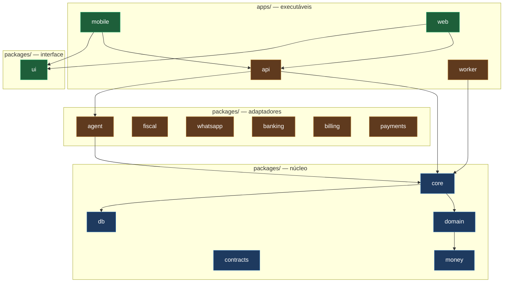

# Módulos

Índice de todos os módulos do monorepo. **Este documento não repete o conteúdo
dos READMEs de módulo** — ele diz onde cada um está, o que ele pode fazer e
quem é responsável.

A documentação detalhada de cada módulo mora junto do código, para ser revisada
no mesmo PR que o altera.

---

## Mapa



🔵 Trilha 1 — Núcleo & Dados · 🟠 Trilha 2 — Plataforma & Integrações ·
🟢 Trilha 3 — Clientes

## Índice

### Aplicações

| Módulo        | Responsabilidade                                                                  | Depende de                                         | Trilha | Doc                                   |
| ------------- | --------------------------------------------------------------------------------- | -------------------------------------------------- | ------ | ------------------------------------- |
| `apps/api`    | REST, webhooks e runtime do agente. Autentica, monta contexto, chama casos de uso | `core` `contracts` `agent` + adapters (composição) | 🟠 2   | [README](../../apps/api/README.md)    |
| `apps/worker` | Filas e jobs agendados: emissão fiscal, cobrança, lembrete, importação bancária   | `core` `contracts` + adapters (composição)         | 🟠 2   | [README](../../apps/worker/README.md) |
| `apps/mobile` | PDV do lojista: código de barras, venda, consulta. Opera com rede instável        | `contracts` `ui` + API por HTTP                    | 🟢 3   | [README](../../apps/mobile/README.md) |
| `apps/web`    | Backoffice, relatórios, conciliação, catálogo público e landing                   | `contracts` `ui` + API por HTTP                    | 🟢 3   | [README](../../apps/web/README.md)    |

### Núcleo

| Módulo               | Responsabilidade                                                                   | Depende de                        | Trilha | Doc                                          |
| -------------------- | ---------------------------------------------------------------------------------- | --------------------------------- | ------ | -------------------------------------------- |
| `packages/core`      | **Casos de uso.** Toda operação de negócio, com transação, autorização e auditoria | `domain` `contracts` `db` `money` | 🔵 1   | [README](../../packages/core/README.md)      |
| `packages/domain`    | **Regras puras.** Precificação, imposto, tarifa de cartão, parcelamento, margem    | `money`                           | 🔵 1   | [README](../../packages/domain/README.md)    |
| `packages/contracts` | **Contrato único.** Schemas Zod que servem HTTP, tipos e tools do agente           | `money`                           | 🔵 1   | [README](../../packages/contracts/README.md) |
| `packages/db`        | Schema Drizzle, migrations, políticas RLS, repositórios                            | `contracts` `money`               | 🔵 1   | [README](../../packages/db/README.md)        |
| `packages/money`     | Tipo `Money` — inteiro em centavos, divisão sem perda de resto                     | —                                 | 🔵 1   | [README](../../packages/money/README.md)     |

### Adaptadores

Cada um implementa uma **porta declarada por `core`** e isola um provedor
externo. O que ainda não foi escolhido continua atrás de `DEC`.

| Módulo              | Porta que implementa                                | Provedor                                                        | Decisão                                                  | Trilha | Doc                                         |
| ------------------- | --------------------------------------------------- | --------------------------------------------------------------- | -------------------------------------------------------- | ------ | ------------------------------------------- |
| `packages/agent`    | Runtime do assistente: tools, memória, confirmações | Mastra + OpenAI `gpt-4o-mini`                                   | [ADR-0010](../decisoes/adr/0010-mastra-e-gpt-4o-mini.md) | 🟠 2   | [README](../../packages/agent/README.md)    |
| `packages/fiscal`   | `InvoiceIssuer`                                     | NFC-e / NFS-e                                                   | [DEC-004](../decisoes/README.md#dec-004)                 | 🟠 2   | [README](../../packages/fiscal/README.md)   |
| `packages/whatsapp` | `MessageSender`                                     | WhatsApp                                                        | [DEC-003](../decisoes/README.md#dec-003)                 | 🟠 2   | [README](../../packages/whatsapp/README.md) |
| `packages/banking`  | `BankStatementProvider`                             | Open Finance                                                    | [DEC-005](../decisoes/README.md#dec-005)                 | 🟠 2   | [README](../../packages/banking/README.md)  |
| `packages/billing`  | `SubscriptionProvider`                              | Cobrança SaaS (Asaas `/v3/subscriptions` na conta-pai)          | [ADR-0004](../decisoes/adr/0004-asaas.md)                | 🟠 2   | [README](../../packages/billing/README.md)  |
| `packages/payments` | `PaymentGateway`                                    | PSP — Pix, boleto, link, cartão ([Asaas](integracoes/asaas.md)) | [ADR-0004](../decisoes/adr/0004-asaas.md)                | 🟠 2   | [README](../../packages/payments/README.md) |

### Interface

| Módulo        | Responsabilidade                                                 | Depende de          | Trilha | Doc                                   |
| ------------- | ---------------------------------------------------------------- | ------------------- | ------ | ------------------------------------- |
| `packages/ui` | Tokens de design e componentes compartilhados entre web e mobile | `contracts` `money` | 🟢 3   | [README](../../packages/ui/README.md) |

### Infraestrutura

| Diretório  | Responsabilidade                  | Doc                             |
| ---------- | --------------------------------- | ------------------------------- |
| `infra/`   | Docker Compose local, IaC, deploy | [README](../../infra/README.md) |
| `scripts/` | Utilitários de repositório        | —                               |

## Quem pode importar quem

Resumo da [matriz completa](principios.md#matriz-de-imports-permitidos), que é
verificada automaticamente na CI.

```
money      →  (nada)
domain     →  money
contracts  →  money
db         →  contracts, money
core       →  domain, contracts, db, money
agent      →  core, contracts, money
adapters   →  contracts, money            ← nunca core
payments   →  contracts, money            ← idem: PSP é adapter
ui         →  contracts, money
api/worker →  core, contracts, adapters, db  ← adapters e db SÓ na composição
mobile/web →  contracts, ui, money        ← nunca core, nunca db
```

## Onde escrever cada tipo de código

A pergunta mais frequente do dia a dia:

| Se você está escrevendo…                       | Vai em                    | Nunca em             |
| ---------------------------------------------- | ------------------------- | -------------------- |
| Cálculo de imposto, tarifa, margem, parcela    | `domain`                  | `core`, `apps/*`     |
| "Registrar venda" ponta a ponta                | `core`                    | `apps/api`           |
| Validação do corpo de uma requisição           | `contracts`               | dentro do handler    |
| Consulta SQL / migration                       | `db`                      | `core`, `apps/*`     |
| Chamada ao provedor fiscal                     | `fiscal`                  | `core`               |
| Cobrança Pix ou link de pagamento              | `payments`                | `core`               |
| Interpretação de mensagem em linguagem natural | `agent`                   | `core`               |
| Rota HTTP, autenticação, montagem de contexto  | `apps/api`                | `core`               |
| Job agendado, consumidor de fila               | `apps/worker`             | `apps/api`           |
| Tela, navegação, estado de interface           | `apps/mobile`, `apps/web` | `packages/*`         |
| Componente visual reutilizável                 | `ui`                      | apps individualmente |
| Manipulação de valor monetário                 | `money`                   | qualquer outro lugar |

**Teste rápido:** se o código precisa rodar igual pelo app **e** pelo WhatsApp,
ele pertence a `core` ou `domain`. Se ele só faz sentido numa tela ou numa rota,
pertence ao app.

## Template de README de módulo

Todo README de módulo segue esta estrutura, para que qualquer desenvolvedor
saiba onde procurar:

```markdown
# <módulo>

<uma linha do que é>

## Responsabilidade o que faz — e o que explicitamente NÃO faz

## Fronteiras o que expõe (API pública) e o que consome

## Dependências permitidas e proibidas

## Estrutura organização interna de pastas

## Conceitos principais tipos e modelos centrais

## Decisões escolhas locais e links para ADRs

## Testes o que se testa aqui e como

## Variáveis de ambiente as que este módulo lê

## Desenvolvimento como rodar e desenvolver
```

## Estado atual

Nenhum módulo tem implementação. `apps/web` e `apps/mobile` têm apenas o
scaffold gerado pelo Next.js e pelo Expo.

| Estado               | Módulos                                                                                                                         |
| -------------------- | ------------------------------------------------------------------------------------------------------------------------------- |
| 🔴 Vazio (só README) | `api` `worker` `core` `domain` `contracts` `db` `agent` `fiscal` `whatsapp` `banking` `billing` `payments` `money` `ui` `infra` |
| 🟡 Scaffold          | `web` (Next.js), `mobile` (Expo)                                                                                                |
| 🟢 Implementado      | —                                                                                                                               |

A ordem de implementação está no
[Task Ledger](../processo/task-ledger.md). Resumo: `money` e `contracts`
primeiro, porque destravam as três trilhas ao mesmo tempo.

## Documentos relacionados

- [Princípios](principios.md) — as regras que definem estas fronteiras
- [Visão geral](visao-geral.md) — como os módulos se compõem em containers
- [Task Ledger](../processo/task-ledger.md) — quem implementa o quê
- [Integrações](integracoes/) — avaliação de cada provedor externo
