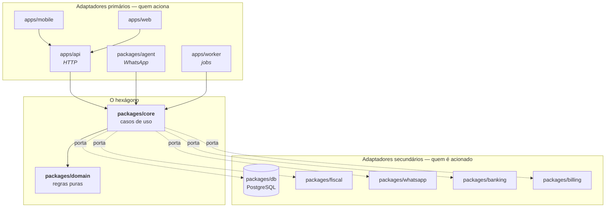
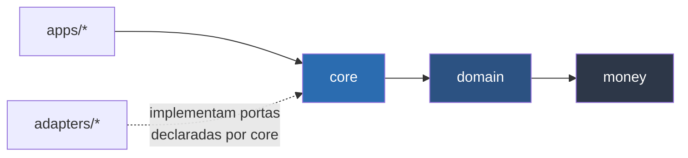

# Princípios de arquitetura

Este é o documento mais importante de [`docs/arquitetura/`](.). Ele define as
regras que **não se negociam por conveniência de prazo**, porque são elas que
garantem a promessa central do produto: app e WhatsApp acionam exatamente as
mesmas regras de negócio.

Cada regra aqui é verificada automaticamente na CI
([RNF-065](../produto/requisitos-nao-funcionais.md)). Uma regra que só existe em
documento é uma regra que já foi quebrada — só ninguém percebeu ainda.

---

## O problema que a arquitetura resolve

O produto tem **dois canais de entrada** para a mesma operação:

```
Aplicativo  ─┐
             ├─→  registrar venda  →  mesmas validações, mesmos cálculos,
WhatsApp    ─┘                        mesma auditoria, mesmo resultado
```

A forma preguiçosa de construir isso é implementar a venda no app e, depois,
implementar "de novo, mais simples" para o WhatsApp. Em três meses os dois
caminhos divergem: o WhatsApp não aplica limite de desconto, o app não registra
o canal na auditoria, e o lojista descobre a diferença quando o número não bate.

**A arquitetura existe para tornar essa divergência impossível**, não
improvável.

## Arquitetura hexagonal (portas e adaptadores)



**O que isso significa na prática:**

- `core` **não sabe** se a requisição veio do app ou do WhatsApp. Ele recebe um
  comando validado e um contexto de execução (quem, qual empresa, qual canal).
- `core` **não sabe** qual é o provedor fiscal. Ele conhece uma interface
  `InvoiceIssuer` declarada por ele mesmo; quem implementa é `fiscal`.
- Trocar o provedor de WhatsApp mexe em **um** pacote.
- Adicionar um terceiro canal de entrada (uma API pública, por exemplo) não
  toca em nenhuma regra de negócio.

## A regra de dependência

> **As setas apontam para dentro.** Nada no núcleo conhece o que está fora dele.



### Matriz de imports permitidos

Esta tabela é a fonte da verdade. O arquivo de configuração do
`dependency-cruiser` a traduz em código — ver
[`code-style.md`](../engenharia/code-style.md#fronteiras-de-dependência).

| De ↓ / Pode importar →                           | `money` | `domain` | `contracts` | `db` | `core` | adapters | `ui` |
| ------------------------------------------------ | :-----: | :------: | :---------: | :--: | :----: | :------: | :--: |
| `packages/money`                                 |    —    |    ❌    |     ❌      |  ❌  |   ❌   |    ❌    |  ❌  |
| `packages/domain`                                |   ✅    |    —     |     ❌      |  ❌  |   ❌   |    ❌    |  ❌  |
| `packages/contracts`                             |   ✅    |    ❌    |      —      |  ❌  |   ❌   |    ❌    |  ❌  |
| `packages/db`                                    |   ✅    |    ❌    |     ✅      |  —   |   ❌   |    ❌    |  ❌  |
| `packages/core`                                  |   ✅    |    ✅    |     ✅      |  ✅  |   —    |    ❌    |  ❌  |
| `packages/agent`                                 |   ✅    |    ❌    |     ✅      |  ❌  |   ✅   |    ❌    |  ❌  |
| `packages/fiscal` `whatsapp` `banking` `billing` |   ✅    |    ❌    |     ✅      |  ❌  |   ❌   |    ❌    |  ❌  |
| `packages/ui`                                    |   ✅    |    ❌    |     ✅      |  ❌  |   ❌   |    ❌    |  —   |
| `apps/api` `apps/worker`                         |   ✅    |    ❌    |     ✅      | ✅ ¹ |   ✅   |   ✅ ¹   |  ❌  |
| `apps/mobile` `apps/web`                         |   ✅    |    ❌    |     ✅      |  ❌  |  ❌ ²  |    ❌    |  ✅  |

¹ Apenas na **raiz de composição** — o arquivo que instancia a conexão de banco e
os adapters e os injeta em `core`. Nunca dentro de um handler de rota, de um
consumidor de fila ou de um caso de uso. É a única exceção, e existe porque
alguém precisa montar o grafo de dependências; se ela vazar para além do
`composition.ts`, vira a proibição nº 1.
² Os apps de interface falam com a API por HTTP, não importam `core` diretamente.

### As quatro proibições que mais importam

| #   | Proibição                             | Por que existe                                                                                                                               |
| --- | ------------------------------------- | -------------------------------------------------------------------------------------------------------------------------------------------- |
| 1   | **Nenhum handler importa `db`**       | Se um handler consulta o banco direto, a regra de negócio migra para a rota e o WhatsApp deixa de aplicá-la. Só a raiz de composição vê `db` |
| 2   | **`apps/*` não importa `domain`**     | Cálculo chamado direto pelo app é cálculo que o agente não faz igual                                                                         |
| 3   | **`domain` não importa nada com I/O** | Regra que toca rede ou banco não é testável em milissegundos, e por isso deixa de ser testada                                                |
| 4   | **Adapter não importa `core`**        | A seta tem que apontar para dentro; adapter que conhece `core` não é substituível                                                            |

## Princípios

### 1. `core` é o núcleo

Todo caso de uso vive em `core`. Um caso de uso é uma operação de negócio
completa: `registerSale`, `settleReceivable`, `issueInvoice`.

**Um handler de rota HTTP faz exatamente três coisas:** valida a entrada com
`contracts`, monta o contexto de execução, chama o caso de uso. Se um handler
tem `if` de regra de negócio, a regra está no lugar errado.

```ts
// apps/api — o handler não decide nada
app.post('/v1/sales', async (req, reply) => {
  const input = CreateSaleInput.parse(req.body) // contracts
  const ctx = buildContext(req) // quem, qual company, qual canal
  const sale = await registerSale(deps, ctx, input) // core decide tudo
  return reply.code(201).send(sale)
})
```

### 2. `domain` é puro

Sem I/O, sem framework, sem relógio, sem aleatoriedade. Entra dado, sai dado.

Isso não é purismo acadêmico: é o que permite testar a regra de tarifa de cartão
em 200 casos diferentes em menos de um segundo. Precisa da data de hoje? Ela é
**parâmetro**, não `new Date()` dentro da função.

```ts
// packages/domain — determinístico, testável sem infraestrutura
export function calculateSaleTotals(
  items: SaleItemInput[],
  payments: PaymentInput[],
  taxRules: TaxRules,
  cardFees: CardFeeTable,
): SaleTotals
```

### 3. Adapters isolam provedores

Os quatro adapters (`fiscal`, `whatsapp`, `banking`, `billing`) escondem
fornecedores externos atrás de uma interface **declarada por `core`**.

```ts
// packages/core — core declara o que precisa
export interface InvoiceIssuer {
  issue(input: IssueInvoiceInput): Promise<IssuedInvoice>
  cancel(accessKey: string, reason: string): Promise<void>
}

// packages/fiscal — o adapter implementa, e conhece core apenas como tipo
export function createFocusNfeIssuer(config: FocusConfig): InvoiceIssuer
```

Isso vale ouro agora: [DEC-003](../decisoes/README.md#dec-003) e
[DEC-005](../decisoes/README.md#dec-005) ainda estão em aberto; o PSP já é
Asaas ([ADR-0004](../decisoes/adr/0004-asaas.md)). **A porta pode ser escrita e
testada hoje**, com um adapter falso, e o provedor real entra depois sem tocar
em `core`.

### 4. `contracts` é o contrato único

Um schema Zod por operação, usado em **três** lugares:

```
CreateSaleInput ──┬─→ validação do corpo HTTP        (apps/api)
                  ├─→ tipo TypeScript                 (todo o monorepo)
                  └─→ definição da tool do agente     (packages/agent)
```

É aqui que a promessa "app e WhatsApp fazem a mesma coisa" deixa de depender de
disciplina e passa a ser estrutural: **a tool do agente é gerada do mesmo schema
que valida a rota HTTP**. Não existe forma de o agente aceitar um campo que a
API recusa.

Por isso `contracts` é o pacote mais sensível do repositório — mudança nele
exige revisão das três trilhas
([git-workflow](../engenharia/git-workflow.md#pull-requests)).

### 5. `money` é obrigatório

Dinheiro é `Money` (inteiro em centavos), nunca `number` com decimal
([RNF-044](../produto/requisitos-nao-funcionais.md)).

```ts
0.1 + 0.2 === 0.3 // false — e é assim que o caixa não fecha
Money.cents(10).add(Money.cents(20)).equals(Money.cents(30)) // true
```

Divisão de parcelas distribui o resto de forma que a soma seja exatamente o
total ([RNF-045](../produto/requisitos-nao-funcionais.md)).

### 6. O caso de uso controla a transação

Venda, baixa de estoque e criação de recebível acontecem na mesma transação
([RNF-046](../produto/requisitos-nao-funcionais.md)). Quem abre e fecha a
transação é o caso de uso, nunca o repositório — um repositório que gerencia a
própria transação impossibilita compor operações atomicamente.

### 7. Toda escrita com valor é idempotente

O PDV opera com rede instável ([RNF-051](../produto/requisitos-nao-funcionais.md)).
Reenvio vai acontecer. Sem chave de idempotência, reenvio vira venda duplicada
([RNF-043](../produto/requisitos-nao-funcionais.md)).

### 8. O tenant vem do contexto, nunca do cliente

`companyId` é resolvido a partir da autenticação e injetado no contexto de
execução. **Nenhum endpoint aceita `companyId` no corpo ou na query.** O
isolamento é imposto no banco por RLS
([`dados.md`](dados.md#multi-tenant), [RNF-021](../produto/requisitos-nao-funcionais.md)).

### 9. Nada é apagado

Venda não é deletada: é cancelada ou devolvida
([RNF-040](../produto/requisitos-nao-funcionais.md)). Auditoria é
somente-inserção ([RNF-047](../produto/requisitos-nao-funcionais.md)). O lojista
precisa poder desfazer sem medo — princípio 4 da
[visão](../produto/visao.md#princípios-de-produto).

### 10. O canal é dado de primeira classe

Todo caso de uso recebe o canal de origem (`app`, `whatsapp`, `api`, `job`) e o
registra na auditoria. É isso que permite responder "essa venda foi lançada pelo
WhatsApp às 14h32 pelo próprio dono".

## Contexto de execução

Assinatura padrão de todo caso de uso:

```ts
type ExecutionContext = {
  companyId: CompanyId
  userId: UserId
  role: Role
  channel: 'app' | 'whatsapp' | 'api' | 'job'
  requestId: string // correlaciona logs — RNF-058
  idempotencyKey?: string // escrita com valor — RNF-043
  now: Date // injetado, nunca lido de dentro
}

type UseCase<I, O> = (deps: Deps, ctx: ExecutionContext, input: I) => Promise<O>
```

`now` é injetado pelo mesmo motivo que `domain` é puro: teste de vencimento não
pode depender do dia em que a suíte roda.

## Como isso é verificado

| Regra                               | Verificação                 | Bloqueia PR? |
| ----------------------------------- | --------------------------- | ------------ |
| Matriz de imports                   | `dependency-cruiser` na CI  | ✅           |
| `domain` sem I/O                    | Regra de import proibido    | ✅           |
| Nenhuma rota sem schema `contracts` | Revisão + teste de contrato | ✅           |
| Dinheiro sem `Money`                | Regra de lint               | ✅           |
| `companyId` vindo do cliente        | Teste automatizado por rota | ✅           |
| Caso de uso fora de `core`          | Revisão de PR               | 👤 humano    |

Detalhes de configuração em
[`code-style.md`](../engenharia/code-style.md#fronteiras-de-dependência).

## Quando quebrar uma regra

Nunca por prazo. Se houver um motivo real, o caminho é:

1. Abrir um `DEC-xxx` em [decisões](../decisoes/README.md) explicando o custo de
   manter a regra
2. Discutir com as três trilhas
3. Se aceito, virar uma ADR em [`adr/`](../decisoes/adr/) e **atualizar a matriz
   e a configuração da CI no mesmo PR**

Uma exceção que não está na matriz não é exceção: é violação que passou.

## Documentos relacionados

- [Visão geral](visao-geral.md) — os containers que aplicam estes princípios
- [Módulos](modulos.md) — o que cada módulo pode e não pode fazer
- [Fluxos](fluxos.md) — os princípios em ação, ponta a ponta
- [Code style](../engenharia/code-style.md) — a configuração que impõe tudo isso
