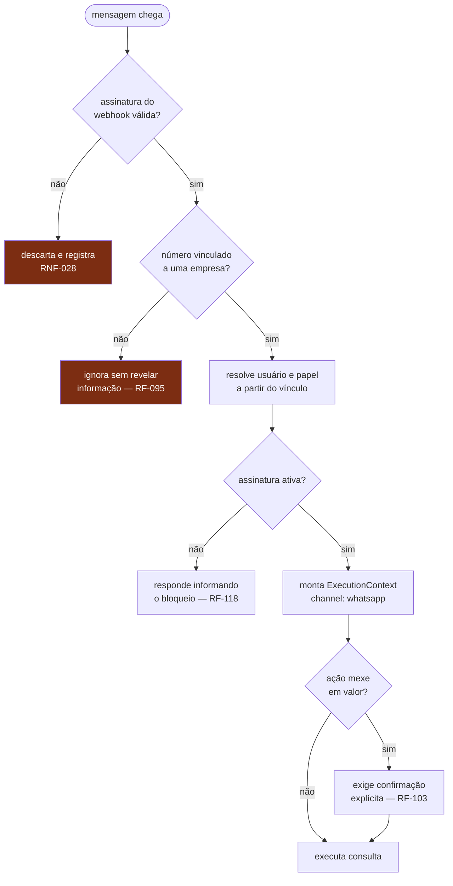

# Segurança e privacidade

Autenticação, autorização, gestão de segredos e conformidade com a LGPD.

Requisitos correspondentes: [RNF-020 a RNF-036](../produto/requisitos-nao-funcionais.md).

> [!WARNING]
> A solução de autenticação é [DEC-008](../decisoes/README.md#dec-008) e ainda
> está em aberto. Este documento define **o que precisa ser verdade**
> independentemente da escolha.

---

## Modelo de ameaças

O que estamos de fato protegendo, em ordem de gravidade:

| #   | Ameaça                                              | Consequência                                                               | Controle principal                                                                                                   |
| --- | --------------------------------------------------- | -------------------------------------------------------------------------- | -------------------------------------------------------------------------------------------------------------------- |
| T1  | Uma loja enxergar dados de outra                    | Fim do produto — quebra de confiança irrecuperável                         | RLS no banco ([RNF-021](../produto/requisitos-nao-funcionais.md))                                                    |
| T2  | Vazamento do certificado digital A1                 | Terceiro emite nota em nome da empresa; responsabilidade fiscal e criminal | Cifragem em repouso com chave separada ([RNF-024](../produto/requisitos-nao-funcionais.md))                          |
| T3  | Mensagem a cliente sem consentimento                | Sanção da ANPD e denúncia por spam                                         | Consentimento verificado antes de todo envio ([RNF-032](../produto/requisitos-nao-funcionais.md))                    |
| T4  | Funcionário vendo margem e financeiro               | Conflito interno; perda de confiança do lojista                            | Autorização por papel ([RF-012](../produto/requisitos-funcionais.md), [RF-042](../produto/requisitos-funcionais.md)) |
| T5  | Assistente executando ação de número não autorizado | Lançamento financeiro fraudulento                                          | Vínculo de número + confirmação ([RF-095](../produto/requisitos-funcionais.md))                                      |
| T6  | Webhook forjado                                     | Estado inconsistente, cobrança falsa                                       | Verificação de assinatura ([RNF-028](../produto/requisitos-nao-funcionais.md))                                       |
| T7  | Dado pessoal em log                                 | Violação de LGPD sem ninguém perceber                                      | Mascaramento + varredura ([RNF-034](../produto/requisitos-nao-funcionais.md))                                        |
| T8  | Segredo em código versionado                        | Comprometimento total do ambiente                                          | Varredura bloqueante na CI ([RNF-022](../produto/requisitos-nao-funcionais.md))                                      |

**T1 é a ameaça existencial.** Todas as decisões de arquitetura de dados
([`dados.md`](dados.md)) partem dela.

## Autenticação

### Princípios que valem qualquer que seja a decisão

| Regra                                                           | Motivo                                                                                  |
| --------------------------------------------------------------- | --------------------------------------------------------------------------------------- |
| Senha nunca é reversível — Argon2id ou bcrypt                   | [RNF-023](../produto/requisitos-nao-funcionais.md)                                      |
| Falha de login não revela se o usuário existe                   | Impede enumeração de contas ([RF-120](../produto/requisitos-funcionais.md))             |
| Tentativas repetidas são desaceleradas por usuário **e** por IP | [RNF-026](../produto/requisitos-nao-funcionais.md)                                      |
| Sessão tem expiração e é revogável                              | Remoção de funcionário encerra a sessão ([RF-006](../produto/requisitos-funcionais.md)) |
| `platform_admin` exige segundo fator                            | [RNF-025](../produto/requisitos-nao-funcionais.md)                                      |
| Token nunca vai em URL nem em log                               | URL vaza em histórico, referer e log de proxy                                           |

### Um usuário, várias empresas

Um contador ou um sócio pode pertencer a mais de uma empresa. O modelo é
`users ↔ company_users ↔ companies`, e **a empresa ativa é escolhida no login**
e vive no `ExecutionContext` — nunca é inferida do corpo da requisição
([princípio 8](principios.md#8-o-tenant-vem-do-contexto-nunca-do-cliente)).

### Autenticação do canal WhatsApp

O caso mais delicado do sistema: uma mensagem de texto não carrega credencial.



**O vínculo do número é a credencial.** Consequências:

- Um número pertence a **uma** empresa; tentativa de vincular a outra é recusada
- O vínculo é confirmado por código enviado ao próprio número
  ([RF-094](../produto/requisitos-funcionais.md))
- Perda ou troca de chip exige revincular — não há recuperação automática
- A confirmação explícita de ação com valor ([RF-103](../produto/requisitos-funcionais.md))
  é controle de **usabilidade**: evita o lançamento por engano

> [!WARNING]
> Este documento afirmava que a confirmação explícita contrabalançava o SIM
> swap. **Não contrabalança.** A confirmação chega e é respondida no mesmo
> canal: quem fez o SIM swap tem o número, recebe o pedido e responde "sim".
> Confirmação em banda não é segundo fator — é o primeiro fator perguntando
> duas vezes. A correção está na
> [ADR-0002](../decisoes/adr/0002-autenticacao-identidade-propria.md).

### O que o vínculo do número não autoriza

O número prova **continuidade de conversa**, não identidade forte. Ele basta
para ler e para registrar operação reversível e auditada — lançar uma venda,
lançar uma conta, consultar o caixa. O pior caso é dado sujo, e para isso já
existem a trilha de auditoria e o estorno.

Estas exigem sessão do aplicativo, que é o **segundo canal**:

| Operação                                                                          | Por quê                                               |
| --------------------------------------------------------------------------------- | ----------------------------------------------------- |
| Vincular o número a outro aparelho ou usuário                                     | É a operação que entrega todas as outras              |
| Convidar usuário ou mudar papel ([RF-005](../produto/requisitos-funcionais.md))   | Cria credencial nova; é escalada de privilégio        |
| Trocar a conta bancária de repasse                                                | Redireciona o dinheiro sem mexer em nenhum lançamento |
| Exportar ou anonimizar a base ([RF-125](../produto/requisitos-funcionais.md)–128) | Exfiltração completa numa mensagem                    |

O eixo é **tipo de ação**, e não valor. Um piso monetário — "acima de R$ X pede
segundo canal" — foi recusado por duas razões: transforma o ataque em
aritmética, porque quem controla o número faz N operações abaixo da linha; e
não existe linha boa, porque o movimento diário de uma loja de bairro e de uma
com quatro funcionários difere em uma ordem de grandeza. Cada operação da
tabela tem a propriedade de que **uma única execução já é o dano**.

A regra vive em `core`, ao lado de `assertCanWrite`, e não no handler HTTP: se
ficasse no handler, o canal WhatsApp não a aplicaria — que é exatamente o canal
contra o qual ela existe ([princípio 1](principios.md#1-core-e-o-nucleo)).

## Autorização

Dois níveis, aplicados em ordem:

```
1. Isolamento de tenant  →  RLS no banco. Não é contornável pela aplicação.
2. Permissão por papel   →  verificada no caso de uso, em core.
```

A verificação de papel vive em `core`, **não** no handler HTTP — se ficasse no
handler, o canal WhatsApp não a aplicaria
([princípio 1](principios.md#1-core-é-o-núcleo)).

A matriz completa está em
[`personas.md`](../produto/personas.md#matriz-de-permissões). Regras que se
repetem em vários casos de uso:

| Regra                                                   | Onde é imposta                                                       |
| ------------------------------------------------------- | -------------------------------------------------------------------- |
| `staff` não vê custo, margem, imposto                   | `core`, ao montar a resposta — não filtrado no cliente               |
| `staff` tem limite de desconto configurável             | `domain`, no cálculo ([RF-008](../produto/requisitos-funcionais.md)) |
| `staff` não cancela venda emitida sem aprovação         | `core`                                                               |
| `accountant` é somente leitura e exportação             | `core`                                                               |
| `platform_admin` não acessa dado de tenant sem registro | `core` ([RF-131](../produto/requisitos-funcionais.md))               |

Recurso de outra empresa responde **404**, nunca 403 — 403 confirmaria que o
recurso existe.

## Gestão de segredos

| Regra                                                     | Verificação                                                                     |
| --------------------------------------------------------- | ------------------------------------------------------------------------------- |
| Nenhum segredo em código, `.env` versionado ou log        | Varredura bloqueante na CI ([RNF-022](../produto/requisitos-nao-funcionais.md)) |
| `.env.example` só com nomes e valores falsos              | Revisão de PR                                                                   |
| Segredos em gerenciador dedicado, por ambiente            | [DEC-009](../decisoes/README.md#dec-009)                                        |
| Rotação documentada, com prazo                            | [`ambientes.md`](../engenharia/ambientes.md)                                    |
| Desenvolvedor nunca usa credencial de produção            | [RNF-070](../produto/requisitos-nao-funcionais.md)                              |
| Vazamento suspeito → rotação imediata, sem análise prévia | Procedimento de incidente                                                       |

### Certificado digital A1 — tratamento especial

É o segredo mais perigoso do sistema (T2):

- Cifrado em repouso, com chave **fora** do banco
- Senha do certificado nunca em log, nem mascarada — simplesmente não é logada
- Decifrado apenas em memória, no momento da emissão, e descartado em seguida
- Acesso registrado em auditoria
- Alerta 30 dias antes do vencimento ([RF-004](../produto/requisitos-funcionais.md))

## Segurança da aplicação

| Controle                                                              | Requisito                                          |
| --------------------------------------------------------------------- | -------------------------------------------------- |
| TLS 1.2+ em todo tráfego externo; banco e Redis sem exposição pública | [RNF-020](../produto/requisitos-nao-funcionais.md) |
| Toda entrada validada por schema Zod antes da lógica de negócio       | [RNF-027](../produto/requisitos-nao-funcionais.md) |
| Consultas parametrizadas via Drizzle; SQL cru só revisado             | Prevenção de injeção                               |
| Limite de requisições em autenticação e escrita                       | [RNF-026](../produto/requisitos-nao-funcionais.md) |
| Webhooks verificam assinatura e rejeitam repetição (replay)           | [RNF-028](../produto/requisitos-nao-funcionais.md) |
| Upload restrito por tipo e tamanho, servido de origem separada        | Anexos e certificados                              |
| Dependências auditadas a cada PR, bloqueante em severidade alta       | [RNF-029](../produto/requisitos-nao-funcionais.md) |
| Cabeçalhos de segurança e CSP na web                                  | Prática padrão                                     |
| Erro nunca expõe stack, SQL ou dado interno ao cliente                | [RNF-054](../produto/requisitos-nao-funcionais.md) |

## Segurança do assistente

Riscos que só existem porque há um LLM no caminho:

| Risco                                                               | Controle                                                                                                                                                                                                                              |
| ------------------------------------------------------------------- | ------------------------------------------------------------------------------------------------------------------------------------------------------------------------------------------------------------------------------------- |
| **Injeção de prompt** — cliente manda texto que tenta virar comando | O agente só executa via _tool call_ tipada; texto nunca vira SQL nem chamada arbitrária                                                                                                                                               |
| **Escalada de privilégio** — agente faz o que o usuário não pode    | O agente chama `core` com o mesmo `ExecutionContext`; papel é verificado no caso de uso                                                                                                                                               |
| **Ação não intencionada**                                           | Confirmação explícita antes de qualquer efeito com valor ([RF-103](../produto/requisitos-funcionais.md))                                                                                                                              |
| **Vazamento entre conversas**                                       | Contexto isolado por empresa; nunca compartilhado ([RF-106](../produto/requisitos-funcionais.md))                                                                                                                                     |
| **Dado sensível enviado ao provedor de LLM**                        | Envia-se o mínimo necessário ([RNF-075](../produto/requisitos-nao-funcionais.md)); a OpenAI é subprocessador declarado ([RNF-036](../produto/requisitos-nao-funcionais.md), [ADR-0010](../decisoes/adr/0010-mastra-e-gpt-4o-mini.md)) |
| **Alucinação com consequência financeira**                          | O agente nunca calcula: `domain` calcula, o agente apenas transporta ([RF-101](../produto/requisitos-funcionais.md))                                                                                                                  |

A última linha é a mais importante do documento: **o LLM interpreta linguagem,
nunca decide valor.** Total, imposto, tarifa e parcela vêm de `domain`. Se um
número aparece numa mensagem, ele foi calculado por código determinístico e
testado.

## LGPD

### Dados pessoais tratados

| Categoria                    | Dados                            | Titular         | Base legal sugerida                                                |
| ---------------------------- | -------------------------------- | --------------- | ------------------------------------------------------------------ |
| Cadastro do lojista          | nome, e-mail, telefone, CPF/CNPJ | usuário         | Execução de contrato                                               |
| Cadastro de cliente final    | nome, telefone, CPF, endereço    | cliente da loja | Legítimo interesse do lojista (controlador)                        |
| Conversa de WhatsApp         | conteúdo das mensagens           | lojista         | Execução de contrato                                               |
| Comunicação ao cliente final | cobrança, comprovante, catálogo  | cliente da loja | Consentimento ([RNF-032](../produto/requisitos-nao-funcionais.md)) |
| Dado fiscal                  | CPF em nota                      | cliente da loja | Obrigação legal                                                    |

> [!IMPORTANT]
> **Papéis de controlador e operador ainda não estão definidos juridicamente.**
> A leitura provável é: o lojista é controlador dos dados dos clientes dele, e a
> plataforma é operadora. Isso muda quem responde por quê e precisa de validação
> jurídica — [QST-004](../decisoes/README.md#qst-004).

### Direitos do titular

| Direito                           | Como é atendido                                                                                                                                |
| --------------------------------- | ---------------------------------------------------------------------------------------------------------------------------------------------- |
| Acesso                            | Exportação completa ([RF-125](../produto/requisitos-funcionais.md))                                                                            |
| Correção                          | Edição de cadastro                                                                                                                             |
| Exclusão                          | Anonimização, preservando o que a lei fiscal obriga reter ([RF-127](../produto/requisitos-funcionais.md)) — implementada em `core`, ver abaixo |
| Portabilidade                     | Exportação em formato aberto ([RNF-050](../produto/requisitos-nao-funcionais.md))                                                              |
| Oposição a comunicação            | Opt-out respeitado e registrado ([RF-016](../produto/requisitos-funcionais.md))                                                                |
| Informação sobre compartilhamento | Subprocessadores declarados ([RNF-036](../produto/requisitos-nao-funcionais.md))                                                               |

### O que a anonimização não alcança

Três limites, e cada um tem uma razão que precisa estar escrita — porque o
titular pediu **exclusão** e recebe **anonimização**, e a diferença é a
resposta que o lojista tem de conseguir dar a ele.

| Não é apagado               | Por quê                                                                                                                                                                                    |
| --------------------------- | ------------------------------------------------------------------------------------------------------------------------------------------------------------------------------------------ |
| A venda, com seus valores   | Registro fiscal e contábil: cinco anos de retenção obrigatória, e apagar mudaria os totais de períodos já fechados ([RF-128](../produto/requisitos-funcionais.md))                         |
| O CPF dentro do XML da nota | O XML é **assinado**: alterá-lo invalida a assinatura e destrói o próprio documento que a lei obriga a guardar. O CPF ali tem base legal de **obrigação legal**, não de interesse legítimo |
| A trilha de auditoria       | Ela é imutável ([RF-124](../produto/requisitos-funcionais.md)) — e é justamente por isso que ela **nunca** deve receber dado pessoal. Ver abaixo                                           |

**A anonimização não grava os valores antigos na trilha.** A tentação é óbvia,
porque toda outra alteração grava o antes e o depois. Seria autodestrutivo: a
trilha é imutável e a anonimização não a alcança, então gravar nome, telefone e
CPF ali criaria uma cópia **permanente** de exatamente o dado que o titular
pediu para excluir, no único lugar do sistema de onde ele nunca sairia. O pedido
de exclusão viraria o registro definitivo do dado excluído.

Fica o id do cliente, quem pediu, quando, e o motivo escrito pelo lojista — o
suficiente para responder "quem anonimizou quem, a pedido de quê".

**Cliente com fiado em aberto não é anonimizado.** Fiado é relação contratual
viva: anonimizar o devedor apagaria a única forma de cobrar, a dívida
continuaria na contabilidade sem ninguém a quem cobrar, e o pedido de exclusão
teria funcionado como perdão de dívida. A LGPD permite reter o necessário para
o exercício de direitos. A recusa diz o caminho: receber o valor, ou baixar a
dívida como perda.

### A exportação não consulta cobrança

[RF-126](../produto/requisitos-funcionais.md) exige que a exportação continue
disponível com a conta bloqueada por inadimplência, e a forma de garantir isso
é a **ausência** de uma verificação em `exportCompanyData`: retenção de dados
como alavanca de cobrança é o que a LGPD não permite. A regra de bloqueio vive
em `billing`, e a exportação é a exceção dela.

Quem pode exportar: `owner` e `accountant` — exportar é literalmente o trabalho
do contador. `staff` não, porque dar a base integral a cada pessoa contratada
seria um ponto de exfiltração por funcionário. E ninguém pelo WhatsApp
([ADR-0002](../decisoes/adr/0002-autenticacao-identidade-propria.md)).

### Minimização

- Dado pessoal nunca em log ([RNF-034](../produto/requisitos-nao-funcionais.md)),
  com varredura automatizada por CPF, telefone e e-mail
- Auditoria guarda antes/depois **sem** dado pessoal nos campos sensíveis
- Ao provedor de LLM (OpenAI, [ADR-0010](../decisoes/adr/0010-mastra-e-gpt-4o-mini.md)) vai o mínimo necessário
- Mensagens retidas pelo prazo mínimo declarado, com expurgo verificável
  ([RNF-035](../produto/requisitos-nao-funcionais.md))

## Resposta a incidentes

| Etapa                                               | Prazo alvo                                                                |
| --------------------------------------------------- | ------------------------------------------------------------------------- |
| Detecção e registro                                 | Imediato, via alerta ([RNF-061](../produto/requisitos-nao-funcionais.md)) |
| Contenção (rotação de segredo, revogação de sessão) | ≤ 1 h                                                                     |
| Avaliação de impacto sobre dado pessoal             | ≤ 24 h                                                                    |
| Comunicação à ANPD e aos titulares, se aplicável    | Conforme prazo legal                                                      |
| Análise de causa raiz, sem busca de culpado         | ≤ 7 dias                                                                  |
| Correção e verificação                              | Rastreada como tarefa no ledger                                           |

O procedimento operacional detalhado depende da hospedagem
([DEC-009](../decisoes/README.md#dec-009)) e será escrito quando ela for
definida.

## Documentos relacionados

- [Dados](dados.md) — o isolamento que sustenta T1
- [Princípios](principios.md) — por que a autorização vive em `core`
- [Personas](../produto/personas.md#matriz-de-permissões) — a matriz de papéis
- [Ambientes](../engenharia/ambientes.md) — onde cada segredo vive
