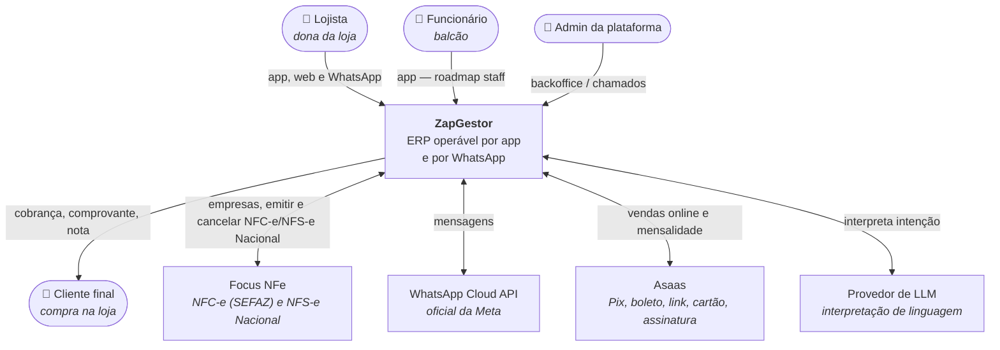
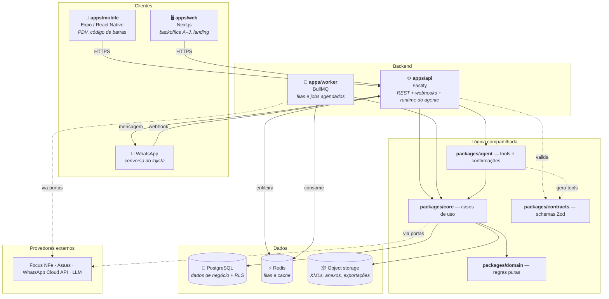
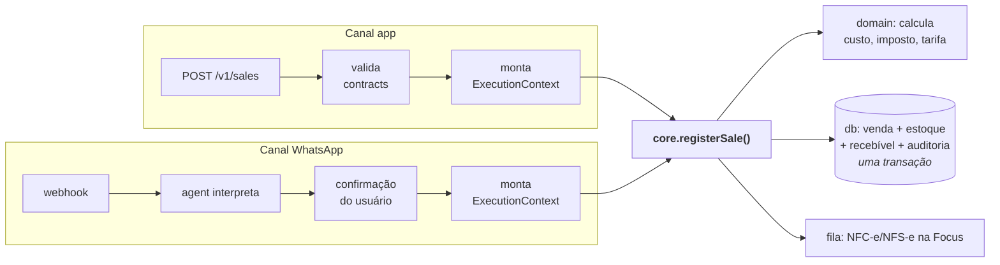

# Arquitetura — visão geral

Diagramas [C4](https://c4model.com/) de nível 1 (contexto) e 2 (containers). O
nível 3 (componentes) vive no README de cada módulo — ver
[`modulos.md`](modulos.md).

As regras que sustentam esta arquitetura estão em
[`principios.md`](principios.md). Este documento mostra **o quê**; aquele
explica **por quê**.

---

## Nível 1 — Contexto

Quem usa o sistema e com que sistemas externos ele fala.

**Integrações externas no recorte A–J:** Focus NFe (NFC-e e NFS-e Nacional), Asaas,
WhatsApp Cloud API, LLM ([DEC-007](../decisoes/README.md#dec-007) ainda aberta).
Open Finance está
[adiado](../decisoes/README.md#dec-005). Adapters isolam os provedores mesmo
com Focus e Asaas já escolhidos.

## Nível 2 — Containers

### Por que estes containers

| Container      | Existe porque                                                                                                                   | Alternativa descartada                                                                 |
| -------------- | ------------------------------------------------------------------------------------------------------------------------------- | -------------------------------------------------------------------------------------- |
| `apps/api`     | Um único ponto de entrada para app, web e webhooks, com autenticação e contexto de tenant em um lugar só                        | Um serviço por domínio — complexidade de operação que 3 devs e zero clientes não pagam |
| `apps/worker`  | Emissão Focus não pode bloquear a venda ([RNF-004](../produto/requisitos-nao-funcionais.md)); cobrança e lembrete são agendados | Fazer tudo síncrono na API — quebra RNF-003 e RNF-004                                  |
| `apps/mobile`  | O PDV é no balcão, com código de barras e rede instável ([RNF-051](../produto/requisitos-nao-funcionais.md))                    | Web responsiva — não resolve leitor nativo nem operação offline                        |
| `apps/web`     | Backoffice, painel, financeiro, CRM, empresa — trabalho de tela grande                                                          | Só mobile — plano de contas e chamado no celular são hostis                            |
| PostgreSQL     | Dado financeiro exige transação e integridade; RLS dá isolamento no banco ([RNF-021](../produto/requisitos-nao-funcionais.md))  | NoSQL — sem transação multi-tabela, a atomicidade de RNF-046 vira código de aplicação  |
| Redis          | Fila para emissão, mensagens e jobs; cache de leitura quente                                                                    | Fila no próprio Postgres — viável, mas piora o pico de mensagens de RNF-018            |
| Object storage | XML fiscal por 5 anos ([RNF-037](../produto/requisitos-nao-funcionais.md)), anexos e exportações                                | Guardar no banco — caro e pesado para backup                                           |

### O runtime do agente mora na API

O `packages/agent` roda **dentro** de `apps/api`, não como serviço separado.

Motivo: o agente precisa do mesmo contexto de execução, da mesma autenticação e
das mesmas portas de `core` que uma requisição HTTP. Separá-lo criaria uma
segunda composição de dependências — e é assim que os dois canais começam a
divergir, que é exatamente o que a arquitetura existe para impedir.

Quando o volume justificar processo separado, o `agent` já é um pacote isolado:
a mudança é de empacotamento, não de código de negócio.

## Fluxo de uma requisição

Os dois canais convergem no mesmo caso de uso:

A diferença entre os canais termina em `ExecutionContext` — `channel: 'app'` ou
`channel: 'whatsapp'`. Daí para frente é o mesmo código, inclusive as
validações e a auditoria.

## Decisões estruturais tomadas

| Decisão                | Escolha                           | Por quê                                                                                                                                                                          |
| ---------------------- | --------------------------------- | -------------------------------------------------------------------------------------------------------------------------------------------------------------------------------- |
| Organização do código  | Monorepo                          | Contrato compartilhado entre 4 apps; mudança em `contracts` precisa ser atômica                                                                                                  |
| Gerenciador de pacotes | pnpm + Turborepo                  | Cache de tarefas e execução por pacote afetado; `node-linker=hoisted` por causa do Metro/Expo                                                                                    |
| Linguagem              | TypeScript em todo o stack        | Um tipo de venda compartilhado entre backend, app e agente                                                                                                                       |
| Estilo de API          | REST                              | Público e superfície pequenos; GraphQL não se paga aqui                                                                                                                          |
| ORM                    | Drizzle                           | SQL explícito e tipado, essencial para trabalhar com RLS sem surpresa                                                                                                            |
| Isolamento             | RLS no PostgreSQL                 | Isolamento que não depende de o desenvolvedor lembrar do `WHERE` — [ADR-0001](../decisoes/adr/0001-rls-por-linha.md)                                                             |
| Acesso                 | 1 usuário ↔ 1 empresa             | Staff depois, mesma loja — [ADR-0004](../decisoes/adr/0004-usuario-uma-empresa.md)                                                                                               |
| Fiscal                 | Focus NFe, NFC-e e NFS-e Nacional | Só MEI/Simples sem Híbrido; A1 transita; não falamos com SEFAZ nem o Ambiente Nacional — [ADR-0002](../decisoes/adr/0002-focus-nfe.md), [DEC-017](../decisoes/README.md#dec-017) |
| PSP e assinatura       | Asaas                             | Pix, boleto, link, cartão online; dinheiro/maquininha só registro — [ADR-0007](../decisoes/adr/0007-asaas.md)                                                                     |
| WhatsApp               | Cloud API oficial                 | Sem lib não oficial — [ADR-0005](../decisoes/adr/0005-whatsapp-cloud-api.md)                                                                                                     |
| Validação              | Zod em `contracts`                | O mesmo schema serve a HTTP, tipos e tools do agente                                                                                                                             |

## Decisões estruturais ainda em aberto

Estas **não** estão decididas e não devem ser assumidas em código:

| Tema                            | Decisão                                  | Impacto se decidida errado                       |
| ------------------------------- | ---------------------------------------- | ------------------------------------------------ |
| Hospedagem e deploy             | [DEC-009](../decisoes/README.md#dec-009) | Define `infra/` e os workflows de deploy         |
| Autenticação                    | [DEC-008](../decisoes/README.md#dec-008) | Afeta api, web, mobile e o vínculo do WhatsApp   |
| LLM e recuperação de informação | [DEC-007](../decisoes/README.md#dec-007) | Define o runtime do `agent` e o custo por tenant |

## Documentos relacionados

- [Princípios](principios.md) — as regras que estruturam tudo isso
- [Fluxos](fluxos.md) — as sequências detalhadas
- [Dados](dados.md) — modelo, multi-tenant e RLS
- [Esquema PostgreSQL](esquema-postgresql.md) — catálogo físico das tabelas
- [Segurança](seguranca.md) — autenticação, autorização e LGPD
- [Módulos](modulos.md) — o detalhe de cada caixa destes diagramas
